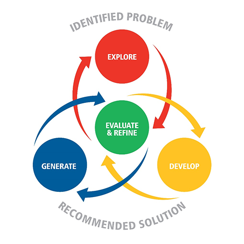

# Digital Solutions

:::{dropdown} Learning Goals
By the end of this section you will:
- understand what constitutes a digital solution
- understand the processes involved in creating a digital solution
:::

## What are Digital Solutions?

A digital solution is a functional system combining user interface, data and programming elements to address a defined real-world problem that meets human needs, wants or opportunities.

Its key features include:

- A **user interface** that allows meaningful interaction between the user and the system.
- **Programmed components** that use algorithms, control structures and data processing to perform the required functions.
- **Data components** such as databases or data stores that collect, validate, manipulate and display information.
- **Integration** of user, data and program elements into a single functional system.
- **Useability principles** that ensure accessibility, effectiveness, safety, utility and learnability.
- **Testing and refinement** to evaluate performance against success criteria and improve accuracy, maintainability, efficiency and user experience.
- **Consideration of personal, social and economic impacts**, including ethics, privacy and security.

## How do we create a Digital Solution?

We create a digital solution by following a structured problem-solving process. 

1. We **explore** a need, want or opportunity by analysing users, existing systems and constraints. Next, w
2. We **develop ideas** using design, systems and computational thinking to plan how the solution will work. 
3. We then **generate components**, including the user interface, programmed code and data structures, using suitable software and programming tools. 
4. Finally, we **evaluate and refine** the solution by testing it against success criteria, improving its performance, security and user experience until it meets the identified need.

This process is refered to as the EDGE problem-solving framework.

