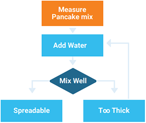

# Coding Introduction

:::{dropdown} Learning Goals
By the end of this section you will:
- understand the computational thinking concept of decomposition
- know how to decompose a digital problem
- understand the computational thinking of concept pattern recognition
- know how to recognise patterns a digital problem
- understand the computational thinking of concept abstraction
- know how to apply abstraction to a digital problem
- understand the computational thinking of concept algorithmic thinking
- know how to apply algorithmic thinking to a digital problem
- understand systems thinking
- know how to apply systems thinking to a digital problem
:::

> Problem solving in technology-rich environments involves using digital technology, communication tools and networks to acquire and evaluate information, communicate with others and perform practical tasks. It requires the ability to solve problems for personal, social and economic purposes through the setting of appropriate goals and plans and by the accessing and making use of information through computers and computer networks. `piaacexpertgroupinproblemsolvingintechnologyrichenvironments_2009_piaac`

> Digital problems are therefore those problems that are solvable using information and communication technologies. These digital solutions can use a wide variety of developed and developing contexts such as web applications, mobile applications, interactive media and intelligent systems.  `digitaltechnologieshub_2017_topics`

What distinguishes a digital problem is that the solution consists of digital hardware and software working together to form a digital system.

&nbsp;

In a digital system:

- data goes in (input)
- data is manipulated (process)
- data is sent out (output)

People control the a digital system through the use of **algorithms**.

&nbsp;

For example, the input process and output (IPO) for logging on would be:

| Input | Process | Output |
|:---|:---|:---|
| Username Password |`IF correct THEN` &nbsp;&nbsp;&nbsp;&nbsp;`go to home screen` `ELSE` &nbsp;&nbsp;&nbsp;&nbsp;`send message "incorrect password"` `ENDIF` | Next Screen or Error message |

:::{seealso} IPO Activities
:class: dropdown
Create an IPO table for the following scenarios.

**1. Budget Calculator**

A student wants to plan their weekly spending. They type in how much money they have and list their expected expenses for things like food, transport, and entertainment. The system uses this data to figure out how much money they'll have left after expenses.

---

**2. Step Counter App**

A fitness app tracks the number of steps a person takes each day. It collects step data from the phone's motion sensors. The app processes this to calculate total steps, distance walked, and calories burned, then shows this to the user.

---

**3. Quiz App**

A student uses an app to practise for a science test. The app shows a question and several possible answers. When the student picks one, the app checks if it’s correct and updates their score. The final score is shown after all questions are answered.
:::

---

## Computational thinking

> Computational thinking describes the processes and approaches we draw on when thinking about how a computer can help us to solve complex problems and create systems. We often draw on logical reasoning, algorithms, decomposition, abstraction, and patterns and generalisation when thinking computationally.  `digitaltechnologieshub_2017_topics`

### Decomposition

Decomposition is when you break a big problem into smaller, simpler parts. This makes the problem easier to understand and helps you solve it step by step without getting overwhelmed.

Most complex problems are just lots of smaller problems joined together. When you break them down, it’s easier to figure out what to do and plan your solution.

&nbsp;

When using decomposition, ask yourself:

- What are the different parts of the problem?
- What tasks do I need to do to solve it?
- Can I do each task easily, or should I break it down more?
- If I finish all the smaller tasks, will that solve the whole problem?

**Decomposition Example**

Problem: Create a program that calculates a student's average grade.

Decomposition steps:

1. Get input from the user
   * Ask the user how many subjects they have
   * Ask for the grade for each subject
2. Store the grades
   * Save the grades in a list or array
3. Calculate the average
   * Add all the grades together
   * Divide by the number of subjects
4. Show the result
   * Display the average grade to the user

:::{seealso} Decomposition Activities
:class: dropdown
**Activity 1**

Create a program that helps students manage their homework tasks. Students need to build a digital tool that allows users to enter, view, and organise their homework across subjects.

---

**Activity 2**

Design a digital scoreboard for a school sports event. The system should display team names, update scores during matches, and show the final result at the end.

---

**Activity 3**
Develop a quiz app for science revision. The app should present questions, let users choose answers, and give feedback on how they did.
:::

### Pattern Recognition

Pattern recognition means spotting things that are the same or similar. In Digital Solutions, you look for patterns when you break down a big problem into smaller parts.

By comparing the different parts, you can notice what repeats or what looks similar. This helps you understand the problem better and come up with a smarter solution. It's not just about patterns in numbers or letters—it can be patterns in how problems work or how information is structured.

&nbsp;

When using pattern recognition, ask:

- What patterns do I see?
- Have I solved something like this before?
- Do any parts of the problem work in a similar way?
- Is anything repeating?

:::{seealso} Pattern Recognition Activities
:class: dropdown
Identify the patterns in the following scenarios

**Activity 1**

A program must check student answers to a multiple-choice quiz and give feedback for each question. Consider how the answers and feedback work across all questions.

---
**Activity 2**

A weather app shows the forecast for the week using icons, temperatures, and text. Consider how the same data is displayed each day and what information is reused.

---
**Activity 3**

A timetable generator takes input from different students and builds their weekly schedules. Consider how class times, subjects, and breaks are arranged for each person.
:::

### Abstraction

Abstraction is about focusing on the most important parts of a digital problem and ignoring the details that don’t help solve it. After breaking a problem into parts (decomposition) and spotting patterns (pattern recognition), abstraction helps you decide what features, data, and actions are needed for your digital solution.

In programming, **procedural abstraction** is when you group steps into a named procedure or function. Instead of worrying about how the steps work each time, you just call the procedure. This makes your code simpler, clearer, and easier to reuse.

It’s like designing an app: you include only the features that matter, and you organise repeated actions into clean, reusable blocks of code.

&nbsp;

When using abstraction, ask:

- What is the main goal of my digital solution?
- What information and features are essential?
- What can I ignore because it’s not needed?
- Can I group actions into procedures to keep my code clean and simple?

:::{seealso} Abstraction Activities
:class: dropdown
**Activity 1**

A student is creating an app to track daily water intake. The app needs to collect, display, and manage user data about how much water they drink each day.

What information and features are necessary to help users track their water intake, and what can be left out?

---

**Activity 2**

A game is being developed where a player moves through different levels by solving puzzles. Each level has different themes, but the game mechanics remain consistent across them.

What parts of the game design stay the same across all levels, and how can these be grouped or simplified?

**Activity 3**

A school website needs to show staff profiles, including names, roles, and contact details. Each profile should follow a consistent layout while displaying different information.

What is the essential information to show for each staff member, and how can the display be made consistent without repeating code?
:::

### Algorithmic Thinking

Algorithmic thinking is about planning the steps needed to solve a problem. It helps you create a clear set of instructions (an algorithm) that a person or computer can follow to get the right result.

Instead of just finding an answer, you work out how to solve the problem step by step. These steps take input, do something with it, and give the correct output. If you follow the steps the same way every time, you should always get the same result.

In Digital Solutions, algorithmic thinking is used to design instructions for programs and apps so they work reliably and predictably.

&nbsp;

Then creating algorithms, ask:

- What’s the first thing I need to do?
- What steps do I need to follow?
- What order should the steps go in?

:::{seealso} Algorithm Activities
:class: dropdown
**Activity 1**

A program needs to organise a list of student last names into alphabetical order. 

What steps must be followed to arrange the last names correctly from A to Z?

---

**Activity 2**
A vending machine should accept money, check if enough was entered, and dispense the selected item.

What steps are needed to go from inserting money to receiving the item?

---

**Activity 3**
A program needs to check if a password meets certain rules (e.g. length, symbols, numbers).

What steps should the program take to test if a password is strong enough?
:::

---

## Systems thinking

> A system is a set of interrelated elements that make a unified whole. Systems are everywhere — for example, the interdisciplinary team involve in supporting someone, the Human Resources in your organization, the circulatory system in your body, the predator/prey relationships in nature, the ignition system in your car, and so on. Ecological systems and human social systems are living systems; human-made systems such as cars and washing machines are nonliving (sic) systems.  `persondirectclinicalservice_2017_system`

Systems thinking is about looking at the big picture when solving problems. It helps you understand how different parts of a system work together and affect one another.

In Digital Solutions, this means seeing how your solution fits into a larger system — like how an application, a database, and a user all interact. If one part changes, it might impact other parts. This helps you design better, more reliable systems.

When using systems thinking, ask:

- What parts make up the system?
- How do the parts connect and depend on each other?
- What happens if one part changes?
- How does this solution affect people, other systems, or the environment?

:::{seealso} System Thinking Activities
:class: dropdown
**Activity 1:**

An app records student attendance and sends reports to teachers and parents.

What are the different parts of the system, and how do they interact when a student is marked present or absent?

---

**Activity 2:**

A digital system lets users order food, notifies restaurants, and tracks delivery.

What systems are involved in taking, processing, and delivering an order, and how do changes in one part affect the others?

---

**Activity 3:**

A smart system turns lights on or off automatically based on user settings and sensors.

What are the parts of the smart lighting system, and how do they work together to respond to user actions or environmental changes?
:::