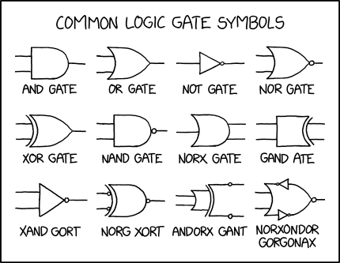

# Basic Features

:::{dropdown} Learning Goals
By the end of this section you will:
- remembered the basics of Python that have been covered in previous courses.
:::

Algorithms are the commands that make up our programs.

There are 6 basic building blocks that an algorithm consists of. Each of them serve a particular purpose.

- **Sequence:** a number of instructions that are processed one after the other.
- **Assignment:** used to store the value of an expression into a **variable**.
- **Condition:** the way that a computer asks a question which can only generate two possible responses: `True` (yes) or `False` (no).
- **Selection:** a statement that uses a condition to select, or determine, whether the next line of the program is to be executed.
- **Iteration:** the repetition of a number of instructions. These are generally referred to as loops and refer to a section of code that is repeated.
- **Modularisation:** refers to the process of breaking a large, unwieldy programming task into separate, smaller, more manageable subtasks or modules. Individual modules can then be cobbled together like building blocks to create a larger application.

In designing your algorithm, you will need to decide how to arrange these building block to achieve you outcome. To do this it is wise to follow good programming practices.

:::{warning} Teacher's marking considerations
In assessing your code and pseudocode, your teaching will look for examples of these six building blocks. Keep this in mind when selecting which code and pseudocode you will demonstrate in your assessment.
:::

---

## Variables

Variables are the names you give to computer memory locations which are used to store values in a computer program. Variables can store data of different types, and different variable types can do different things.

### Variable Types

Variable can be of different **types**. The type of a variable indicates the what kind of data is stored at that memory location.

:::{hint} Dynamic vs Static Variables
:class: dropdown
In programming languages, there are two different type variable systems:

- **dynamic:** type checking only occurs as the code runs, and the type of a variable is allowed to change over its lifetime.
- **static:** type checks are performed without running the program. In most statically typed languages this is done as your program is compiled. The type of a variable is not allowed to change over its lifetime.

Python is a **dynamically** typed language. This means that you can store any type of data in a variable, irrespective of the type of data that is already stored there.
:::

The Python data types that we will be using are:

- **Strings:** 
  - strings are sequences of character data
  - the string type in Python is called `str`
  - string literals may be delimited using either single or double quotes
  - [Strings refresher](https://www.w3schools.com/python/python_strings.asp)

- **Integers:**
  - integers are whole numbers
  - the integer type in Python is called `int`
  - there is effectively no limit to how long an integer value can be, but it is constrained by the amount of memory your system has.
  - [Integer refresher](https://www.w3schools.com/python/python_numbers.asp)

- **Floating-Point Numbers:**
  - float values are numbers specified with a decimal point
  - the `float` type in Python designates a floating-point number
  - optionally, the character e or E followed by a positive or negative integer may be appended to specify scientific notation
  - [Float refresher](https://www.w3schools.com/python/python_numbers.asp)

- **Boolean Type:**
  - objects of Boolean type may have one of two values, `True` or `False`
  - the Boolean type in Python is called `bool`
  - a value that is true in Boolean context is sometimes said to be "truthy" and one that is false in Boolean context is said to be "falsie"
  - the "truthiness" of an object of Boolean type is self-evident: Boolean objects that are equal to `True` are truthy (true), and those equal to `False` are falsy (false)
  - [Boolean refresher](https://www.w3schools.com/python/python_booleans.asp)

### Truthiness and Falseness of Variables

In Python, variables have an associated *truthiness* (evaluated as `True`) or *falseness* (evaluated as `False`) when used in a Boolean context like an `if` statement.

**Falsy values in Python**

| Evaluate to `False`  | Evaluate to `True`|
| --- | --- |
| `None`<br>`False`<br>`0` (all numeric types, e.g. `0`, `0.0`, `0j`)<br>`''` or `""` (empty string)<br>`[]` (empty list)<br>`{}` (empty dictionary)<br>`set()` (empty set)<br>`()` (empty tuple)<br>`range(0)` | Everything else including:<br>&nbsp;<br>Non-zero numbers: `1`, `-5`, `3.14`<br>Non-empty strings: `"hello"`<br>Non-empty lists `[1]`<br>Non-empty tuples `(0,)`<br>Non-empty sets `{1}`<br>Non-empty dicts `{'a': 1}` | 

For example, the following code:

```python
if []:
    print("Truthy")
else:
    print("Falsy")
```

outputs:

``` bash
Flasy
```

### Scope: Local and Global Variables

When writing code, **scope** means where in your program a variable can be used.

* **Global variables** are made outside of functions and can be used anywhere in your code.
* **Local variables** are made inside functions and can only be used inside those functions.

Older languages like BASIC didn’t use local variables, so every part of the program could change any variable at any time. This made debugging hard.

Modern languages like Python use scope to avoid problems like this. In Python, you can’t use a variable everywhere unless it’s global. Where you create the variable decides where you’re allowed to use it. This helps keep your code more organised and easier to manage.


**Python Scope and the LEGB Rule**

Python follows a rule called **LEGB** to figure out which variable to use when you refer to a name. LEGB stands for:

* **Local** – Variables made *inside a function*. Only that function can use them. Each time the function runs, a new local scope is created.
* **Enclosing** – Variables made *in outer functions*, when you have functions inside functions. The inner function can use these variables, but can’t change them unless declared `nonlocal`.
* **Global** – Variables made *at the top of your program*. They can be used anywhere, but only changed inside a function if declared `global`.
* **Built-in** – Variables and functions that come with Python, like `print()` or `len()`. These are always available.

Python checks for a name in this order: **Local → Enclosing → Global → Built-in**. If it finds the name, it stops there. If not, it gives an error.

:::{attention} Stop and Think
What would happen if you made a function called `print`?
:::

**What You Can Do in Different Scopes**

| Action | In Global Code | In a Function (Local Code) | In a Nested Function |
| :-- | :-- | :-- | :-- |
| Use global variables                         | Yes            | Yes                        | Yes                    |
| Change global variables                      | Yes            | No (unless `global`)       | No (unless `global`)   |
| Use local variables                          | No             | Yes (its own only)         | Yes (its own only)     |
| Change built-in names (not recommended)      | Yes            | Yes (while running)        | Yes (while running)    |
| Use variables from the enclosing function    | N/A            | N/A                        | Yes                    |
| Change variables from the enclosing function | N/A            | N/A                        | No (unless `nonlocal`) |


---

## Control Structures

Flow of control through any given function is implemented with three basic types of control structures:

### Sequential

Sequential code runs line by line from top to bottom. The program starts with the first line, then moves to the next, and keeps going in order until it finishes.

### Conditions

A **condition** is how a computer checks if something is true or false. It’s like asking a yes/no question. The answer will always be either `True` or `False`.

In Python, conditions are used in `if` and `while` statements. They follow this pattern: **value operator value**

There are six main comparison operators in Python:

| Operator | Condition example |
| --- | --- |
| Equals | a == b |
| Not Equals | a != b |
| Less than | a < b |
| Less than or equal to | a <= b |
| Greater than | a > b |
| Greater than or equal to | a >= b |

### Selection

Selection is when a program makes a choice between different paths based on a condition. Only one path is taken &mdash; the others are skipped. After the selected path runs, the program continues with the next line after the selection block. This is also called **branching**, like how a tree or river splits into different directions.

Python has two main types of branching:

**`if ... elif ... else` statements**

This type checks conditions in order and chooses one path to run.

| Component | Features |
| --- | --- |
| `if` | Must come first<br>Only one allowed<br>Always required |
| `elif` | Comes after `if` and before `else`<br>Optional<br>Can have as many as needed<br>Runs only if all conditions above are `False` |
| `else` | Must come last<br>Optional<br>Only one allowed<br>Runs only if all previous conditions are `False` |

[W3Schools: if...elif...else refresher](https://www.w3schools.com/python/python_conditions.asp)

**`match case` statement**

  * Checks a variable against different fixed values
  * Similar to `switch` in other languages
  * Added in Python 3.10
  * [LearnPython: match case statement](https://learnpython.com/blog/python-match-case-statement/)


### Iteration

**Iteration** means repeating a block of code. This is also called a **loop**. There are two main types:

* **Indefinite iteration** – used when you don’t know how many times the loop will run

  * **Pre-test loop** (`while` loop): checks the condition *before* running the code
  * **Post-test loop** (like `do...while` in other languages): runs the code *then* checks the condition &mdash; Python does **not** have this type

* **Definite iteration** – used when you know how many times to run

  * **Counted loop** (`for` loop): repeats for a fixed number of times or through each item in a sequence

Python has two loop types

| Loop type | Features |
| --- | --- |
| `while` loop | Checks the condition first<br>Repeats while the condition is `True`<br>Is used for infinite loops<br>[W3Schools: while loop refresher](https://www.w3schools.com/python/python_while_loops.asp) |
| `for` loop | Loops through a sequence (like a list or range)<br>Uses each item one at a time<br>Stops when there are no more items<br>[W3Schools: for loop refresher](https://www.w3schools.com/python/python_for_loops.asp) |


:::{hint} What is an iterable?
:class: dropdown
In Python, an **iterable** is a container you can move through one item at a time, like going through pages in a book. Built-in iterables include **lists**, **tuples**, **strings**, **dictionaries**, and **sets**.
:::

---

## Data Structures

> Data structures are used to store data in an organized form. No matter what problem are you solving, in one way or another you have to deal with data &mdash; whether it's an employee's salary, stock prices, a grocery list, or even a simple telephone directory. {cite}`ulhaq_2018_the`
> 
The easiest way to understand **data structures** is to see them as collections of related data &mdash; like a list of shopping items or a group of contacts with phone numbers. In fact they are frequently referred to as collections.

In Python, we commonly use these four data structures:

| Data structure | Features |
| --- | --- |
| Lists | Ordered collection of items<br>Created using square brackets `[]` with items separated by commas<br>Example: `[1, 2, 3, 4]`<br>Items can be changed, added, or removed (mutable)<br>Each item has an index, starting at 0<br>[Lists refresher](https://www.w3schools.com/python/python_lists.asp) |
| Tuples | Ordered collection like lists, but **cannot be changed** (immutable)<br>Created using parentheses `()` with items separated by commas<br>Example: `(1, 2, 3, 4)`<br>Good for fixed data and faster performance<br>Indexing starts at 0<br>[Tuples refresher](https://www.w3schools.com/python/python_tuples.asp) |
| Sets | Collection of **unique** items with **no specific order**<br>Created using curly braces `{}` with items separated by commas<br>Example: `{1, 2, 3, 4}`<br>Mutable &mdash; you can add or remove items<br>Useful when you care about presence, not order or duplicates<br>[Sets refresher](https://www.w3schools.com/python/python_sets.asp) |
| Dictionaries | Collection of **key-value pairs**<br>Created using curly braces `{}`, with a colon `:` between each key and value<br>Example: `{"Doh": "Doherty", "Fly": "Flynn"}`Keys must be unique<br>Useful when each value has a unique label or ID<br>Mutable &mdash; values can be added, updated, or deleted<br>[Dictionary refresher](https://www.w3schools.com/python/python_dictionaries.asp) |

---

## Syntax

**Syntax** is the set of rules a programming language follows to write commands properly. It decides which combinations of words, symbols, and punctuation are valid in that language.

[Python syntax refresher](https://www.w3schools.com/python/python_syntax.asp)

---

## Libraries

A **library** is a collection of code &mdash; like functions, modules, or scripts &mdash; that you can use in your own programs. Python includes a standard library with many useful tools. You can also install extra libraries using `pip`, or even create your own.

---

## Classes

In object-oriented programming, a **class** is a blueprint for creating objects. It defines the attributes (data) and methods (actions) that all objects of that type share.

For example, a `Car` class might include:

* attributes like `colour` and `wheels`
* methods like `drive()` and `brake()`

You can then create many car objects from that one class, like `ferrari = Car()`.

A `Truck` class might share some features with `Car` but have differences. Both could inherit from a more general `Vehicle` class, which contains shared code. This avoids repeating code while still allowing for differences.

Inside a class:

- **attributes** store data, like `speed` or `size`
- **methods** perform actions, like `drive()` or `turn_left()`

To use a method, you create an object and call it like this:
`ferrari.drive(distance)`

We covered classes and object-oriented programming in the [Deepest Dungeon course](https://damom73.github.io/python-oop-with-deepest-dungeon/).

---

## Operations

**Operators** are symbols used to perform actions on variables or values in Python. These actions can include math, comparisons, logic checks, and more.

Python includes several types of operators:

- Arithmetic operators
- Assignment operators
- Comparison operators
- Logical operators
- Identity operators
- Membership operators
- Bitwise operators

[Python operations refresher](https://www.w3schools.com/python/python_operators.asp)

### Arithmetic Operators

Used to do basic maths with numbers.

| Operator | Action | Example |
| --- | --- | --- |
| `+` | Addition | `x + y` |
| `-` | Subtraction | `x - y` |
| `*` | Multiplication | `x * y` |
| `/` | Division | `x / y` |
| `%` | Modulus (remainder) | `x % y` |
| `**` | Exponentiation | `x ** y` |
| `//` | Floor division (whole number result) | `x // y` |

Note: brackets `()` work just like in maths to control order.

### Assignment Operators

Used to assign or update the value of a variable.

| Operator | Example | Same As |
| --- | --- | --- |
| `=`  | `x = 5` | `x = 5` |
| `+=` | `x += 3` | `x = x + 3` |
| `-=` | `x -= 3` | `x = x - 3` |
| `*=` | `x *= 3` | `x = x * 3` |
| `/=` | `x /= 3` | `x = x / 3` |
| `%=` | `x %= 3` | `x = x % 3` |
| `//=` | `x //= 3` | `x = x // 3` |
| `**=` | `x **= 3` | `x = x ** 3` |

### Comparison Operators

Used to compare values and return `True` or `False`.

| Operator | Action | Example |
| --- | --- | --- |
| `==` | Equal | `x == y` |
| `!=` | Not equal | `x != y` |
| `>` | Greater than | `x > y` |
| `<` | Less than | `x < y` |
| `>=` | Greater than or equal to | `x >= y` |
| `<=` | Less than or equal to | `x <= y` |

### Logical Operators

<p>&nbsp;</p>

Used to combine or modify condition results.

| Operator | Description | Example |
| --- | --- | --- |
| `and` | `True` if both are `True` | `x < 5 and x < 10` |
| `or` | `True` if at least one is `True` | `x < 5 or x < 3` |
| `not` | Reverses the result | `not(x < 5)` |

### Identity Operators

Check whether two variables are actually the same object in memory.

| Operator | Description | Example |
| --- | --- | --- |
| `is` | True if same object | `x is y` |
| `is not` | True if not same object | `x is not y` |

### Membership Operators

Check if a value exists in a sequence like a list or string.

| Operator | Description | Example |
| --- | --- | --- |
| `in`| True if value is present | `'a' in 'apple'` |
| `not in` | True if value is not present | `5 not in [1, 2, 3]` |

### Bitwise Operators

Used with binary numbers. Rarely needed in basic Python, but good to know they exist.

| Operator | Name | Description |
| ---| --- | --- |
| `&` | AND | `1` if both bits are `1` |
| `\|` | OR | 1 if at least one bit is 1 |
| `^` | XOR | 1 if bits are different |
| `~` | NOT | Flips all bits |
| `<<` | Left shift | Moves bits left, adds 0s on the right |
| `>>` | Right shift | Moves bits right, keeps leftmost bit |
