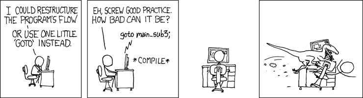

# Good Programming Practice

:::{dropdown} Learning Goals
By the end of this section you will:
- understand why good programming practice improves reliability, efficiency, and teamwork
- know how to apply style guides like PEP 8 to format and organise code
- know how to write maintainable code using naming conventions, comments, and small functions
- understand the importance of reducing cognitive load in code structure
- know how to write dependable code that handles errors and unexpected inputs
- understand and apply strategies to improve algorithmic and code efficiency
- know how to test programs using exploratory, unit, and integrated testing
- know how to identify and fix syntax, runtime, and logic errors
- know how to write docstrings and block comments to explain code clearly
- understand what code portability is and how to write cross-platform Python code
:::

<p>&nbsp;</p>

Good programming practice is important because it makes code easier to read and understand, which helps developers quickly identify and fix errors. It improves the reliability and performance of digital solutions, making them more effective and efficient. Following consistent practices also supports teamwork, as well-structured code is easier for others to read, maintain, and build upon. Additionally, it ensures that solutions are scalable and adaptable, allowing for future updates or changes without introducing new problems.

There are many good programming practices that should be followed. These need to be applied from the very beginning, starting with algorithm development.

## Dependability

Code dependability refers to how reliable and consistent a program is when it runs. Dependable code performs as expected under different conditions, handles errors gracefully, and does not crash or behave unpredictably. It includes writing code that is well-tested, handles edge cases, and can recover from unexpected inputs or failures. Dependable code is essential for building trust in the digital solution and ensuring a good user experience.

<p>&nbsp;</p>

In systems engineering, dependability is a measure of a system's maintainability and reliability.

### Maintainability

<p>&nbsp;</p>

Developers often say that code is read more than it is written. This is especially true when multiple people are working on the same project. Even in a classroom setting, maintainability matters — your code might be reviewed by a classmate, a teacher, or even your future self trying to make sense of what you once wrote.

:::{hint} What is Cognitive Load?
:class: dropdown
Cognitive load is the amount of mental effort needed to understand and work with information. It increases when information is confusing, overly complex, or badly organised, making it harder to think clearly and complete tasks.

Reducing cognitive load is important for improving focus, learning, and problem-solving. This can be done by presenting information simply, using clear language, giving step-by-step instructions, and removing unnecessary distractions to make tasks easier to manage.
:::

Maintainability is about writing code that is easy to read, understand, and update. It reduces cognitive load by keeping code clear and predictable, making it easier to identify and safely change the specific parts that need updating, without accidentally breaking other parts of the program.

:::{hint} What are Dependant Modules?
:class: dropdown
If your code imports and uses another module, it becomes dependent on that module. This means changes to the way the imported module works *could* break your code. Things get more complex when you consider that the module you imported may itself depend on other modules, which might also rely on additional modules.

This sequence of interconnected modules, where each one depends on the previous, is known as a **dependency chain**.
:::

<p>&nbsp;</p>

Here are some simple ways to improve your code's maintainability:

- **Follow the style guide**

  - Creates consistency across different code files (e.g. always using 4-space indentation)
  - Python’s official guide is called [PEP 8](https://peps.python.org/pep-0008/)
  - The Python extension in VSCode helps flag style issues
  - We will also use the [Ruff VS Code Extension](https://marketplace.visualstudio.com/items?itemName=charliermarsh.ruff) to automatically format our code to follow PEP 8

- **Use naming conventions**

  - Typically part of the style guide, but important enough to highlight separately
  - Good names give clues about what a variable or function does
  - Details are explained [further down the page](#naming-conventions)

- **Keep functions small**

  - Break up your code so each function does one clear task
  - Smaller, focused functions are easier to test and update

- **Add comments**

  - Comments explain what your code does and why
  - This helps others (and your future self) quickly understand key parts of your logic
  - More about commenting is included later on this page

### Reliability

Reliability is how likely a program is to run without errors or failures when performing a task.

* In Digital Solutions, testing and usability play key roles in improving reliability.
* For example, anticipating potential user or system errors helps you choose the right programming constructs to handle them effectively.

## Efficiency

Efficiency is when a system completes its tasks using the least possible time and processing power. There are two main types:


### Algorithmic Efficiency

This refers to how reliably and quickly an algorithm solves a problem, using clear and structured programming techniques to keep solutions concise and effective.

To achieve algorithmic efficiency in your programs, you can follow these simple practices:

- **Pick the right data structure:** Use structures like lists, dictionaries or sets that help you store and access data quickly.
- **Avoid unnecessary steps:** Don’t repeat the same actions if you don’t need to. Keep your code clean and direct.
- **Use better algorithms:** Some algorithms solve problems faster than others. For example, binary search is quicker than checking every item one by one.
- **Write better loops:** Try not to use loops inside other loops unless needed. Also, end a loop early if you’ve already found what you’re looking for.
- **Break your code into small parts:** Write small functions that do one job well. This makes your code easier to manage and faster to test.
- **Think about how your code grows:** As the amount of data gets bigger, your code should still run well. Try to reduce how much time and memory your code needs.

### Code Efficiency

Code efficiency is closely related to algorithmic efficiency. It focuses on reducing resource usage and execution time while maintaining stability. For example, using a `for` loop instead of repeating multiple `if`, `then`, `else` statements improves both performance and readability.

<p>&nbsp</p>

To achieve code efficiency in your programs, you can follow these tips:

- **Keep your code simple and clear:** Write code that is easy to read and understand. Avoid overcomplicating it.
- **Reuse code with functions:** If you do the same task more than once, write a function. This avoids repeating code and makes it easier to update.
- **Use loops and conditions smartly:** Choose efficient structures like `for` or `while` loops instead of repeating code with lots of `if-else` statements.
- **Avoid unnecessary calculations:** Don’t calculate the same thing multiple times—store it in a variable if you need it again.
- **Choose efficient operations:** For example, using a list to store values is fine, but if you need to look things up quickly, a dictionary might be better.
- **Test and improve your code:** Try your code with different amounts of data and look for ways to make it faster or use fewer resources.

---

## Effectiveness

Effectiveness measures how well an algorithm solves the intended problem. While simple problems can be tested with a desk check, most algorithms must be written, run, and tested in the correct context to determine if they work as expected.

To ensure your algorithm is effective, follow these steps:

- **Understand the problem clearly:** Make sure you know what the problem is asking and what a correct solution looks like.
- **Define success criteria:** Decide how you will measure whether the solution works — e.g. correct output, valid data, or user satisfaction.
- **Design and plan your algorithm:** Break the problem into smaller steps using pseudocode or flowcharts before coding.
- **Write the code carefully:** Follow your plan and keep your logic clear and structured.
- **Test the code with real data:** Use different inputs, including edge cases and invalid data, to check if the algorithm works properly in all situations.
- **Evaluate and refine:** Look at the results. If something doesn’t work or can be improved, go back and fix the algorithm.
- **Use feedback:** If other users or testers try your solution, listen to their feedback to improve it further.

---

## Testing

<p>&nbsp;</p>

Testing is the process of systematically checking that your code performs as expected. It plays a key role in ensuring a solution is **effective** (solves the intended problem), **efficient** (runs smoothly and quickly), and **dependable** (works reliably under different conditions). Testing should happen throughout development and involves three main types:

- **Exploratory testing**
  Informal testing done without a set plan. It helps check overall behaviour by trying out features and experimenting. This is useful for spotting unexpected issues early and ensuring the solution feels effective and usable.

- **Unit testing**
  Focuses on testing individual parts of the code (like functions or classes) to make sure each component behaves correctly. This improves dependability by catching errors close to the source.

- **Integrated testing**
  Checks how different components work together. It helps identify issues that only appear when parts of the system interact, supporting both dependability and efficiency by ensuring smooth operation across the whole program.

By combining all three types of testing, you can refine your solution to be more reliable, solve the problem accurately, and perform well.

---

## Debugging

<p>&nbsp;</p>

Debugging is the process of identifying and fixing errors or issues in a program that prevent it from working correctly. These issues, called bugs, can affect how the software runs or produces results. Most programming languages and development environments include tools called debuggers to help locate and resolve these problems more efficiently.

---

## Error Correction

Fixing errors is a normal and essential part of programming. Over time, experienced developers become skilled at identifying and correcting the mistakes they make. 

<p>&nbsp;</p>

During program development, three main types of errors can occur:

### Syntax Errors

Syntax errors happen when the code breaks the rules of the programming language. These errors prevent the program from running at all and must be fixed before execution. Most integrated development environments (IDEs) will highlight syntax errors automatically.

Examples include:

- Misspelling a command (e.g. writing `pint` instead of `print`)
- Using a variable before declaring it
- Missing or mismatched brackets

### Runtime Errors

Runtime errors happen while the program is running. These usually cause the program to crash. They often occur when the program tries to perform an action that isn’t allowed, like accessing a list index that doesn’t exist.

Examples include:

- Trying to access the 6th item in a list that only has 5 items
- Attempting to divide a number by zero (e.g. `x = 10 / 0`)
- Trying to perform a calculation with incompatible data types, such as adding a number and a string (e.g. `result = 5 + "hello"`)

### Logic Errors

Logic errors occur when the program runs but doesn’t behave as expected. These mistakes don’t crash the program, but they cause it to produce incorrect results or actions.

Examples include:

- Using the wrong condition (e.g. `< 5` instead of `<= 5`)
- Misusing Boolean operators
- Creating an unintended infinite loop
- Misplacing brackets in calculations
- Reusing variable names incorrectly
- Poor program design

---

## Coding Conventions

<p>&nbsp;</p>

### Code Simplicity

Code simplicity means writing programs in a way that is easy to read and understand. It focuses on using clear logic, meaningful variable names, and avoiding unnecessary complexity. 

<p>&nbsp;</p>

Simple code is easier to test, fix, and update, making it more efficient and less likely to contain errors.

### Naming Conventions in Python

<p>&nbsp;</p>

Python has **naming rules** (which must be followed or you'll get an error) and **naming conventions** (which help others understand your code better).

**Naming rules:**

- Only letters, numbers, and underscores (`_`) are allowed
- No spaces
- Cannot start with a number
- Names are case-sensitive (`name` and `Name` are different)

**Naming conventions:**

- Use meaningful, descriptive names:
  - `x = 30` → unclear
  - `temperature = 30` → better
  - `temperature_celsius = 30` → best
- Use `snake_case` for variables and functions:
  - Use lowercase
  - Separate words with underscores (`_`)
  - Example: `max_speed_limit`
- Use `UPPER_CASE` for constants:
  - Example: `MAX_SIZE = 100`
- Use `CamelCase` for class names:
  - Capitalise each word
  - No underscores
  - Example: `DataProcessor`
- Avoid using Python keywords as names:
  - e.g. `print`, `for`, `if`, `while`


### Commenting

If you use meaningful names following naming conventions, most of your code will be easy to understand without extra explanation. 

<p>&nbsp;</p>

However, comments are still important in two key places:

- **Docstrings** — placed directly after a function definition, they describe the function’s inputs, processes, and outputs. IDEs use docstrings to show help messages, hints, and tooltips while you write code.

```python
def calculate_area(width, height):
    """
    Calculates the area of a rectangle.
    
    Parameters:
    width (float): The width of the rectangle.
    height (float): The height of the rectangle.
    
    Returns:
    float: The area of the rectangle.
    """
    return width * height
```

- **Block comments** — used to explain complex or unclear sections of code that aren’t immediately understandable.

```python
# Find the index of the first prime number in the list
# This uses a basic method and stops once it finds one
for i in range(len(numbers)):
    if is_prime(numbers[i]):
        prime_index = i
        break
```

### Code Portability

Code portability means writing code that works across different platforms and systems without needing changes. This makes the code more flexible and useful. We’ll be using Python, which runs on Windows, macOS, Linux, as well as embedded systems, iOS, Android, and the web.

:::{seealso} Good Programming Practice Activities
:class: dropdown
Answer these ten scenario-based questions about good programming practice:

1. You're working on a team project and someone else needs to update your code. What programming practices can you use to make your code easy for them to read and understand?

2. A user enters unexpected input into your program and it crashes. What could you have done to make your code more dependable?

3. You’ve written a long function that handles many tasks. Your classmate says it’s hard to follow. What change could improve its maintainability?

4. You’re writing a program to process thousands of records, and it’s running slowly. What algorithmic efficiency strategies could help improve performance?

5. You’ve imported a third-party module and suddenly your code breaks after an update. What part of programming practice does this relate to, and how can you manage it better?

6. While testing your program, you notice that it works fine in one case but gives incorrect results in others. What type of error might this be, and how should you fix it?

7. You’ve completed your program, but your teacher asks how effective it is. What steps should you take to evaluate and improve its effectiveness?

8. You see this error message in your code: `IndexError: list index out of range`. What type of error is this, and how can good practices help prevent it?

9. You’re writing a function and want your future self (or others) to understand what it does. What type of comment should you add and why?

10. You want to run your Python program on both a school computer and your phone. What does this situation demonstrate about code portability, and how does Python help?
:::