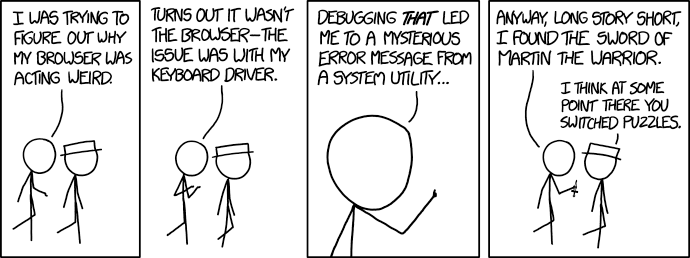

# Good Programming Practice

:::{dropdown} Learning Goals
By the end of this section you will:
- understand why good programming practice improves reliability, efficiency, and teamwork
- know how to apply style guides like PEP 8 to format and organise code
- know how to write maintainable code using naming conventions, comments, and small functions
- understand the importance of reducing cognitive load in code structure
- know how to write dependable code that handles errors and unexpected inputs
- understand and apply strategies to improve algorithmic and code efficiency
- know how to test programs using exploratory, unit, and integrated testing
- know how to identify and fix syntax, runtime, and logic errors
- know how to write docstrings and block comments to explain code clearly
- understand what code portability is and how to write cross-platform Python code
:::

<p>&nbsp;</p>

Good programming practice is important because it makes code easier to read and understand, which helps developers quickly identify and fix errors. It improves the reliability and performance of digital solutions, making them more effective and efficient. Following consistent practices also supports teamwork, as well-structured code is easier for others to read, maintain, and build upon. Additionally, it ensures that solutions are scalable and adaptable, allowing for future updates or changes without introducing new problems.

There are many good programming practices that should be followed. These need to be applied from the very beginning, starting with algorithm development.

## Dependability

Code dependability refers to how reliable and consistent a program is when it runs. Dependable code performs as expected under different conditions, handles errors gracefully, and does not crash or behave unpredictably. It includes writing code that is well-tested, handles edge cases, and can recover from unexpected inputs or failures. Dependable code is essential for building trust in the digital solution and ensuring a good user experience.

<p>&nbsp;</p>

In systems engineering, dependability is a measure of a system's maintainability and reliability.

### Maintainability

<p>&nbsp;</p>

Developers often say that code is read more than it is written. This is especially true when multiple people are working on the same project. Even in a classroom setting, maintainability matters — your code might be reviewed by a classmate, a teacher, or even your future self trying to make sense of what you once wrote.

:::{hint} What is Cognitive Load?
:class: dropdown
Cognitive load is the amount of mental effort needed to understand and work with information. It increases when information is confusing, overly complex, or badly organised, making it harder to think clearly and complete tasks.

Reducing cognitive load is important for improving focus, learning, and problem-solving. This can be done by presenting information simply, using clear language, giving step-by-step instructions, and removing unnecessary distractions to make tasks easier to manage.
:::

Maintainability is about writing code that is easy to read, understand, and update. It reduces cognitive load by keeping code clear and predictable, making it easier to identify and safely change the specific parts that need updating, without accidentally breaking other parts of the program.

:::{hint} What are Dependant Modules?
:class: dropdown
If your code imports and uses another module, it becomes dependent on that module. This means changes to the way the imported module works *could* break your code. Things get more complex when you consider that the module you imported may itself depend on other modules, which might also rely on additional modules.

This sequence of interconnected modules, where each one depends on the previous, is known as a **dependency chain**.
:::

<p>&nbsp;</p>

Here are some simple ways to improve your code's maintainability:

- **Follow the style guide**

  - Creates consistency across different code files (e.g. always using 4-space indentation)
  - Python’s official guide is called [PEP 8](https://peps.python.org/pep-0008/)
  - The Python extension in VSCode helps flag style issues
  - We will also use the [Ruff VS Code Extension](https://marketplace.visualstudio.com/items?itemName=charliermarsh.ruff) to automatically format our code to follow PEP 8

- **Use naming conventions**

  - Typically part of the style guide, but important enough to highlight separately
  - Good names give clues about what a variable or function does
  - Details are explained [further down the page](#naming-conventions)

- **Keep functions small**

  - Break up your code so each function does one clear task
  - Smaller, focused functions are easier to test and update

- **Add comments**

  - Comments explain what your code does and why
  - This helps others (and your future self) quickly understand key parts of your logic
  - More about commenting is included later on this page

### Reliability

Reliability is how likely a program is to run without errors or failures when performing a task.

- In Digital Solutions, testing and usability play key roles in improving reliability.
- For example, anticipating potential user or system errors helps you choose the right programming constructs to handle them effectively.

:::{seealso} Dependability Activities
:class: dropdown
1. What makes code dependable, and how can this affect the user's trust in a digital solution?
2. How does writing code that is easy to understand and update improve its maintainability?
3. Why is it important to reduce cognitive load when writing code?
4. What is a dependency chain, and how can it affect the reliability of a program?
5. How do small, well-named functions and comments contribute to better maintainability?
6. What role does consistent formatting and style (like PEP 8) play in dependable coding?
7. How can anticipating user errors improve the reliability of a digital solution?
8. What is the connection between testing and a program's reliability?
9. How can good naming conventions help reduce confusion in multi-person projects?
10. Why is it important for a program to handle edge cases and unexpected inputs gracefully?
:::

---

## Efficiency

Efficiency is when a system completes its tasks using the least possible time and processing power. There are two main types:

### Algorithmic Efficiency

This refers to how reliably and quickly an algorithm solves a problem, using clear and structured programming techniques to keep solutions concise and effective.

To achieve algorithmic efficiency in your programs, you can follow these simple practices:

- **Pick the right data structure:** Use structures like lists, dictionaries or sets that help you store and access data quickly.
- **Avoid unnecessary steps:** Don’t repeat the same actions if you don’t need to. Keep your code clean and direct.
- **Use better algorithms:** Some algorithms solve problems faster than others. For example, binary search is quicker than checking every item one by one.
- **Write better loops:** Try not to use loops inside other loops unless needed. Also, end a loop early if you’ve already found what you’re looking for.
- **Break your code into small parts:** Write small functions that do one job well. This makes your code easier to manage and faster to test.
- **Think about how your code grows:** As the amount of data gets bigger, your code should still run well. Try to reduce how much time and memory your code needs.

### Code Efficiency

Code efficiency is closely related to algorithmic efficiency. It focuses on reducing resource usage and execution time while maintaining stability. For example, using a `for` loop instead of repeating multiple `if`, `then`, `else` statements improves both performance and readability.

<p>&nbsp</p>

To achieve code efficiency in your programs, you can follow these tips:

- **Keep your code simple and clear:** Write code that is easy to read and understand. Avoid overcomplicating it.
- **Reuse code with functions:** If you do the same task more than once, write a function. This avoids repeating code and makes it easier to update.
- **Use loops and conditions smartly:** Choose efficient structures like `for` or `while` loops instead of repeating code with lots of `if-else` statements.
- **Avoid unnecessary calculations:** Don’t calculate the same thing multiple times—store it in a variable if you need it again.
- **Choose efficient operations:** For example, using a list to store values is fine, but if you need to look things up quickly, a dictionary might be better.
- **Test and improve your code:** Try your code with different amounts of data and look for ways to make it faster or use fewer resources.

:::{seealso} Efficiency Activities
:class: dropdown
1. What does it mean for a system to be efficient in terms of time and processing power?
2. How does choosing the right data structure improve algorithmic efficiency?
3. Why should unnecessary steps be avoided when writing code?
4. What makes some algorithms faster than others for solving the same problem?
5. Why is it a good idea to avoid nested loops unless necessary?
6. How can breaking code into small functions help improve efficiency?
7. What should you consider about your code as the amount of data increases?
8. How is code efficiency related to algorithmic efficiency?
9. Why is a `for` loop often more efficient than using repeated `if-then-else` statements?
10. How does writing clear and simple code affect efficiency?
11. Why is reusing code through functions more efficient than repeating tasks?
12. How can storing repeated calculations in a variable improve code performance?
13. What is the benefit of using a dictionary instead of a list when looking up data?
14. Why is testing your code with different data sizes important for improving efficiency?
:::

---

## Effectiveness

Effectiveness measures how well an algorithm solves the intended problem. While simple problems can be tested with a desk check, most algorithms must be written, run, and tested in the correct context to determine if they work as expected.

To ensure your algorithm is effective, follow these steps:

- **Understand the problem clearly:** Make sure you know what the problem is asking and what a correct solution looks like.
- **Define success criteria:** Decide how you will measure whether the solution works — e.g. correct output, valid data, or user satisfaction.
- **Design and plan your algorithm:** Break the problem into smaller steps using pseudocode or flowcharts before coding.
- **Write the code carefully:** Follow your plan and keep your logic clear and structured.
- **Test the code with real data:** Use different inputs, including edge cases and invalid data, to check if the algorithm works properly in all situations.
- **Evaluate and refine:** Look at the results. If something doesn’t work or can be improved, go back and fix the algorithm.
- **Use feedback:** If other users or testers try your solution, listen to their feedback to improve it further.

:::{seealso} Effectiveness Activities
:class: dropdown
1. What does effectiveness measure in relation to an algorithm?
2. Why is it important to understand the problem clearly before designing an algorithm?
3. What is the purpose of defining success criteria when creating a solution?
4. How can breaking a problem into smaller steps help when designing an algorithm?
5. What is the role of pseudocode or flowcharts in algorithm design?
6. Why is it important to keep your logic clear and structured when writing code?
7. How does testing with real data, including edge cases and invalid inputs, help ensure effectiveness?
8. What should you do if your algorithm does not work as expected after testing?
9. How can user or tester feedback be used to improve an algorithm?
10. Why might a desk check be enough for simple problems but not for more complex ones?
:::

---

## Testing

<p>&nbsp;</p>

Testing is the process of systematically checking that your code performs as expected. It plays a key role in ensuring a solution is **effective** (solves the intended problem), **efficient** (runs smoothly and quickly), and **dependable** (works reliably under different conditions). Testing should happen throughout development and involves three main types:

- **Exploratory testing**
  Informal testing done without a set plan. It helps check overall behaviour by trying out features and experimenting. This is useful for spotting unexpected issues early and ensuring the solution feels effective and usable.

- **Unit testing**
  Focuses on testing individual parts of the code (like functions or classes) to make sure each component behaves correctly. This improves dependability by catching errors close to the source.

- **Integrated testing**
  Checks how different components work together. It helps identify issues that only appear when parts of the system interact, supporting both dependability and efficiency by ensuring smooth operation across the whole program.

By combining all three types of testing, you can refine your solution to be more reliable, solve the problem accurately, and perform well.

:::{seealso} Testing Activities
:class: dropdown
1. What is the main purpose of testing in software development?
2. How does testing contribute to making a solution effective, efficient, and dependable?
3. Why should testing occur throughout the development process?
4. What is exploratory testing and how is it useful?
5. How does exploratory testing help identify unexpected issues?
6. What is unit testing and what part of the code does it focus on?
7. How does unit testing improve the dependability of a program?
8. What is integrated testing and what does it aim to check?
9. Why is integrated testing important for checking interactions between components?
10. How do the three types of testing work together to refine a digital solution?
:::

---

## Debugging

<p>&nbsp;</p>

Debugging is the process of identifying and fixing errors (called *bugs*) in a program that stop it from working correctly. These bugs might cause the program to crash, behave unexpectedly, or give incorrect output.

In **Python**, bugs can happen for many reasons &mdash; such as syntax mistakes, incorrect variable names, bad logic, or unexpected data types. Because Python runs line-by-line, a single error can stop the whole program. That’s why debugging is an important part of development.

If you're using **Visual Studio Code (VSCode)** to write Python, it has built-in tools that make debugging easier. 

<iframe width="560" height="315" src="https://www.youtube-nocookie.com/embed/Qe1oCJk-DYU?si=gS75xZhxPVo1fhK8" title="YouTube video player" frameborder="0" allow="accelerometer; autoplay; clipboard-write; encrypted-media; gyroscope; picture-in-picture; web-share" referrerpolicy="strict-origin-when-cross-origin" allowfullscreen></iframe>

:::{tip} Summary
:class: dropdown
- **Setup**: To get started, you need to install the **Python** and **Python Debugger** extensions in VS Code.
- **Starting the Debugger**: You can start a debug session by going to the "Run and Debug" tab and clicking "Run and Debug". VS Code will ask you to select a debug configuration; for a simple script, choosing "Python File" is sufficient.
- **Breakpoints**:
  - A **breakpoint** is a marker on a line of code that tells the debugger to pause execution at that point. You can set one by clicking in the gutter to the left of the line number.
  - When the code pauses, you can inspect the current values of all variables in the "Variables" panel.
- **Debugger Controls**: Once paused, a toolbar appears with several options:
  - **Continue**: Resumes the program until it hits another breakpoint or finishes.
  - **Step Over**: Executes the current line and moves to the next one in the same function.
  - **Step Into**: If the current line is a function call, this will move the debugger into that function's code.
  - **Step Out**: If you are inside a function, this will execute the rest of the function and return to the line where it was called.
- **Conditional Breakpoints (Expression Breakpoints)**:
  - This is a powerful feature where you can set a condition on a breakpoint. The debugger will only pause if that condition is true
  - To set one, right-click the breakpoint, select "Edit Breakpoint," and enter an expression (e.g., `y == 0`). This is extremely useful for debugging errors that only happen under specific circumstances.
- **Live Variable Editing**:
  - While the code is paused, you can directly edit the values of variables in the "Variables" panel. This allows you to test different scenarios or manually fix a problematic value to see if the rest of the code runs correctly.
:::

* **The Debug Panel** lets you run your Python code step by step, so you can see exactly what your program is doing.
* You can set **breakpoints** (red dots beside the line numbers) to pause the program at certain points and inspect what’s happening.
* The **variables panel** shows the current values stored in your variables while the code is paused.
* The **watch panel** lets you keep track of specific expressions or values as the code runs.
* You can use the **call stack** to see which functions were called and in what order.

VSCode also supports **print-based debugging**, where you add `print()` statements to show what your code is doing at certain points. This is useful for quick checks or when you’re not sure where the bug is hiding.

By using these tools and strategies, you can quickly find and fix bugs to make your Python programs more reliable.

:::{seealso} Debugging Activities
:class: dropdown
1. What is debugging and why is it important in Python programming?
2. What kinds of problems can bugs cause in a Python program?
3. Why can a single error stop a Python program from running?
4. What tools does VSCode provide to help with debugging Python code?
5. How do you start a debug session in VSCode for a simple Python script?
6. What is a breakpoint and how do you set one in VSCode?
7. What does the “Variables” panel show during debugging?
8. What is the purpose of the “Step Over” control in the debugger?
9. How does “Step Into” differ from “Step Over” when using the debugger?
10. What does “Step Out” do during a debug session?
11. How can conditional breakpoints help you find specific types of bugs?
12. What expression might you use to pause when a variable equals a certain value?
13. What can you do with live variable editing while the code is paused?
14. How can the “watch panel” help track specific values or conditions?
15. What does the call stack display during a paused debug session?
16. When might you use print-based debugging instead of the debugger?
17. How do breakpoints and the variables panel work together to help find bugs?
18. What steps should you take to prepare VSCode for Python debugging?
19. Why is it useful to test different values while paused using live editing?
20. How do these debugging tools help make Python programs more reliable?
:::

---

## Error Correction

Fixing errors is a normal and essential part of programming. Over time, experienced developers become skilled at identifying and correcting the mistakes they make. 

<p>&nbsp;</p>

During program development, three main types of errors can occur:

### Syntax Errors

Syntax errors happen when the code breaks the rules of the programming language. These errors prevent the program from running at all and must be fixed before execution. Most integrated development environments (IDEs) will highlight syntax errors automatically.

Examples include:

- Misspelling a command (e.g. writing `pint` instead of `print`)
- Using a variable before declaring it
- Missing or mismatched brackets

### Runtime Errors

Runtime errors happen while the program is running. These usually cause the program to crash. They often occur when the program tries to perform an action that isn’t allowed, like accessing a list index that doesn’t exist.

Examples include:

- Trying to access the 6th item in a list that only has 5 items
- Attempting to divide a number by zero (e.g. `x = 10 / 0`)
- Trying to perform a calculation with incompatible data types, such as adding a number and a string (e.g. `result = 5 + "hello"`)

### Logic Errors

Logic errors occur when the program runs but doesn’t behave as expected. These mistakes don’t crash the program, but they cause it to produce incorrect results or actions.

Examples include:

- Using the wrong condition (e.g. `< 5` instead of `<= 5`)
- Misusing Boolean operators
- Creating an unintended infinite loop
- Misplacing brackets in calculations
- Reusing variable names incorrectly
- Poor program design

:::{seealso} Error Correction Activities
:class: dropdown
1. What is error correction in programming and why is it important?
2. How do experienced developers improve their ability to fix errors?
3. What are the three main types of errors that can occur during program development?
4. What causes a syntax error in Python?
5. Why must syntax errors be fixed before a program can run?
6. How can IDEs help identify syntax errors?
7. What are some common examples of syntax errors?
8. When do runtime errors occur in a program?
9. What can happen when a program tries to divide by zero?
10. Why does adding a number and a string cause a runtime error?
11. What is an example of a runtime error caused by list indexing?
12. What makes logic errors different from syntax and runtime errors?
13. Why might a program with a logic error still run without crashing?
14. How can using the wrong condition in a statement cause a logic error?
15. What are some common causes of logic errors related to calculations?
16. Why is reusing variable names in the wrong way a problem?
17. What is the effect of an unintended infinite loop in a program?
18. How can Boolean operators lead to logic errors if misused?
19. What type of error occurs if a variable is used before it’s declared?
20. How can poor program design contribute to logic errors?
:::

---

## Coding Conventions

<p>&nbsp;</p>

### Code Simplicity

Code simplicity means writing programs in a way that is easy to read and understand. It focuses on using clear logic, meaningful variable names, and avoiding unnecessary complexity. 

<p>&nbsp;</p>

Simple code is easier to test, fix, and update, making it more efficient and less likely to contain errors.

### Naming Conventions in Python

<p>&nbsp;</p>

Python has **naming rules** (which must be followed or you'll get an error) and **naming conventions** (which help others understand your code better).

**Naming rules:**

- Only letters, numbers, and underscores (`_`) are allowed
- No spaces
- Cannot start with a number
- Names are case-sensitive (`name` and `Name` are different)

**Naming conventions:**

- Use meaningful, descriptive names:
  - `x = 30` → unclear
  - `temperature = 30` → better
  - `temperature_celsius = 30` → best
- Use `snake_case` for variables and functions:
  - Use lowercase
  - Separate words with underscores (`_`)
  - Example: `max_speed_limit`
- Use `UPPER_CASE` for constants:
  - Example: `MAX_SIZE = 100`
- Use `CamelCase` for class names:
  - Capitalise each word
  - No underscores
  - Example: `DataProcessor`
- Avoid using Python keywords as names:
  - e.g. `print`, `for`, `if`, `while`


### Commenting

If you use meaningful names following naming conventions, most of your code will be easy to understand without extra explanation. 

<p>&nbsp;</p>

However, comments are still important in two key places:

- **Docstrings** — placed directly after a function definition, they describe the function’s inputs, processes, and outputs. IDEs use docstrings to show help messages, hints, and tooltips while you write code.

```python
def calculate_area(width, height):
    """
    Calculates the area of a rectangle.
    
    Parameters:
    width (float): The width of the rectangle.
    height (float): The height of the rectangle.
    
    Returns:
    float: The area of the rectangle.
    """
    return width * height
```

- **Block comments** — used to explain complex or unclear sections of code that aren’t immediately understandable.

```python
# Find the index of the first prime number in the list
# This uses a basic method and stops once it finds one
for i in range(len(numbers)):
    if is_prime(numbers[i]):
        prime_index = i
        break
```

### Code Portability

Code portability means writing code that works across different platforms and systems without needing changes. This makes the code more flexible and useful. We’ll be using Python, which runs on Windows, macOS, Linux, as well as embedded systems, iOS, Android, and the web.

:::{seealso} Coding Conventions Activities
:class: dropdown
1. What does code simplicity mean and why is it important?
2. How does using clear logic and meaningful variable names improve code quality?
3. Why is simple code easier to test, fix, and update?
4. What are Python’s naming rules that must be followed to avoid errors?
5. Why is it important that variable names do not start with a number in Python?
6. What does case-sensitive mean in relation to Python variable names?
7. What is the difference between naming rules and naming conventions in Python?
8. Why is `temperature_celsius` a better variable name than just `x`?
9. What is `snake_case` and when should it be used?
10. How should constants be written according to Python conventions?
11. What is `CamelCase` used for in Python?
12. Why should Python keywords not be used as variable names?
13. When are comments necessary even if meaningful names are used?
14. What is a docstring and where is it placed in Python code?
15. What information should a docstring include about a function?
16. How do IDEs use docstrings to assist programmers?
17. When should block comments be used in a Python program?
18. How do block comments help explain unclear code sections?
19. What does code portability mean?
20. Why is Python considered a portable language?
:::

:::{seealso} Good Programming Practice Activity
:class: dropdown
You are part of a development team creating a simple Python console app for a cinema booking system. A former developer has left the code in poor condition: it’s buggy, hard to read, and doesn’t follow good programming practice. Your job is to apply your understanding of good programming practices to review, fix, and improve the code.

Instructions:

1. Download and Review the Starter Code: [booking code](./assets/03/booking_system.py)
2. Code Analysis:
   - Identify and highlight examples of poor programming practice.
   - Categorise the problems into:
     - Style and naming issues
     - Maintainability issues (e.g. long functions, poor structure)\
     - Efficiency problems (e.g. repeated code)
     - Errors (syntax, runtime, or logic)
  - Use the following questions:
    - Where does this code break the [PEP 8 style guide](https://peps.python.org/pep-0008/)?
    - Are there any unnecessary calculations or repeated code blocks?- Can you find any infinite loops or bugs from invalid input?
    - What parts would be hard for a teammate to understand?
3. Debugging Challenge:
   - Set **breakpoints** at key lines (e.g. user input, booking confirmation)
   - Use **Step Into**, **Variables panel**, and **Live Variable Editing** to track a logic error (e.g. booking overwrites existing bookings)
   - Write a short summary of how the debugger helped you fix the issue
4. Refactor the Code:
   - Apply good programming practices:
     - Rename variables using meaningful names and `snake_case`
     - Break long code into small functions
     - Add docstrings and block comments
     - Catch and handle runtime errors using `try-except`
     - Replace inefficient logic (e.g. repeated ifs &rarr; loop or dictionary)
     - Test edge cases like no input, long names, or double bookings
5. Testing Plan (15 mins)
   - Design and carry out:
     - One **exploratory test**: Try unexpected inputs or misuse
     - Two **unit tests**: Test individual functions you wrote/refactored
     - One **integrated test**: Run the whole program with realistic input
   - Document:
     - What worked and what didn’t?
     - What bugs did you find using each type of test?
:::