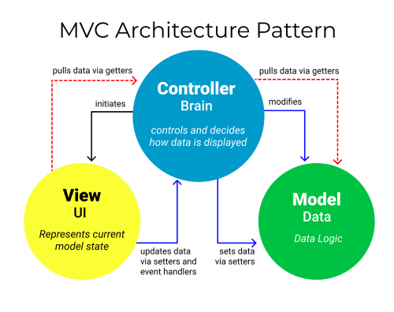

# Programming Paradigms

:::{dropdown} Learning Goals
By the end of this section you will:
* understand what a programming paradigm is and why different paradigms are used
* know how object-oriented programming (OOP) models software using classes and objects
* identify and explain the four core principles of OOP: encapsulation, inheritance, polymorphism, and abstraction
* describe how event-driven programs use events, event handlers, and event loops
* understand the purpose and structure of the Model-View-Controller (MVC) pattern
* explain how MVC supports modularisation and separation of concerns in application design
* know how the controller connects the model and view in the MVC pattern
* recognise when to use OOP, event-driven programming, or MVC depending on the type of application
:::

## Object-Oriented Programming (OOP)

Object-Oriented Programming (OOP) is a coding approach that structures software around **objects**, which represent real-world entities or ideas. Each object is created from a **class**, which acts as a blueprint. Objects have **attributes** (data) and **methods** (functions) that define how they behave.

The four core principles of OOP are:

1. **Encapsulation** – Hides an object’s internal details and allows interaction only through defined methods, helping protect data and reduce complexity.
2. **Inheritance** – Lets one class inherit properties and methods from another, promoting code reuse and reducing repetition.
3. **Polymorphism** – Allows objects of different classes to be treated as the same type, enabling flexible and dynamic code.
4. **Abstraction** – Focuses on the essential features of an object while hiding unneeded details, simplifying complex systems.

OOP helps create clean, modular, and reusable code, making it a common choice in modern software development.

Python fully supports OOP and is one of the most widely used OOP languages today.

We explore these ideas in the [Deepest Dungeon course](https://damom73.github.io/python-oop-with-deepest-dungeon/). For a refresher, start with the [OOP Primer](https://damom73.github.io/python-oop-with-deepest-dungeon/oop_introduction.html).

---

## Event-Driven Programming

Event-driven programming is a style of programming where the program's behaviour is controlled by **events**, such as user actions, system signals, or messages from other parts of the system. Instead of running in a set order, the program waits for events and responds to them by running specific code called **event handlers**.

Key concepts include:

1. **Events** – Actions or signals that trigger code execution, such as mouse clicks, key presses, file downloads, or timer updates.
2. **Event Handlers** – Functions or methods that run when a specific event occurs. They define the response to that event.
3. **Event Loop** – A continuous loop that listens for events and sends them to the right handler when they happen.

Event-driven programming is widely used in GUIs, web development, games, and any system that needs to react to external inputs. It is supported by many languages including JavaScript (for the web), Python (with tools like Tkinter), and C# (with Windows Forms).

---

## MVC Architecture Pattern

The **Model-View-Controller (MVC)** pattern is a design approach that makes complex applications easier to manage by breaking them into modular parts. It is an example of modularisation and decomposition.

Parts of the MVC are:

- **Model (Data):**
  - The model manages the application's data and rules. 
  - It provides the data needed by the view and accepts changes through the controller.
  - In our projects this will consist of a `.bd` SQLite database file and a `datastore.py` file that provides **getter** and **setter** functions.
- **View (User Interface):**
  - The view displays the data and defines how the interface looks to the user. 
  - It updates when the model changes.
  - In our projects this will be a `.ui` file created in QtDesigner which produces a Qt User Interface.
- **Controller (Logic):**
  - The controller handles user input and acts as the bridge between model and view. 
  - It uses **getter** functions to fetch data from the model and update the view
  - It uses **setter** functions to send user changes back to the model.
  - In our projects this will be the `main.py` file.

### Why use MVC?

MVC supports **separation of concerns (SoC)** by keeping data, user interface, and logic separate. This makes the codebase easier to organise, test, and update—especially when multiple developers are working on different parts of the application.

:::{seealso} Programming Paradigms Activities
:class: dropdown
1. You’ve created a class called `Vehicle` and now want to create a `Car` class that shares its attributes and methods. Which OOP principle allows you to do this, and what are its benefits?

2. A developer is working on a weather app. They want to keep the code for displaying weather separate from the code that fetches the weather data. What architecture pattern should they use, and how does it support this separation?

3. Your program needs to respond when a user clicks a button or moves the mouse. What programming paradigm should you use, and how would event handlers help?

4. A team is working on a web app. One person is editing how the interface looks, while another is working on the database. Which part of the MVC pattern is each developer working on, and how does this structure help collaboration?

5. In a GUI application, a function runs automatically when the user presses a key. What is this function called, and how does it relate to the event loop?

6. You're building a game where each character has different stats and abilities. What programming paradigm would help you manage these characters as reusable objects with shared and unique behaviours?

:::