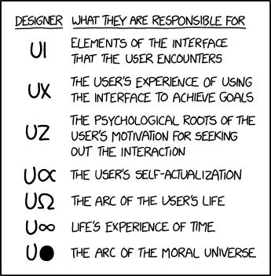

# User Experience Introduction

:::{dropdown} Learning Goals
By the end of this section you will:
- Understand what User Experience (UX) is.
- Understand why User Exeperience (UX) is important
:::

> UX design is all about the overall feel of the experience, while UI design is all about how the product’s interfaces look and function. `lamprecht_2022_ux`

## What is User Experience?

UX, or User Experience, refers to the overall experience that a person has when interacting with a product, service, or system, especially in the context of digital technology. It encompasses all aspects of a user's interaction, including how easy or difficult it is to use, the efficiency of the interaction, how enjoyable and satisfying the experience is, and whether it meets the user's needs and expectations. 

&nbsp;

UX design involves creating products and services that are user-centric, intuitive, and effective, with the goal of enhancing user satisfaction and ensuring that users can achieve their goals with minimal frustration. UX designers consider factors like usability, accessibility, visual design, information architecture, and user feedback to create a positive and meaningful user experience.

## Why is UX important

The user needs to be central to the development of the the User Experience (UX) and, subsequently, the User Interface (UI). These are examples of human-first design, or, to be more specific, user-first design.

This might seem obvious, but the history of digital solutions is littered with examples of developer-first design, where the solution is based on the developer's needs. Even worst is machine-first design where the solution is based on the needs of the machine running it.

:::{seealso} User Experience Activities
:class: dropdown
1. What does User Experience (UX) refer to in the context of digital technology?
2. Why is it important to focus on user-first design instead of developer-first or machine-first design?
:::
