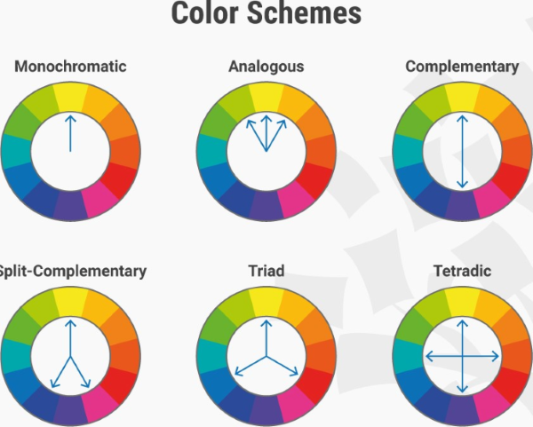

# Visual Communication

:::{dropdown} Learning Goals
By the end of this section you will:
- understand and be able to identify the seven principles of visual communication.
- understand and be able to identify the eight elements of visual communication.
- know how to manipulate visual communication elements to achieve the visual communication principles.
:::

> Visual communication is the practice of using visual elements to convey a message, inspire change, or evoke emotion. `nediger_2020_how`

We will consider two aspects of Visual Communication:

- Visual Communication Principles
- Visual Communication Elements

You use elements of visual communication to achieve the principles of visual communication.  An analogy, if the **principle** is the cake you want to make, then the **elements** are the ingredients you use to make it.

:::{seealso} Visual Communication Activities
:class: dropdown
The activity for this section will involve analysing a website and identifying where visual communication has been used.

The website we will analyse is the [Official Lego website](https://www.lego.com/en-au)
:::

## Visual Communication Principles

The principles of visual communication are the effects you wish to express with your design. They address the overall feel of your design and communicate a message to the user which effects the UI and UX. In other words the principles of visual communication are the **what** that you want to achieve.  

To remember the Visual Communication Principles use the mnemonic: **All Big Cats Have Really Hairy Paws**  

### Alignment

The arrangement of elements along a common axis or edge to create a sense of order, organization, and unity in a design. Alignment can be used to provide unity and proximity to the different elements used in the design. Good alignment aids readability and shows connections between different elements. Objects that are perfectly aligned provide a cleaner aesthetic and more professional appearance which inspires trust and confidence.

&nbsp;

**Alignment Examples**

| Type | Details |
| --- | --- |
| Left Align Text | Aligning the text to the left creates a clean and organized appearance. |
| Centre Align Headings | Draws attention and create a focal point. |
| Grid Layouts | Using a grid system ensures consistent alignment of text and images. |
| Bullet Points | Use consistent bullet points or numbering for lists to align items neatly. |
| Align Icons | Aligning icons and buttons helps improves learnability. |
| Align Charts and Graphs | Aligning labels, axes, and data points ensures clarity and accuracy. |
| Text and Image Alignment | Aligning text with related images aids in comprehension and aesthetics. |

:::{seealso} Alignment Activity
:class: dropdown
Analyse the [Official Lego website](https://www.lego.com/en-au) and identify where **alignment** has been used.
:::

### Balance

The distribution of visual elements within a design to create a sense of stability and equilibrium.

Balance occurs when the combination of elements on one side of a design appears equal to the other side. The weight of the design on each side can be influenced by use of colour, space and shape. For example, adding a dark colour to a small empty space on one side can balance a large area of black type on a white background.

&nbsp;

**Balance Examples**

| Type | Details |
| --- | --- |
| Symmetrical Balance | Identical or similar elements on both sides of a central axis. |
| Asymmetrical Balance | Balancing dissimilar elements by adjusting their size, colour, or position. |
| Radial Balance | Arranging elements radiating outward from a central point. |
| Colour Balance |  Distributing colours evenly across a design. |
| Text and Image Balance | Harmonizing the placement of text and images. |
| Whitespace | Use strategically to create balance by separating content. |
| Visual Weight | Heavier, dominant elements counterbalance lighter, less prominent ones. |

:::{seealso} Balance Activity
:class: dropdown
Analyse the [Official Lego website](https://www.lego.com/en-au) and identify where **balance** has been used.
:::

### Contrast

The juxtaposition of elements with differences in characteristics to create visual interest and emphasize distinctions.

Contrast is used to emphasise an element of the design by using a markedly different colour, size or other characteristic. Contrast is also an important factor for readability of text. It is important that there is high contrast between the colour used for typeface and its background colour.

&nbsp;

**Contrast Examples**

| Type | Details |
| --- | --- |
| Colour Contrast | Using colour schemes that emphasise contrast or complimentary colours. |
| Font Contrast | Combine fonts with different characteristics. |
| Scale Contrast | Vary the scale of elements. |
| Texture Contrast | Utilize different textures in your design. |
| Shape Contrast | Employ different shapes within your design. |
| Spacing Contrast | Adjust the spacing between elements. |
| Directional Contrast | Arrange elements in contrasting directions. |

:::{seealso} Contrast Activity
:class: dropdown
Analyse the [Official Lego website](https://www.lego.com/en-au) and identify where **contrast** has been used.
:::

### Harmony

The intentional use of design elements and principles to create a balanced, cohesive, and aesthetically pleasing composition.

Harmony is the pleasing effect of combining similar elements such as using similar colours, typeface and shapes throughout the design.

&nbsp;

**Harmony Examples**

| Type | Details |
| --- | --- |
| Colour Harmony | Use a colour palette with complementary or analogous colours. |
| Font Harmony | Select fonts that work well together and maintain consistency. |
| Design Elements | Maintain a consistent style for graphic elements. |
| Alignment and Grids | Ensure that elements are aligned properly using a grid system. |
| Whitespace | Use whitespace strategically to give content room to breathe. |
| Visual Rhythm | Establish a visual rhythm by repeating design elements. |
| Texture and Patterns | Use textures and patterns sparingly and consistently. |

:::{seealso} Harmony Activity
:class: dropdown
Analyse the [Official Lego website](https://www.lego.com/en-au) and identify where **harmony** has been used.
:::

### Repetition

Involves the consistent use of visual elements, such as colours, fonts, or shapes, to create a cohesive and recognizable design.

Repetition of the same element throughout the design brings consistency, unity and cohesion. For example, repetition of the same icon or button shape can reduce cognitive load and improve learnability for the user. However, too much repetition can become monotonous. Small variations in line, tone or colour to a repeated element can restore interest in the design and helps to retain user attention.

&nbsp;

**Repetition Examples**

| Type | Details |
| --- | --- |
| Consistent Fonts | Use the same heading font, subheadings font, and body text font. |
| Colour Palette | Use a predefined colour palette for all elements. |
| Logo Placement |  Place your logo in the same position on all materials. |
| Graphic Elements | Use the same icons, buttons, or graphical elements consistently. |
| Recurring Shapes | Reuse specific shapes or forms consistently. |
| Consistent Spacing | Maintain uniform spacing between text and objects. |
| Standardized Iconography | Use a set of standardized icons or symbols to represent concepts. |

:::{seealso} Repetition Activity
:class: dropdown
Analyse the [Official Lego website](https://www.lego.com/en-au) and identify where **repetition** has been used.
:::

### Hierarchy

The organization and prioritization of elements in a design to guide attention and convey the importance of information.

Hierarchy improves readability of the interface by emphasising more important elements with placement or size. Larger elements or those positioned towards the top of the design are considered more important.

&nbsp;

**Hierarchy Examples**

| Type | Details |
| --- | --- |
| Typography | Use different fonts, sizes, and styles for headings and subheadings. |
| Colour | Employ contrasting colours to highlight important elements. |
| Spacing | Increase the space around important content to draw attention. |
| Scale | Vary the scale of elements. Larger elements tend to grab more attention. |
| Positioning | Place key elements in strategic positions. |
| Contrast | Make use of contrast in to distinguish between levels of importance. |
| Visual Cues | Incorporate visual cues like arrows or pointers to direct attention. |

:::{seealso} Hierarchy Activity
:class: dropdown
Analyse the [Official Lego website](https://www.lego.com/en-au) and identify where **hierarchy** has been used.
:::

### Proximity

Elements placed close together are perceived as related or part of the same group, promoting organization and visual clarity.

Proximity is the positioning of elements near other elements. Proximity is an important factor in useability because it is easier to interact with a digital solution if similar functions are in close proximity to each other, such as the navigation links in a webpage.

&nbsp;

**Proximity Examples**

| Type | Details |
| --- | --- |
| Group Related Content | Place elements close together to indicate they are related. |
| Content Blocks | Cluster related text or images within clearly defined content blocks. |
| Contact Information | Group contact details in a distinct section. |
| Margins and Padding | Employ adequate margins and padding to separate text from images. |
| Icons and Labels | Position icons and their labels together to show association |
| Align Text and Graphics | Align text and images related to a specific topic. |
| Organize Data Tables | Place data labels, columns, and rows to convey the associations in a table. |

:::{seealso} Proximity Activity
:class: dropdown
Analyse the [Official Lego website](https://www.lego.com/en-au) and identify where **proximity** has been used.
:::

## Visual Communication Elements

The **elements** of visual communication are the building block of UI design. By manipulating visual communication elements to implement the principles of visual communication you achieve the desired effect on the UI and, subsequently the UX. In other words, the elements of visual communication are the **how** of what you want top achieve.

To remember the Visual Communication Elements use the mnemonic: **Curious Furry Lions Proudly Sit Sleeping Till Tuesday**

### Colour

Used to convey emotions, establish branding, guide user attention, and enhance usability.

Colour can provide contrast or emphasis, unify a design, fill a shape or space and imply emotion. A colour scheme can be inspired by a logo or photograph. Colour theory defines rules that can be used to select aesthetically pleasing colour combinations.

&nbsp;

**Colour Examples**

| Type | Details |
| --- | --- |
| Consistency | Consistent colour schemes create a pleasing and cohesive user experience. |
| Navigation | Highlight active and hover states of navigation links and buttons. |
| Feedback | Use colours to provide immediate feedback to users. |
| Accessibility | Ensure colour choices are accessible to all users by using colour contrast. |
| Focus Indicators | Using lines to highlight the focused element. |
| Themes | Option to select from different colour themes to personalize experience. |
| Emotion | Consider the psychological impact of colours. |

:::{seealso} Colour Activity
:class: dropdown
Analyse the [Official Lego website](https://www.lego.com/en-au) and identify how **colour** has been used to implement visual communication principles.
:::

### Form

The three-dimensional quality and structure of elements which helps users perceive them as tangible objects.

Form is the combination of other elements to create solid effects such as the use of tone and shape to create shadows, or the use of line, shape and colour to create a 3D perspective.

&nbsp;

**Form Examples**

| Type | Details |
| --- | --- |
| Buttons | Design buttons make them appear clickable. |
| Input Fields | Create the illusion of depth in input fields, making them seem indented. |
| Icons | Make icons appear as if they have volume and can be interacted with. |
| Cards | Create card components that appear to be floating above the background. |
| Pop up boxes | Design with a shadow or overlay to indicate their temporary nature. |
| Toggle Switches | Make toggle switches appear like physical switches that users can flip. |
| Tabs | Use bevelled edges or colour variations to distinguish the active tab. |

:::{seealso} Form Activity
:class: dropdown
Analyse the [Official Lego website](https://www.lego.com/en-au) and identify how **form** has been used to implement visual communication principles.
:::

### Line

The use of strokes or marks to define shapes, create structure, convey direction, or separate elements.

Lines can direct the user to a focal point, divide different sections, form shapes and provide emphasis. They can be thick, thin, straight or wavy. They can create order or encourage creativity.

&nbsp;

**Line Examples**

| Type | Details |
| --- | --- |
| Divider Lines | Adding horizontal or vertical lines to separate sections or content blocks. |
| Buttons | Using lines to create borders around buttons to make them stand out. |
| Underlines | Employing underlines for hyperlinks to indicate interactivity. |
| Borders | Employing lines as borders around images, panels, or entire components. |
| Focus Indicators | Using lines to highlight the focused element. |
| Arrows | Employing lines in arrow shapes to indicate direction. |
| Charts and Graphs | Creating various types of charts and graphs to represent data. |

:::{seealso} Line Activity
:class: dropdown
Analyse the [Official Lego website](https://www.lego.com/en-au) and identify how **line** has been used to implement visual communication principles.
:::

### Proportion

The balanced relationship between the sizes and spacing of elements, ensuring a harmonious and visually pleasing layout.

Proportion relates to the size or quantity of elements in the design in comparison with other elements. Images with disproportionate height and width appear distorted. Unbalanced proportions are usually unattractive but can be used strategically to provide emphasis.

&nbsp;

**Proportion Examples**

| Type | Details |
| --- | --- |
| Typography Hierarchy | Varying font sizes to proportionally emphasize different content. |
| Icon Size | Ensure icons are proportionate to their importance. |
| Image Scaling | Maintain consistent image proportions to avoid distortion. |
| Button Placement | Primary buttons prominent over secondary buttons. |
| Grid Layouts | Use to proportionally align and size elements. |
| Progress Bars | Proportional progress bars to indicate the completion of tasks. |
| Navigation Menus | Allocate space in navigation menus based on importance. |

:::{seealso} Proportion Activity
:class: dropdown
Analyse the [Official Lego website](https://www.lego.com/en-au) and identify how **proportion** has been used to implement visual communication principles.
:::

### Scale

The relative size of elements and how they visually relate to each other.

Scale refers to the size of an element. It can be used consistently to provide order and repetition to a design or contrasted to create a focal point or emphasis the importance of one element over another.

&nbsp;

**Scale Examples**

| Type | Details |
| --- | --- |
| Emphasizing Importance | Use larger scale for headline text compared to body text. |
| Visual Depth | Vary the scale of elements to create a sense of depth and hierarchy. |
| Visual Balance | Use scale to balance the layout, ensuring that no element dominates. |
| Consistency | Maintain a consistent scale for similar elements. |
| Visual Impact | Use scale to create visual impact. |
| Whitespace | Adjust whitespace scale of to control the spacing between elements. |
| Typography Hierarchy | Different font sizes for headings, subheadings, and body text. |

:::{seealso} Scale Activity
:class: dropdown
Analyse the [Official Lego website](https://www.lego.com/en-au) and identify how **scale** has been used to implement visual communication principles.
:::

### Shape

The use of different shapes can convey meaning, hierarchy, and interactivity within the user interface.

Shapes can be natural, abstract or geometrical. They can be used to symbolically represent an action or create proximity by grouping similar elements.

&nbsp;

**Shape Examples**

| Type | Details |
| --- | --- |
| Buttons | Rectangular or rounded shapes for buttons indicate interactivity. |
| Icons | Use simple shapes to represent actions or objects. |
| Containers | Group related content within shapes to create visual hierarchy. |
| Information alerts | Use shapes like triangles for warning signs or information alerts. |
| Navigation Menus | Employ horizontal or vertical rectangular shapes for navigation menus. |
| Callout Boxes | Use shapes with a distinct background to draw attention to specific content. |
| Toggle Buttons | Circular shapes can be used for toggling options on and off. |

:::{seealso} Shape Activity
:class: dropdown
Analyse the [Official Lego website](https://www.lego.com/en-au) and identify how **shape** has been used to implement visual communication principles.
:::

### Space

The intentional arrangement of empty areas impacting the overall composition's balance, readability, and emphasis.

Space is the area you have to work with. It includes space that is empty and space that contains text, images and other design features. Different uses of space can create clutter or it can create simplicity.

&nbsp;

**Space Examples**

| Type | Details |
| --- | --- |
| Margins and Padding |  Leave adequate margins and padding around UI elements. |
| Whitespace | Whitespace to create a clean and organized layout. |
| Button Spacing | Space between buttons prevent accidental clicks or taps. |
| Text Line Spacing | Adjust line spacing to enhance text readability. |
| Icon Spacing | Maintain consistent spacing between icons and labels. |
| Form Fields | Space form fields and labels appropriately to indicate association. |
| Error Messages | Give error messages or notifications sufficient space to stand out. |

:::{seealso} Space Activity
:class: dropdown
Analyse the [Official Lego website](https://www.lego.com/en-au) and identify how **space** has been used to implement visual communication principles.
:::

### Tone

The consistent and coherent use of colour shades and gradients to convey depth, hierarchy, and visual harmony.

Tone is the lightness or the darkness of a colour and can be contrasted to provide hierarchy, emphasis or separation of content.

&nbsp;

**Tone Examples**

| Type | Details |
| --- | --- |
| Depth and Hierarchy | Darker tones have higher importance, lighter tones less importance. |
| Buttons and Interaction | Change in tone to buttons when they are hovered over or clicked. |
| Typography | Variations in tone create contrast between text and its background. |
| Shadows | Shadow effects to give a three-dimensional appearance and depth. |
| Highlighting | Use tone to highlight selected or active elements. |
| Background Gradients | Subtle tone transitions gradients create a visually pleasing background. |
| Error Messages | Error Messages |

:::{seealso} Tone Activity
:class: dropdown
Analyse the [Official Lego website](https://www.lego.com/en-au) and identify how **tone** has been used to implement visual communication principles.
:::

### Texture

The visual surface quality of elements to evoke a tactile sensation and add depth and realism to the user interface.

Texture can be used to add interesting to a shape or space, attract attention or unify a design by linking it to the a real world idea with a similar texture.

**Texture Examples**

| Type | Details |
| --- | --- |
| Button Depth |  A subtle shadow texture makes buttons appear tactile and clickable. |
| Background Patterns | Subtle textures or patterns in the background add visual interest. |
| Material Design | Use textures and shadows to mimic real-world materials. |
| Texture for Feedback | Use textures as feedback mechanisms (eg, pressing a button) |
| Visual Hierarchy | Use different textures to differentiate between elements’ importance. |
| Theme Consistency | Ensure textures align with the overall theme and branding. |
| Content Separation | Use textures to separate content sections. |

:::{seealso} Texture Activity
:class: dropdown
Analyse the [Official Lego website](https://www.lego.com/en-au) and identify how **texture** has been used to implement visual communication principles.
:::
