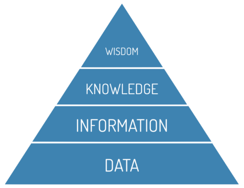

# Data Introduction

:::{dropdown} Learning Goals
By the end of this section you will:
- understand the nature of data-driven problems
- understand the DIWK Pyramid and how the value of data comes from processing it
- know the three layers of a data driven application.
:::

## What are Data-Driven Problems?

> Data can be enormously helpful with formulating policies, providing services and performing government tasks. This is something that we will tackle systematically. Taking a data-driven approach refers to the systematic collection, management, analysis, interpretation and application of data. `nldigibeter_2019_problem`

Data driven solutions have the following characteristics:

- They access data that has been collected:
  - This data may be collect by the solution or retrieved from a third-party
  - Quality of the data is important than the quantity
- They query that data:
  - The storage of the data must enable the querying of the data
- They interpret the data:
  - Analysis of the retrieved data to provide insight.

### The DIKW Pyramid

> The DIKW Pyramid is introduced is use to understand the way data is converted to wisdom, which is the one overall goal of data. `dataliteracy_2020_11`

Data needs to be transformed to become meaningful and meet the needs of the user. This process is represented by the **DIKW Pyramid**.

&nbsp;

<iframe width="560" height="315" src="https://www.youtube.com/embed/u9DoQ9gY4z4" title="YouTube video player" frameborder="0" allow="accelerometer; autoplay; clipboard-write; encrypted-media; gyroscope; picture-in-picture" allowfullscreen></iframe>

:::{tip} Developing Understanding using the DIKW Pyramid Summary
:class: dropdown
The DIKW Pyramid:
- **Data:** The base of the pyramid. It consists of raw, meaningless values or measurements.
- **Information:** The next level up, created by adding **context** (like who, what, when, where) to data. Both data and information are generally objective.
- **Knowledge:** Built by combining information with **experience**, which can be gained through study (second-hand) or life/work (first-hand). This level becomes subjective because experiences vary.
- **Wisdom:** The peak of the pyramid, formed by applying **action** to knowledge. It guides future decisions and is also subjective.

Other considerations:
- **Time Perspective:** Data, Information, and Knowledge are rooted in the **past**, while Wisdom is forward-looking and used to guide **future** actions.
- **Value and Meaning:** As you move **up** the pyramid, the **value increases**. Conversely, as you move **down** the pyramid, the **meaning decreases**.
:::

In summary:
- **data:** clear and definitive facts
- **information:** data + the context that data is found in
- **knowledge:** information + experience that relates to this kind of information
- **wisdom:** knowledge + action in response to the new knowledge

Consider this example for the DIWK Pyramid in action

- **data:** 3000mm
- **information:** 3000mm is the length of a timber board I am buying
- **knowledge:** previously I could not fit a 2600mm timber board in my car
- **wisdom:** I will have to get the board delivered

### What is data-driven programming

For the purposes of this course, data-driven programming is programming that filters, transforms and aggregates structured data.

## Working with data

A data driven application can be thought as having three different viewing layers:

- **External layer:**
  - what the end user will see (UI)
  - ensure the data is represented in a way that enhances understanding
- **Internal layer:**
  - relates to the underlying operational and physical storage such a file systems, management systems etc.
  - modern computer technologies automate this process.
- **Logical layer:**
  - conceptually sits between external layer and internal layer
  - relates to how data is stored that ensures:
    - **data integrity:** data is maintained to to continue to have meaning and value
    - **data reliability:** the ability to trust that data accurately reflects the facts descriptions or actions it is representing
    - **data validity:** the data meets defined formats, rules and criteria or order to maintain integrity and reliability
  - usually symbolic or structured representations that show links between data

:::{seealso} Data Solutions
:class: dropdown
1. What are the three key characteristics of data-driven solutions?
2. What does the DIKW Pyramid represent in the context of data use?
3. How does information differ from raw data in the DIKW Pyramid?
4. What transforms knowledge into wisdom according to the DIKW Pyramid?
5. Why does value increase as you move up the DIKW Pyramid?
6. What is an example of how a measurement like 3000mm can become wisdom?
7. What does data-driven programming involve in this course?
8. What are the three layers of a data-driven application?
9. What is the purpose of the external layer in a data-driven application?
10. What does the logical layer ensure in terms of data quality?
:::
