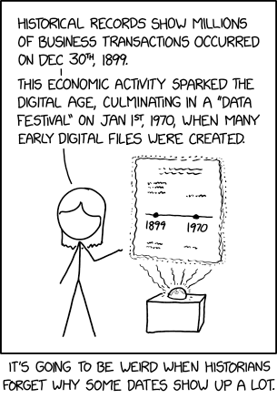

# Data Principles 📝

:::{dropdown} Learning Goals
By the end of this section you will:
- understand the issues involved in managing data, including acquisition, integrity, anomalies and security.
- understand data representation and how choices pertaining to it influence data.
:::

Data principles are fundamental guidelines that ensure data is collected, stored, processed, and used in ways that maintain its quality, reliability, and security.  

## Data Management 📝

Delivering a data-driven digital solution requires a detailed understanding of the data involved. Therefore it is vital to consider the data that underpins the application and issues related to managing that data.

These issues fall under four main categories:

- Data acquisition
- Data integrity
- Data anomalies
- Security and protection

### Acquisition 📝

Data acquisition is the process of collecting and capturing data from various sources and converting it into a usable digital format for further analysis and processing. In acquiring the your data you need to consider both the timeliness of the data acquisition and the ownership of the data.

**Timeliness**

Data is a point-in-time measurement, which means there is always a delay between between data creation and data entry. This difference is called data **timeliness**.

The impact of data timeliness data depends upon its purpose. A database that records daily temperature has a different timeliness demand than a database that records the core temperature of a nuclear powerplant. Despite both databases recording temperature, a delay of a minute would be of no concern for recording the daily temperature, but could be catastrophic for the nuclear powerplant.

In exploring the data needs of your solution, consider what delay there may be in your data acquisition, as well as, how much delay can be tolerated.

**Ownership**

There are three types of data ownership:
1. **Personal data ownership:** refers to an individual's ownership of their personal data, such as their name, address, and contact information.
2. **Corporate data ownership:** refers to the ownership of data generated and collected by an organization or company, such as customer data, sales data, and financial data.
3. **Public data ownership:** refers to data that is owned by the public or government, such as census data, public records, and government statistics.

It is possible for the data in a database to contain a mix of ownerships. Each type of data ownership has different handling requirements. It is important to identify the ownership of the data we are working with.

### Integrity 📝

Data integrity means keeping data **accurate**, **complete**, and **consistent** at every stage&mdash;from creation and storage to processing and sharing. It ensures that the data remains **trustworthy** and **protected** from unauthorized changes, loss, or damage. This is especially important in fields like healthcare, finance, and research, where reliable data is essential.

In analysing the data for your solution you should consider both the received data integrity in addition to steps you need to take to ensure the ongoing integrity of that data.

Data integrity depends on the data being:

- **complete**: all data elements are entered correctly and not elements are missing
- **accurate**: the data represents the truth and can be relied upon
- **kept up to date**: all changes to data occurs in a timely manner
- **consistent**: the manipulation of data is completed in a consistent manner
- **secure**: the data is protected from others who may intentionally corrupt it
- **relevant**: the data has meaning and use in the context of your solution

### Anomalies & Redundancy

Data anomalies refer to inconsistencies or errors that arise when storing or manipulating data in a database. These anomalies can occur in various forms, such as:

- **Insertion anomalies**: occur when it is not possible to insert data into a database table without also adding additional, unnecessary data.
- **Deletion anomalies**: occur when deleting data from a table inadvertently causes the loss of other related data that should have been retained.
- **Update anomalies**: occur when updating data in a table results in inconsistencies between related data items.

Identifying and resolving these data anomalies is critical for maintaining data integrity in databases and ensuring that the data is accurate, complete, and consistent.

Proper database design, normalization techniques, and data validation processes can help minimize the occurrence of data anomalies. We will learn about these techniques later in this Unit. For the purposes of the Explore phase, the prevention of such anomalies would form a requirement for your digital solution.

### Security and Protection

Security is essential to the success of any information system and the valuable data stored in it.  

**Threats**
The potential threats to your digital solution include:

- **malware:** software with malicious intent that can infect systems that serve a data-driven application. Malware examples include:
  - **viruses:** replicates itself by infecting other files and programs, causing damage to the system and potentially spreading to other devices.
  - **worms:** replicates itself and spreads across networks, consuming bandwidth and causing system slowdowns or crashes.
  - Trojans horses: disguises itself as legitimate software, tricking users into downloading and installing it, and then allowing unauthorized access to the system.
  - **ransomware:** encrypts files and demands payment in exchange for restoring access to them.
  - **spyware:** secretly monitors user activity and collects personal information, such as login credentials, credit card numbers, and browsing history.
  - adware: displays unwanted advertisements, often in the form of pop-ups or banners, and may redirect users to malicious websites.
  - **rootkits:** allows attackers to gain privileged access to a system, often remaining undetected and persistent even after system reboots or antivirus scans.
- **data theft and identity theft**: major concerns in relation to information systems and data-driven applications. Systems whose security measures become compromised can be mined for values, sensitive and private data.
- **invasion of privacy**: the security of data access and transmission can lead to invasion of privacy as information may be leaked, gathered, and used for blackmail or unsolicited marketing.

**Solutions**
Steps can be taken to minimise the risks presented by the potential threats. These include:

- **user-level access control**: a security mechanism that limits the access of users to specific resources or functionalities within a database based on their roles or permissions. User-level access control can protect a database in several ways:
  - **limiting access** to sensitive data or functionalities to only those users who have a legitimate need to access them, thus reducing the risk of unauthorized access or data breaches
  - **enforcing policies** such as password requirements, access restrictions, or data retention policies, which can help to ensure compliance with regulatory requirements or internal guidelines
  - **monitoring and auditing user activities** within the database, such as logins, data queries, or modifications, which can help to detect and investigate potential security breaches or policy violations.
- **encryption**: a process of changing data from human-readable text into text that is indecipherable, and is an important measure to protect sensitive data such as passwords, financial details, personal information, and intellectual property. There are two methods for encryption:
  - **encryption:** a two way process where a key is used to scramble and unscramble data. This is used when the data needs to be returned to its original form
  - **hashing:** a one way process where a key is used to scramble data. The data cannot be unscrambles, but hashing the same data will always produce the same result. This is generally used with passwords where a password is hashed before being stored. When a user logs in, their entered password is also hashed and the two hashed passwords are compared.
- **backup and disaster recover**: disasters are always made worse by not planning for them. Good database management practices:
  - regularly backup the database so that it can be restored if it fails.
  - log data transactions so that committed data changes can be rolled back

:::{seealso} Data Management Activities
:class: dropdown

1. What two key factors should be considered during data acquisition?
2. What are the three types of data ownership and how do they differ?
3. What does data integrity mean and why is it important for digital solutions?
4. What six qualities must data have to maintain integrity?
5. What is a data anomaly and how can it affect a database?
6. What are insertion, deletion, and update anomalies?
7. How can proper database design help reduce data anomalies?
8. What are some threats to the security of a data-driven application?
9. How does user-level access control help protect a database?
10. What is the difference between encryption and hashing when protecting data?
:::

## Data Representation

When we talk about **representation**, it's about how we turn different things, like numbers or text, into a language that computers understand, which usually involves using combinations of 0s and 1s for numbers and specific codes for letters and symbols. The way we do this is crucial because it affects how fast and accurately computers can work with data.  

### Text representation

Representing text is a significant issue when considering data. There are two main ways of representing text, ASCII and Unicode.

**ASCII** is like a simple language that computers first used, where each letter, number, or symbol is represented by a specific number. For example, the letter 'A' is represented by the number 65. This made it easy for early computers to work with text, but it had limitations because it could only represent a small set of characters, mainly English letters and symbols.

**Unicode**, on the other hand, is like a more advanced and universal language for computers. It can represent characters from almost all the world's languages, emojis, and special symbols. Instead of just using numbers like ASCII, it assigns a unique number to every single character in all these languages. So, whether you're typing in English, Chinese, Arabic, or even using emojis, Unicode ensures that computers understand and display it correctly.

Make sure you know which method you data uses.

### Other Data representations

The storage of data needs to be consistent. That means the way that one data point is stored is the same from record to record. For example 100,000 and $10^5$ are the same number, but they are represented differently. Before designing a database and storing data, the accepted format of this data needs to be decided.

&nbsp;

Some common data formats that need to be established:

- **Dates:**
  - dates have the widest range of accepted range of formats
  - date formatting is represented by:
    - d: day
    - m: month
    - y: year
  - common date formats (example is 13th August 1984):
    - dd/mm/yyyy    13/08/1984
    - dd/mm/yy      13/08/84
    - d/m/yy        13/8/84
    - mm/dd/yyyy    08/13/1984 (US date style)
    - yyyy-mm-dd      19840813 (this is the [international ISO 8601 standard](https://en.wikipedia.org/wiki/ISO_8601))
- **Time:**
  - time of day also has a range of accepted formats
  - time of day formatting is represented by:
    - H: 24hr hour
    - h: 12hr hour
    - m: minute
    - s: second
    - A: AM or PM
  - common time of day formats (example is 1:15pm)
    - HH:mm     13:15
    - hh:mmA    01:15pm
    - h:mmA     1:15pm
- **Numbers:**
  - numbers and are often formatted in a specific way (eg. phone numbers and currency) or may be expected to have specific number of places after the decimal point.
  - numbers formatting is represented by:
    - 0: required digit between 0 and 9
    - 9: optional number between 0 and 9
  - common number formats:
    - mobile number:    0000 000 000
    - landline number:  (00) 0000 0000
    - postcode:         0000
    - currency:         $ 90.00

:::{seealso} Data Representation Activities
:class: dropdown

1. What does representation mean in the context of computer systems?
2. How does ASCII represent characters in a computer system?
3. Why is Unicode preferred over ASCII for modern digital solutions?
4. What kinds of characters can Unicode represent that ASCII cannot?
5. Why is it important to know whether your data uses ASCII or Unicode?
6. Why must data storage formats be consistent in a database?
7. What are two different ways the number 100,000 can be represented?
8. Why must a data format be decided before designing a database?
9. What is the international standard format for writing dates and what is it called?
10. How is time formatted differently in 12-hour and 24-hour systems?
11. What symbols are used to represent hours, minutes, seconds, and AM/PM in time formatting?
12. What is the difference between 0 and 9 in number formatting rules?
13. What is a common format for an Australian mobile number?
14. How are decimal places commonly used in currency formatting?
:::
