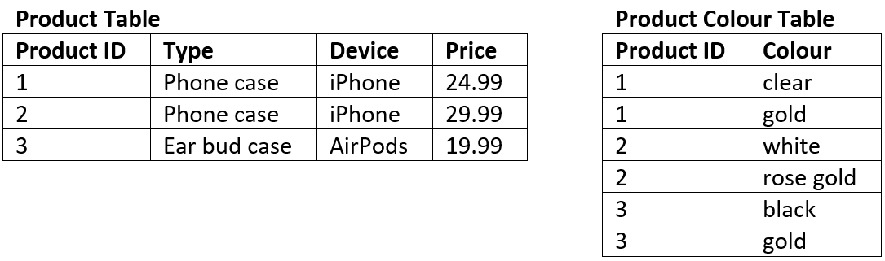
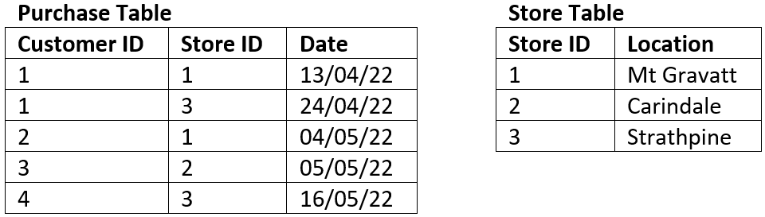
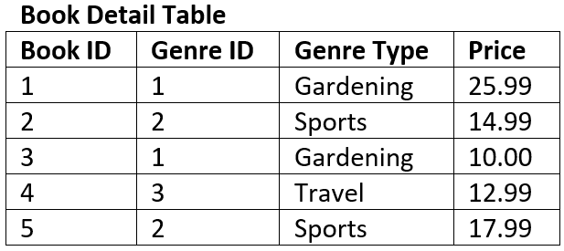

# Structuring Data

:::{dropdown} Learning Goals
By the end of this section you will:
- understand the features and limitations of flat file databases
- understand the features of relational databases  
- understand the impacts of redundancy
- understand the process of normalisation through 1NF, 2NF and 3NF
:::

## Database Types

### Flat File Databases

A flat file database is a type of database that stores data in a simple, two-dimensional table or spreadsheet-like structure. In a flat file database, information is organized into **rows** and **columns**, where each row represents a single **record** or entry, and each column represents a specific attribute or **field** of that record.

Unlike more complex relational databases, flat file databases do not have multiple tables with predefined relationships between them. Instead, all data is stored in a single file, making it easy to create and manage but limited in terms of its ability to handle complex data relationships.  

Flat file databases are often used for relatively small-scale data storage needs, such as simple lists, address books, or basic inventory records. They are easy to create and understand but may not be suitable for more complex and data-intensive applications.

---

### Relational Databases

<iframe width="560" height="315" src="https://www.youtube-nocookie.com/embed/oN3jBRGnPO4?si=DIvn1x_PiI9s69Fd" title="YouTube video player" frameborder="0" allow="accelerometer; autoplay; clipboard-write; encrypted-media; gyroscope; picture-in-picture; web-share" allowfullscreen></iframe>

:::{tip} What are Relational Databases for Beginners Summary
:class: dropdown
**What is a Relational Database?**

- It's a collection of data items with predefined relationships between them.
- Data is organized into **tables**, which consist of **columns** (attributes) and **rows** (records or tuples).
- Each row in a table is uniquely identified by a **primary key**.
- Relationships between different tables are established using **foreign keys**, which are primary keys from one table used in another.

**Anatomy of a Table**

The video shows a sample customer table to illustrate the concepts:
- **Table:** The entire structure (e.g., a "Customers" table).
- **Column (Attribute):** A vertical category of data (e.g., `Firstname`, `Birthdate`).
- **Row (Tuple):** A horizontal record representing a single entity (e.g., all information for one customer).
- **Primary Key:** A column with a unique value for each row, used for identification (e.g., `CustomerID`).
- **Data Value:** The actual information in a single cell (e.g., "John").

**Key Features of Relational Databases**

The video highlights four main features:
- **SQL (Structured Query Language):** The standard language used to interact with relational databases for tasks like adding, updating, deleting, and retrieving data.
- **Data Integrity:** The assurance of accuracy and consistency of data over its entire lifecycle. Relational databases enforce this through constraints.
- **Transactions:** A sequence of operations performed as a single logical unit of work. A transaction is "all-or-nothing"—it must either complete successfully (commit) or be entirely undone (rollback).
- **ACID Compliance:** A set of properties that guarantee transaction reliability:
  - **A**tomicity: Transactions are indivisible; they either happen completely or not at all.
  - **C**onsistency: A transaction brings the database from one valid state to another.
  - **I**solation: Concurrent transactions do not interfere with each other.
  - **D**urability: Once a transaction is committed, its changes are permanent, even in the event of a system failure.
:::

A relational database is a type of database that organizes and stores data in a structured manner, using a collection of tables with predefined relationships between them. It is based on the principles of relational algebra and was introduced by Edgar F. Codd in the 1970s.

In a relational database, data is organized into **tables**, where each table represents a specific **entity** or **concept**, and each **row** in the table represents a unique record or instance of that entity. **Columns** in the table represent attributes or characteristics of the entity.

The key features of relational databases include:

- **Tables**: Data is stored in tables with **rows** and **columns**, providing a clear structure for organizing information.
- **Relationships**: Tables can be **related** to each other through common (shared) fields called **keys**, allowing for complex queries and the retrieval of related data.
- **Integrity**: Relational databases enforce data integrity through **constraints**, ensuring that data remains **accurate** and **consistent**.
- **SQL (Structured Query Language)**: Relational databases use SQL for **querying** and **manipulating** data, making it a powerful tool for working with databases.
- **ACID Properties**: Relational databases adhere to ACID properties, which guarantee the reliability of data transactions:
  - **Atomicity**:
    - Atomicity treats a database transaction as an all-or-nothing operation.
    - It ensures that either the entire transaction is successfully completed, and its changes are applied, or none of it happens.
    - If any part of a transaction fails, the entire transaction is rolled back, ensuring data consistency.
  - **Consistency**:
    - Consistency ensures that a transaction transforms the database from one valid state to another valid state.- It prevents transactions from violating the integrity rules defined in the database schema.
    - If a transaction would break these rules, it is halted, and the database remains unchanged.
  - **Isolation**:
    - Isolation guarantees that concurrent transactions do not interfere with each other.
    - Each transaction runs as if it's the only one, preventing issues like data conflicts caused by simultaneous access.
    - Different isolation levels determine the degree of separation between transactions.
  - **Durability**:
    - Durability ensures that once a transaction is committed, its changes are permanent and survive system failures.
    - Committed data is stored in non-volatile memory (usually on disk) for recovery even in the event of a system crash.
    - Durability ensures data remains reliable and persistent over time.

Relational databases are widely used in various applications, from business systems to web applications, due to their ability to handle structured data and complex relationships efficiently. Popular relational database management systems (RDBMS) include MySQL, PostgreSQL, Oracle, SQL Server, and SQLite.

:::{seealso} Database Types Activities
:class: dropdown

1. What is a flat file database and how is its data structured?
2. Why might a flat file database be unsuitable for complex data relationships?
3. What are the key differences between flat file databases and relational databases?
4. How is data organized in a relational database?
5. What is a primary key and what is its role in a relational database table?
6. What is a foreign key and how does it create relationships between tables?
7. What is the purpose of SQL in relational databases?
8. What does ACID stand for in database transactions?
9. How does atomicity ensure data reliability during a transaction?
10. What is the role of consistency in a relational database transaction?
11. How does isolation protect data during simultaneous transactions?
12. Why is durability important after a transaction is committed?
13. What is a data value and where is it located in a table?
14. What are the benefits of using relational databases in business or web applications?

   :::

   ---

   ## Normalisation

   > Normalization is a database design technique that reduces data redundancy and eliminates undesirable characteristics like Insertion, Update and Deletion Anomalies. Normalization rules divides larger tables into smaller tables and links them using relationships. The purpose of Normalisation ... is to eliminate `richardpeterson_2019_what`

   <iframe width="560" height="315" src="https://www.youtube.com/embed/xoTyrdT9SZI" title="YouTube video player" frameborder="0" allow="accelerometer; autoplay; clipboard-write; encrypted-media; gyroscope; picture-in-picture" allowfullscreen></iframe>

   :::{tip} Basic Concept of Database Normalization Summary
   :class: dropdown
   **What is Normalization?**
   Normalization is a database design technique used to organize data into multiple, smaller, related tables. Its primary goal is to **minimize data redundancy**.

   **The Problem: Data Redundancy**
   Data redundancy is the unnecessary repetition of data in a database. The video illustrates this with an example of a single **STUDENTS TABLE** with the following columns:
- `rollno`
- `name`
- `branch`
- `hod` (Head of Department)
- `office_tel`

In this table, if there are multiple students from the same branch (e.g., Computer Science - CSE), the information for `branch`, `hod`, and `office_tel` is repeated for every single student record. This redundancy leads to several problems, known as **anomalies**:

- **Insertion Anomaly:** When adding a new student to the CSE branch, you must re-enter all the branch details (HOD name, office telephone number) again. This is inefficient and prone to error.
- **Deletion Anomaly:** If you were to delete the records of all students from a particular branch, you would also lose all information about that branch itself (who the HOD is, the office phone number), because that data only existed within the student records.
- **Updation (or Modification) Anomaly:** If the Head of Department (HOD) for the CSE branch changes, you would have to find and update *every single student record* for that branch. If even one record is missed, the database becomes inconsistent, with conflicting information about who the HOD is.

**The Solution: Applying Normalization**
Normalization solves these problems by following a "Divide and Rule" approach. It breaks down the large, problematic table into smaller, more manageable tables.

In the example, the single `STUDENTS TABLE` is split into two separate tables:

1. **New Student Table:**

   - `rollno`, `name`, `branch`
   - This table only stores information specific to each student.

2. **New Branch Table:**

   - `branch`, `hod`, `office_tel`
   - This table stores information specific to each branch. The branch details (like for CSE) are now stored only **once**.

   These two tables are related by the common `branch` column, which acts as a link between them.

   **How This Solves the Problems:**

- **Insertion Solved:** To add a new student, you only add a row to the `Student Table`. The branch information already exists in the `Branch Table` and does not need to be repeated.
- **Deletion Solved:** You can delete all student records from the `Student Table` without losing the branch information, which is safely stored in the `Branch Table`.
- **Updation Solved:** If the HOD changes, you only need to update it in **one single place**—the corresponding row in the `Branch Table`. This change is automatically reflected for all students in that branch because of the relationship between the tables.
:::

**Data redundancy** is **undesirable** because it results in:
- Increased database size
- Erosion of data integrity through:
  - **Insertion anomalies:** the need to repeat data when entering new values
  - **Deletion anomalies:** the loss of a related dataset when some other dataset is deleted
  - **Causes update anomalies:** the same entity can have conflicting values after an incorrect update

The process of **Normalisation** is the the most effective way of removing redundancy.

:::{seealso} Normalisation Activities
:class: dropdown

1. What is the main goal of database normalisation?
2. What is data redundancy and why is it considered a problem?
3. What is an insertion anomaly and how does redundancy cause it?
4. What is a deletion anomaly and how can it result in data loss?
5. How can update anomalies affect data consistency in a database?
6. How does normalisation reduce data redundancy?
7. What does the “Divide and Rule” approach mean in the context of normalisation?
8. In the example, what are the two tables created by normalising the STUDENTS TABLE?
9. How does normalisation solve the insertion anomaly in the student example?
10. How does updating the Head of Department become easier after normalisation?

   :::

   ### First Normal Form (1NF)

   <iframe width="560" height="315" src="https://www.youtube.com/embed/mUtAPbb1ECM" title="YouTube video player" frameborder="0" allow="accelerometer; autoplay; clipboard-write; encrypted-media; gyroscope; picture-in-picture" allowfullscreen></iframe>

   :::{tip} First Normal Form Summary
   :class: dropdown

- **Introduction to 1NF:** The First Normal Form is the first and most fundamental step in the normalization process. A table that is not in 1NF is considered to have a poor database design. Achieving 1NF is a prerequisite for moving to higher normal forms like 2NF and 3NF.
- **The Four Rules of 1NF:** To be in First Normal Form, a table must adhere to four basic rules:

  1. **Atomicity:** Each column must contain only atomic (single, indivisible) values. A single cell cannot hold multiple values.
  2. **Homogeneity:** All values within a single column must be of the same data type.
  3. **Unique Column Names:** Every column in the table must have a unique name.
  4. **Order Independence:** The order in which data (rows) is stored does not matter.

- **Example of 1NF Violation and Solution:** The video demonstrates these rules using a `STUDENTS TABLE` with columns for `rollno`, `name`, and `subject`:
  - **Violation:** The table initially violates 1NF because the `subject` column contains multiple subjects in a single cell (e.g., "OS, CN").
  - **Solution:** To bring the table into 1NF, the multi-valued `subject` column is broken down. This is done by creating a separate row for each subject a student has taken, which results in the student's `rollno` and `name` being repeated but ensures that every cell contains only a single value.
:::

A database is in **1st Normal Form** when :

- Each column contains **atomic values**
- Each column contains the **same type of data**
- Each column has a **unique name**
- The **order** in which the data is saved does not matter

**1NF Example**

The table below is not in 1NF:

- There are two columns with the name of Details
- The first Details column stores information about the type of product **and** the type of device
- The second Details column values are not atomic (each record has multiple colours stored)

&nbsp;

The tables below represent the same data in 1NF:

:::{seealso} First Normal Form Activities
:class: dropdown
Convert the following tables into 1NF

**Table 1**

| SaleID | Region | Product | Product |
| --- | --- | --- | --- |
| 301 | East | Laptop | $999 |
| 302 | West | Phone | $799 |
| 303 | North | Tablet | $599 |
| 304 | South | Monitor | $299 |
| 305 | East | Mouse | $49 |

**Table 2**

| BookID | Title  | Authors | Available |
| --- | --- | --- | --- |
| 401 | Python Basics | John, Maria | yes |
| 402 | Data Science Intro | Alice | 1 |
| 403 | SQL in Practice | Robert, Emma, Lee | 0 |
| 404 | Web Dev Essentials | Sophia | true |
| 405 | Coding with Kids | Chris, Dana | false |

**Table 3**

| EmployeeID | Name | Contact |
| --- | --- | --- |
| 201 | Oliver White | 0400123456 |
| 202 | Jack Smith | <jack@example.com> |
| 203 | Emily Rose | 0499123456 |
| 204 | Grace Blue | <grace@email.com> |
| 205 | Harry Gray | 0420123456 |

**Table 4**

| OrderID | CustomerName | Items              |
| ------- | ------------ | ------------------ |
| 101     | Emma Stone   | Laptop, Mouse      |
| 102     | Liam Gray    | Phone              |
| 103     | Ava Green    | Tablet, Stylus     |
| 104     | Noah Brown   | Monitor            |
| 105     | Mia Black    | Keyboard, Mousepad |

:::

---

### Second Normal Form (2NF)

<iframe width="560" height="315" src="https://www.youtube.com/embed/R7UblSu4744" title="YouTube video player" frameborder="0" allow="accelerometer; autoplay; clipboard-write; encrypted-media; gyroscope; picture-in-picture" allowfullscreen></iframe>

:::{tip} Second Normal Form Summary
:class: dropdown
**Understanding the Rules of Second Normal Form (2NF)**

For a table to be considered in Second Normal Form, it must satisfy two essential conditions:
1. **It must already be in First Normal Form (1NF).** This means the table has a primary key, and all columns contain atomic (indivisible) values, with no repeating groups.
2. **It must not have any Partial Dependencies.** This is the core rule of 2NF.

   **Explaining Dependency and Primary Keys**
   To understand *partial* dependency, the video first explains the concept of **functional dependency** using a simple `STUDENTS` table.

- **Example 1: The `STUDENTS` Table**
  - This table contains columns like `student_id`, `name`, `branch`, and `address`.
  - The `student_id` is the **Primary Key**, as it uniquely identifies each student record.
  - All other columns in the table (like `name` and `branch`) are functionally dependent on the `student_id`. This means if you know the `student_id`, you can uniquely determine the student's name, their branch, and their address.

**Explaining Partial Dependency with a Composite Key**
Partial dependency occurs when a table has a **composite primary key** (a primary key made up of two or more columns), and a non-key column depends on only a *part* of that composite key, not the whole thing.

To illustrate this, the video introduces a more complex scenario with three tables: `STUDENT`, `SUBJECT`, and a new `SCORE` table.

- **Example 2: The `SCORE` Table**
  - This table is designed to store the marks students get in different subjects.
  - Its columns are: `score_id`, `student_id`, `subject_id`, `marks`, and `teacher`.
  - In this table, no single column can uniquely identify a row. A student can have multiple scores (for different subjects), and a subject is taken by multiple students.
  - Therefore, the primary key must be a **composite key** formed by **(`student_id` + `subject_id`)**. This combination uniquely identifies a specific student's score in a specific subject.
  - The problem arises with the `teacher` column. The teacher of a subject (e.g., Mr. J teaches Java) depends only on the `subject_id`, not on which student (`student_id`) is taking the course.
  - This is a **partial dependency**: The `teacher` column depends on only one part (`subject_id`) of the two-part composite primary key.

**How to Achieve 2NF by Removing Partial Dependency**
A table with partial dependency is not in 2NF. To fix this, the dependency must be removed by decomposing the table.

1. **Identify the Partial Dependency:** Recognize that the `teacher` column depends on `subject_id` but not `student_id`.
2. **Decompose the Table:** The solution is to move the column causing the issue (`teacher`) along with the part of the key it depends on (`subject_id`) into a separate, more appropriate table.
3. **Create a New Structure:**

   - The `SCORE` table is simplified to contain only `score_id`, `student_id`, `subject_id`, and `marks`. Its primary key remains (`student_id` + `subject_id`).
   - The `teacher` information is moved to the `SUBJECT` table. The `SUBJECT` table now contains `subject_id`, `subject_name`, and `teacher`.

   After this change, the `SCORE` table has no more partial dependencies, and the entire database structure is now in **Second Normal Form**. The video also notes that an even better design would be to create a separate `TEACHER` table to avoid redundancy if one teacher teaches multiple subjects.
   :::

   A database is in **2nd Normal Form** when:

- It is in **1NF**
- There are no **partial dependencies:**
  - where an attribute is only dependant upon *part* of a composite key
  - this can only happen when you have a composite key

**2NF Example**

The table below is not in 2NF:

- The composite key is *Customer ID* and *Store ID*.
- *Date* is dependent on both the *Customer ID* and the *Store ID*.
- *Location* is only dependent on the *Store ID* it has no connection to *Customer ID* at all, therefore it is a partial dependency.

The tables below represent the same data in 2NF

:::{seealso} Second Normal Form Activities
:class: dropdown
Convert the following tables into 2NF

**Table 1**

Composite Key: (student_id, course_id)

| student_id | course_id | student_name | course_title | grade |
| --- | --- | --- | --- | --- |
| 101 | C01 | Alice | Web Design | B |
| 102 | C02 | Liam | Data Structures | A |
| 103 | C01 | Ava | Web Design | C |
| 104 | C03 | Noah | Networking | B |
| 105 | C02 | Emma | Data Structures | B |

**Table 2**

Composite Key: (customer_id, product_id)

| customer_id | product_id | customer_name | product_name | quantity |
| --- | --- | --- | --- | --- |
| C01 | P01 | John Smith | Smartphone | 2 |
| C02 | P02 | Sarah White | Laptop | 1 |
| C03 | P01 | Emma Brown | Smartphone | 1 |
| C04 | P03 | Liam Black | Headphones | 3 |
| C05 | P02 | Olivia Green | Laptop | 1 |

**Table 3**

Composite Key: (member_id, book_id)

| member_id | book_id | member_name | book_title | borrow_date |
| --- | --- | --- | --- | --- |
| M01 | B01 | Lily | Python Basics | 2024-01-01 |
| M02 | B02 | Max | SQL Fundamentals | 2024-01-05 |
| M03 | B01 | Ava | Python Basics | 2024-01-06 |
| M04 | B03 | Ethan | Java Programming | 2024-01-07 |
| M05 | B02 | Mia | SQL Fundamentals | 2024-01-08 |

**Table 4**

Composite Key: (participant_id, session_id)

| participant_id | session_id | participant_name | session_topic    | attended |
| --- | --- | --- | --- | --- |
| P01 | S01 | Tom Anderson | Cybersecurity | Yes |
| P02 | S02 | Grace Lee | Web Accessibility | No |
| P03 | S01 | Henry Carter | Cybersecurity | Yes |
| P04 | S03 | Zoe Davis | Cloud Computing | Yes |
| P05 | S02 | Leo Martin | Web Accessibility | Yes |

:::

---

### Third Normal Form

<iframe width="560" height="315" src="https://www.youtube.com/embed/aAx_JoEDXQA" title="YouTube video player" frameborder="0" allow="accelerometer; autoplay; clipboard-write; encrypted-media; gyroscope; picture-in-picture" allowfullscreen></iframe>

:::{tip} Third Normal Form Summary
:class: dropdown

- **Recap of 2NF:** The video starts by recapping the 2NF state, where the database consists of three tables: `Student`, `Subject`, and `Score`. This was done to eliminate partial dependencies.
- **Introducing a New Problem:** To demonstrate 3NF, two new columns, `exam_name` and `total_marks`, are added to the `Score` table.
- **Defining 3NF:** A table is in 3rd Normal Form if:

  1. It is already in 2nd Normal Form (2NF).
  2. It has no **transitive dependencies**.

- **Explaining Transitive Dependency:**
  - A transitive dependency exists when a non-primary key attribute depends on another non-primary key attribute.
  - In the example, the primary key for the `Score` table is a composite key of (`student_id` + `subject_id`).
  - The video shows that the `total_marks` column does not depend on the primary key. Instead, `total_marks` is dependent on the `exam_name` column (e.g., a "Practical" exam has different total marks than a "Theory" exam).
  - Since `total_marks` depends on `exam_name` (a non-key attribute), this is a transitive dependency.
- **The Solution for 3NF:**
  - To eliminate the transitive dependency, the problematic attributes (`exam_name` and `total_marks`) are moved out of the `Score` table.
  - A new **table** is created. This new table contains `exam_name` (as its primary key) and `total_marks`.
  - The `Score` table is then modified to simply hold a reference to the `exam_name`.

By the end, the database is in 3NF, now consisting of four tables (`Student`, `Subject`, `Score`, and `Exam`), effectively removing the transitive dependency and making the database more robust and less redundant.
:::

A database is in **3rd Normal Form** when:
- Is at 2NF
- There are no **transitive dependencies:**
  - where an attribute is dependant on an attribute other than the primary key.

**3NF Example**

The table below is not in 3NF:

- The key of the table is *Book ID*
- The field *Genre Type* is dependent on the non-key field of *Genre ID* therefore it is a transitive dependency.

The tables below represent the same data in 3NF

:::{seealso} Third Normal Form Activities
:class: dropdown
**Table 1**

| employee_id | employee_name | department_id | department_name |
| --- | --- | --- | --- |
| E01 | Alice | D01 | Marketing |
| E02 | Bob | D02 | IT |
| E03 | Charlie | D01 | Marketing |
| E04 | Dana | D03 | HR |
| E05 | Ethan | D02 | IT |

**Table 2**

| book\id | title | publisher_id | publisher_name |
| --- | --- | --- | ---- |
| B01 | Learn SQL | P01 | TechBooks |
| B02 | Python in Action | P02 | CodeWorks |
| B03 | Web Design Pro | P01 | TechBooks |
| B04 | Java for Teens | P03 | DevPress |
| B05 | HTML Basics | P02 | CodeWorks |

**Table 3**

| customer_id | name  | suburb_code | suburb_name |
| --- | --- | --- | --- |
| C01 | Mia | S01 | Southport |
| C02 | Jake | S02 | Ashmore |
| C03 | Ruby | S01 | Southport |
| C04 | Noah | S03 | Burleigh     |
| C05 | Chloe | S02 | Ashmore |

**Table 4**

| product_id | product_name | category_id | category_name |
| --- | --- | --- | --- |
| PR01 | Mouse | CAT01 | Accessories |
| PR02 | Keyboard | CAT01 | Accessories |
| PR03 | Monitor | CAT02 | Displays |
| PR04 | Webcam | CAT03 | Peripherals |
| PR05 | Headset | CAT03 | Peripherals |

:::

:::{seealso} Full Normalisation Activity
:class: dropdown
Convert the following table so that it is in 3NF

| student_id | student_name | enrolled_subjects | subject_id | subject_name | teacher_name | department_id | department_name |
| --- | --- | --- | --- | --- | --- | --- | --- |
| S001 | Ali | Maths, English | SUB01 | Maths | Mr. Kay | D01 | Science |
| S002 | Bella | English, History | SUB02 | English | Ms. Smith | D02 | Humanities |
| S003 | Caleb | Maths, History | SUB03 | History | Dr. Lee | D02 | Humanities |
| S004 | Diana | Maths, English, History | SUB01 | Maths | Mr. Kay | D01 | Science |
| S005 | Ethan | English | SUB02 | English | Ms. Smith | D02 | Humanities |

:::