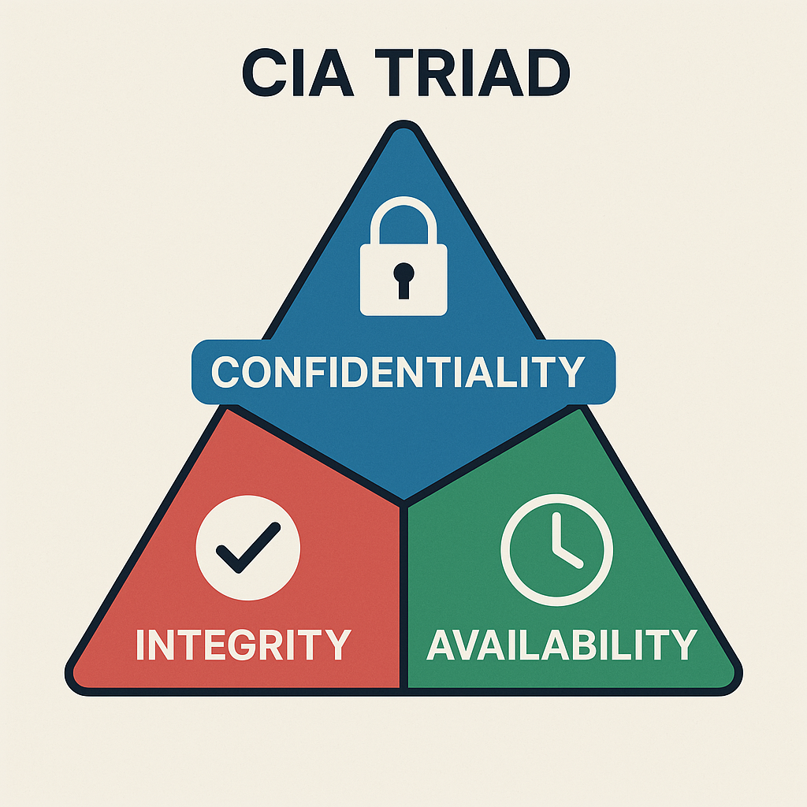
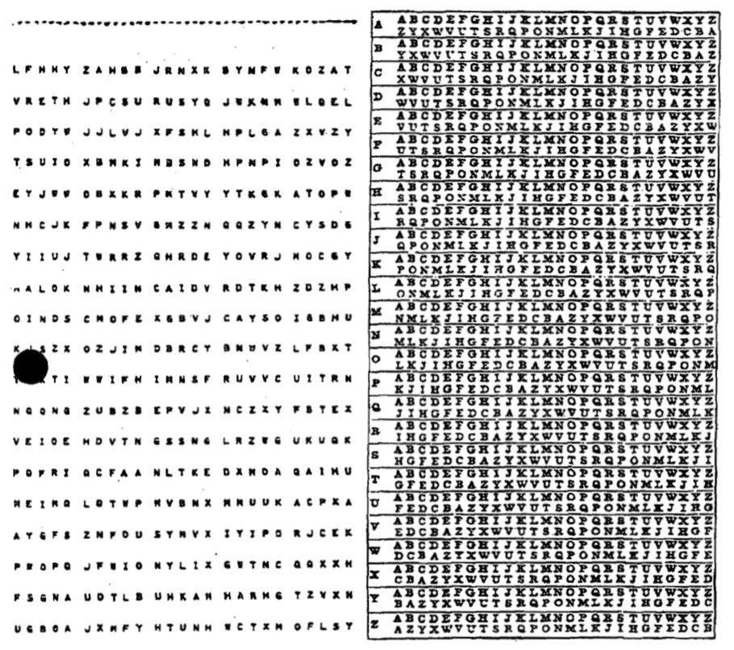

# Data Security Management

:::{dropdown} Learning Goals
By the end of this section you will:
- understand the principles of cybersecurity and why it is important
- understand the the basic principles of encryption and why it is important
- understand the process steps of traditional ciphers and  be able to execute them
- understand how modern symmetric encryption works
- understand how modern asymmetric encryption works
- understand the processes of hashing and when it should be used
- understand the two types of compression ands why they are important
:::

> Data has never been more valuable. It is an increasingly important driver of growth in our modern economy. Whether it is data about individuals, businesses or government, data underpins how we communicate, conduct business, and receive services. At the same time it can be stolen, manipulated or used as a weapon by foreign adversaries and criminals `departmentofhomeaffairs_2023_data`.

<iframe width="560" height="315" src="https://www.youtube-nocookie.com/embed/bPVaOlJ6ln0?si=RS2uTwUpvKUA4RtR" title="YouTube video player" frameborder="0" allow="accelerometer; autoplay; clipboard-write; encrypted-media; gyroscope; picture-in-picture; web-share" referrerpolicy="strict-origin-when-cross-origin" allowfullscreen></iframe>

:::{tip} Crash Course Cybersecurity Summary
:class: dropdown
**Cybersecurity's Goal:** To minimize crime and harm in the digital world, similar to how physical security works in the real world. Its primary objectives are to protect the **secrecy (confidentiality)**, **integrity**, and **availability** of computer systems and data.

- **The CIA Triad:**
  - **Secrecy (Confidentiality):** Ensuring that only authorized individuals can access specific data (e.g., protecting against credit card data breaches).
  - **Integrity:** Ensuring that only authorized individuals can modify data (e.g., preventing someone from using your email password to send fake emails).
  - **Availability:** Ensuring that authorized users can always access their systems and data (e.g., defending against denial-of-service attacks that crash websites).
- **Threat Modeling:** Cybersecurity starts by identifying potential attackers, their capabilities, goals, and methods (attack vectors). This helps focus security efforts on the most likely threats.
- **Authentication:** The process of verifying a user's identity. There are three main types:
  - **What You Know:** Based on secret knowledge, like a username and password. This is the most common but can be vulnerable to guessing or brute-force attacks.
  - **What You Have:** Based on possessing a physical token, like a key, an ATM card, or a smartphone for two-factor authentication.
  - **What You Are:** Based on unique biological characteristics (biometrics), such as fingerprints, iris scans, or facial recognition.
- **Access Control:** Once a user is authenticated, access control determines what they are allowed to see, modify, or use. This is often managed through permissions (read, write, execute) and models like the **Bell-LaPadula model** (no read up, no write down), which is used in military and government systems.
- **Software Security:** Even with strong authentication and access control, security can be compromised by malware or bugs in the software itself. To combat this, security professionals use:
    - **Isolation (Sandboxing):** Running applications in contained environments (sandboxes or virtual machines) so that if one is compromised, it doesn't affect the entire system.
    - **Independent Verification & Validation:** Having external, security-minded developers audit code to find bugs, which is why much security software is open-source.
:::

Data security is crucial because it safeguards sensitive information from unauthorized access, ensuring that personal, financial, and confidential data remains private and protected. In today's digital age, where vast amounts of data are shared and stored online, the risk of data breaches and cyberattacks is significant. These breaches can result in identity theft, financial loss, reputational damage, and legal consequences.

Data breachers far more common than most people believe. The Office of the Australian Information Commissioner, publishes regular [reports on breaches involving Australian organisations](https://www.oaic.gov.au/privacy/notifiable-data-breaches/notifiable-data-breaches-publications). Check the latest report to see the extent of data breaching occurring. Note that these are only the breaches that Australian Law requires organisations to report.

Data security measures, including encryption, access controls, and regular security audits, help prevent such incidents and ensure that individuals and organizations can trust that their data is safe and confidential. It's not only about protecting information but also about maintaining trust, compliance with regulations, and upholding the integrity of data in an increasingly interconnected world.

The following techniques used to manage data effectively, ensuring it can be stored and transferred securely and efficiently.

## The CIA Triad: Core Principles of Cybersecurity


The **CIA Triad** stands for **Confidentiality**, **Integrity**, and **Availability**. It’s a model that helps us understand how to protect information and systems from threats. Every good security strategy aims to balance these three goals.

### Confidentiality – Keeping Information Private

Confidentiality means only **authorized** people can access sensitive data. It prevents data from being read or stolen by people who shouldn’t see it.

**Key Concepts:**
- **Authentication**: Making sure the person accessing the data is who they say they are (e.g. login with username + password).
- **Authorization**: Making sure the user has permission to access the specific data.
- **Encryption**: Scrambling the data so that it’s unreadable without a decryption key.
- **Access control lists (ACLs)** and **permissions**: Rules that say who can access or change files.

**Examples:**
- A teacher can access student marks, but students can’t access each other’s marks.
- Messages sent through WhatsApp are encrypted so that no one (even WhatsApp) can read them.

### Integrity – Keeping Information Accurate and Trustworthy

Integrity means data should stay correct, complete, and unaltered unless changed in an authorized way. It protects against **tampering**, **accidental deletion**, or **corruption**.

**Key Concepts:**
- **Checksums** and **hashing**: Mathematical ways to check if data has been changed.
- **Digital signatures**: Used to verify that a message or document is from a trusted sender and hasn’t been altered.
- **Version control**: Tracking changes to files to avoid mistakes or rollback errors.

**Examples:**
- A medical record system must not allow patient information to be changed without proper approval.
- Software updates are signed by developers so users know the file hasn’t been changed by hackers.

### Availability – Keeping Systems and Data Usable

Availability ensures that systems and data are accessible **when** users need them. Attacks that stop people from using services (like websites or apps) are attacks on availability.

**Key Concepts:**
- **Backups**: Copies of important data stored in case something goes wrong.
- **Redundancy**: Having extra hardware or network connections so systems keep working if one fails.
- **DDoS protection**: Defending against attacks that flood systems with traffic to crash them.
- **Uptime monitoring**: Tools to check that services are always online.

**Examples:**
- A bank website must be available 24/7 for customers to check their accounts.
- During exams, students need reliable access to the school’s learning management system.

### Why It Matters

If **any** part of the CIA Triad is compromised, security is at risk:

| Attack Type                         | Affects...      | Example                                               |
| ----------------------------------- | --------------- | ----------------------------------------------------- |
| Data theft (e.g. a data breach)     | Confidentiality | A hacker steals customer info from a database         |
| Data tampering                      | Integrity       | A virus changes invoice numbers in a billing system   |
| Denial of Service (DoS/DDoS) attack | Availability    | A website goes offline due to a flood of fake traffic |

---

## Encryption

Encryption is the process of converting data into a coded format to prevent unauthorized access. It ensures that only authorized parties can read the information.

### How Encryption works

- **Encryption:** Imagine you write a message in English and then translate it into a secret code that only your friend knows how to read. Even if someone else gets hold of the coded message, they can't understand it without the key to decode it.
- **Decryption:** Your friend uses the key to translate the coded message back into English so they can read it.

### Why Encryption important

Data encryption is necessary for several important reasons:

- **Data Security**: Encryption helps protect sensitive information from unauthorized access. It ensures that even if someone gains access to the data, they won't be able to read or use it without the encryption key.
- **Privacy**: In an era of digital communication, maintaining personal privacy is crucial. Encryption ensures that your personal messages, emails, and data remain private and can't be easily intercepted or eavesdropped upon.
- **Compliance**: Many regulations and laws require organizations to protect sensitive data, such as personal or financial information. Encryption helps companies meet these compliance requirements and avoid legal issues.
- **Data Integrity**: Encryption not only secures data from unauthorized access but also ensures that the data hasn't been tampered with during transmission or storage. If encrypted data is altered, it becomes unreadable.
- **Protection Against Data Breaches**: In the event of a data breach, encrypted data is significantly more challenging for attackers to use. Even if they gain access to encrypted data, it's useless without the encryption key.
- **Secure Communication**: Encryption is essential for securing online transactions, such as e-commerce purchases and online banking. It prevents hackers from intercepting sensitive financial information.
- **International Data Transfer**: When data is transferred across borders, encryption can protect it from government surveillance or other forms of unauthorized access.

### Types of Encryption

- **Symmetric Encryption:** The same key is used for both encryption and decryption. It's like having one key for a lock that both you and your friend have copies of.
- **Asymmetric Encryption:** Uses two keys—a public key for encryption and a private key for decryption. It's like having a lock with two keys: one for locking (encrypting) that everyone can use, and one for unlocking (decrypting) that only you have.

---

## Traditional Ciphers

### Caesar cipher

The Caesar cipher is one of the simplest and most well-known encryption techniques. It is a type of substitution cipher where each letter in the plaintext is shifted a fixed number of places down or up the alphabet. It is named after Julius Caesar, who reportedly used it to protect his private correspondence.

<iframe width="560" height="315" src="https://www.youtube-nocookie.com/embed/sMOZf4GN3oc?si=4T63pMsUZ5TGakaY" title="YouTube video player" frameborder="0" allow="accelerometer; autoplay; clipboard-write; encrypted-media; gyroscope; picture-in-picture; web-share" referrerpolicy="strict-origin-when-cross-origin" allowfullscreen></iframe>

:::{tip} The Caesar cipher Summary
:class: dropdown
- **How it Works:** The Caesar cipher encrypts a message by shifting each letter of the alphabet forward by a fixed number of places, known as the "key." For example, with a key of 3, 'A' becomes 'D', 'B' becomes 'E', and so on. To decrypt the message, the receiver simply shifts each letter back by the same number of places.
- **Encryption Example:** The video shows "Alice" wanting to send the message "MEET ME AT ELEPHANT LAKE" to "Bob." They agree on a key of 3. Alice applies this shift to every letter, creating a scrambled, unreadable message which she can then send openly.
- **Decryption Example:** Upon receiving the message, "Bob," who knows the key is 3, reverses the process by subtracting 3 from each letter's position to reveal the original message.
- **Breaking the Cipher:** For hundreds of years, this method was effective. However, its weakness was eventually discovered through a technique called **frequency analysis**.
- **Frequency Analysis:** This technique is based on the fact that every language has a "fingerprint" where certain letters appear more frequently than others (in English, 'E' is the most common). A codebreaker can count the letter frequencies in the encrypted message. By identifying the most common letter in the ciphertext and assuming it corresponds to the most common letter in the language (e.g., 'E'), they can determine the shift key and easily decode the entire message.
:::

**How the Caesar Cipher Works**

1. **Choose a Shift Value:** Decide on the number of positions each letter will be shifted. For example, with a shift of 3:
   - A becomes D
   - B becomes E
   - C becomes F
   - ..., and so on.
2. **Encrypt the Plaintext:** Replace each letter in the plaintext with the letter that appears a fixed number of positions down the alphabet.
   - For example, with a shift of 3, the word "HELLO" becomes "KHOOR".
3. **Decrypt the Ciphertext:** To decrypt the message, shift the letters in the opposite direction by the same number of positions.
   - "KHOOR" with a shift of 3 back becomes "HELLO".

**Caesar Example**

- **Encryption Process:**
   - Plaintext: "ATTACK AT DAWN"
   - Shift: 3
   - Ciphertext: "DWWDFN DW GDZQ"
- **Decryption Process:**
    - Ciphertext: "DWWDFN DW GDZQ"
    - Shift: 3
    - Plaintext: "ATTACK AT DAWN"

**Caesar Encryption Pseudocode**

```
FUNCTION encrypt_caesar(plaintext, shift):
    alphabet = "ABCDEFGHIJKLMNOPQRSTUVWXYZ"
    result = ""

    FOR each character 'char' in 'plaintext':
        IF char IS a letter:
            char = UPPERCASE(char)
            position = POSITION(char IN alphabet)
            new_position = (position + shift) MOD 26
            result = result + alphabet[new_position]
        ELSE:
            result = result + char

    RETURN result
```
**Caesar Decryption Pseudocode**

```
FUNCTION decrypt_caesar(ciphertext, shift):
    alphabet = "ABCDEFGHIJKLMNOPQRSTUVWXYZ"
    result = ""

    FOR each character 'char' in 'ciphertext':
        IF char IS a letter:
            char = UPPERCASE(char)
            position = POSITION(char IN alphabet)
            new_position = (position - shift + 26) MOD 26
            result = result + alphabet[new_position]
        ELSE:
            result = result + char

    RETURN result
```

**Caesar Characteristics and Security**
- **Simplicity:** The Caesar cipher is very easy to understand and implement, making it an excellent introductory example of encryption.
- **Weak Security:** It is vulnerable to brute force attacks since there are only 25 possible shifts (not counting the shift of 0, which leaves the text unchanged). Frequency analysis can also easily break the cipher because the letter frequencies in the ciphertext match those in the plaintext.
- **Requires Agreed Upon Key:** Like all Symmetric Encryptions, Caesar Cipher requires the sender and receiver to agree upon a key prior to the message being sent.

### Vigenère Cipher

The Vigenère cipher is a method of encrypting alphabetic text by using a simple form of polyalphabetic substitution. It employs a keyword to determine the shift applied to each letter of the plaintext, making it more secure than the Caesar cipher.

<iframe width="560" height="315" src="https://www.youtube-nocookie.com/embed/RCkGauRMs2A?si=Cfp7WfU4D1PE50xJ" title="YouTube video player" frameborder="0" allow="accelerometer; autoplay; clipboard-write; encrypted-media; gyroscope; picture-in-picture; web-share" referrerpolicy="strict-origin-when-cross-origin" allowfullscreen></iframe>

:::{tip} Vigenere Cipher Explained Summary
:class: dropdown
- **History:** The Vigenère cipher was first described in 1553 and remained unbreakable for over 300 years. It is a type of **polyalphabetic cipher**, meaning a single letter in the plaintext (original message) can be encrypted into different letters in the ciphertext (encrypted message), unlike simpler monoalphabetic ciphers (e.g., the Caesar cipher) where a letter always maps to the same encrypted letter.

- **How it Works (Encryption):**
  1.  **Choose a keyword:** For example, "BANANA".
  2.  **Align the keyword** with the plaintext, repeating the keyword as necessary. For the plaintext "ILOVEPEANUTS", the key would be "BANANABANANA".
  3.  **Convert letters to numbers:** Each letter in the plaintext and the key is converted to a number based on its position in the alphabet (e.g., A=1, B=2,... or A=0, B=1,...).
  4.  **Add the numbers:** For each position, the plaintext number is added to the corresponding key number.
  5.  **Use Modulo 26:** The result of the addition is taken modulo 26 to ensure the number wraps around the alphabet.
  6.  **Convert back to letters:** The final numbers are converted back to letters to form the ciphertext.

- **Decryption:** The process is reversed. Instead of adding the key's numerical value, you subtract it from the ciphertext's numerical value (again using modulo 26) to retrieve the original plaintext.

- **Weakness:** The video explains that despite its historical strength, the Vigenère cipher is **easily broken** by modern standards. Its primary weakness is the **repeating keyword**. An attacker can use **frequency analysis** to:
  1.  Identify repeated patterns in the ciphertext to determine the length of the keyword.
  2.  Once the key length is known, the ciphertext can be broken into separate groups, each encrypted by the same letter of the key.
  3.  Frequency analysis can then be applied to each of these simpler monoalphabetic ciphers to crack the entire message.
:::

**How the Vigenère Cipher Works**

1. **Choose a Keyword:** A keyword is selected, and each letter of the keyword is used to create a different Caesar cipher shift.
   - For example, if the keyword is "KEY", it corresponds to shifts of K=10, E=4, and Y=24.
2. **Repeat the Keyword:** The keyword is repeated to match the length of the plaintext. 
   - For example, if the plaintext is "ATTACKATDAWN" and the keyword is "KEY", the repeated keyword is "KEYKEYKEYKEY".
3. **Encrypt the Plaintext:** Each letter of the plaintext is shifted according to the corresponding letter of the keyword. The shift is determined by converting the keyword letter into a number (A=0, B=1, ..., Z=25).
4. **Decrypt the Cyphertext:** To decrypt the message, the same keyword is used. Each letter of the ciphertext is shifted back according to the corresponding letter of the keyword.

**Vigenère Example**

- **Encryption process**
  - Plaintext: ATTACKATDAWN
  - Keyword:   KEYKEYKEYKEY
  - Encryption: 
    - A (shift by K, 10 positions) -> K
    - T (shift by E, 4 positions) -> X
    - T (shift by Y, 24 positions) -> R
    - A (shift by K, 10 positions) -> K
    - C (shift by E, 4 positions) -> G
    - K (shift by Y, 24 positions) -> I
    - A (shift by K, 10 positions) -> K
    - T (shift by E, 4 positions) -> X
    - D (shift by Y, 24 positions) -> B
    - A (shift by K, 10 positions) -> K
    - W (shift by E, 4 positions) -> A
    - N (shift by Y, 24 positions) -> L
  - Ciphertext: KXRGIKXBKAL

- **Decryption Process**
  - Ciphertext: KXRGIKXBKAL
  - Keyword:    KEYKEYKEYKEY
  - Decryption:
    - K (shift back by K, 10 positions) -> A
    - X (shift back by E, 4 positions) -> T
    - R (shift back by Y, 24 positions) -> T
    - K (shift back by K, 10 positions) -> A
    - G (shift back by E, 4 positions) -> C
    - I (shift back by Y, 24 positions) -> K
    - K (shift back by K, 10 positions) -> A
    - X (shift back by E, 4 positions) -> T
    - B (shift back by Y, 24 positions) -> D
    - K (shift back by K, 10 positions) -> A
    - A (shift back by E, 4 positions) -> W
    - L (shift back by Y, 24 positions) -> N
  - Plaintext: ATTACKATDAWN

**Vigenère Encryption Pseudocode**

```
FUNCTION encrypt_vigenere(plaintext, keyword):
    alphabet = "ABCDEFGHIJKLMNOPQRSTUVWXYZ"
    result = ""
    keyword_length = LENGTH(keyword)
    
    FOR i FROM 0 TO LENGTH(plaintext) - 1:
        char = plaintext[i]
        
        IF char IS a letter:
            char = UPPERCASE(char)
            shift_char = UPPERCASE(keyword[i % keyword_length])
            shift = POSITION(shift_char IN alphabet)
            char_position = POSITION(char IN alphabet)
            new_position = (char_position + shift) MOD 26
            result += alphabet[new_position]
        ELSE:
            result += char

    RETURN result
```

**Vigenère Decryption Pseudocode**

```
FUNCTION decrypt_vigenere(ciphertext, keyword):
    alphabet = "ABCDEFGHIJKLMNOPQRSTUVWXYZ"
    result = ""
    keyword_length = LENGTH(keyword)
    
    FOR i FROM 0 TO LENGTH(ciphertext) - 1:
        char = ciphertext[i]
        
        IF char IS a letter:
            char = UPPERCASE(char)
            shift_char = UPPERCASE(keyword[i % keyword_length])
            shift = POSITION(shift_char IN alphabet)
            char_position = POSITION(char IN alphabet)
            new_position = (char_position - shift + 26) MOD 26
            result += alphabet[new_position]
        ELSE:
            result += char

    RETURN result
```

**Vigenère Characteristics and Security**
- **Polyalphabetic Substitution**: The Vigenère cipher uses multiple Caesar ciphers, which makes frequency analysis attacks much more difficult compared to simple substitution ciphers.
- **Simple to Implement**: The method is straightforward to implement and understand.
- **Keyword Repetition**: If the keyword is significantly shorter than the plaintext, patterns may emerge, making the cipher vulnerable to Kasiski examination and other statistical attacks.
- **Keyword Guessing**: If the attacker guesses or determines the length of the keyword, the Vigenère cipher can be broken using methods like frequency analysis.
- **Requires Agreed Upon Key:** Like all Symmetric Encryptions, Vigenère Cipher requires the sender and receiver to agree upon a key prior to the message being sent.

### Gronsfeld Cipher

The **Gronsfeld cipher** is a variant of the Vigenère cipher that uses a numeric key instead of a keyword to shift the letters of the plaintext. It shares many similarities with the Vigenère cipher but simplifies the key by restricting it to numeric digits, making it somewhat easier to use and remember.

### One-time Pad Encryption

The **one-time pad (OTP)** encryption is a theoretically unbreakable encryption technique that involves a random key that is as long as the message being encrypted. It was first described by Frank Miller in 1882 and later formalized by Gilbert Vernam in 1917.



**How OTP Encryption Works**

- **Key Generation:** Generate a truly random key that is the same length as the plaintext message. This key must be kept completely secret and used only once.
- **Encryption:**
  - Convert the plaintext message and the key into numerical form (e.g., using the ASCII values of characters).
  - Perform bitwise XOR (exclusive OR) operation between the numerical representations of the plaintext and the key to produce the ciphertext.
- **Decryption:**
  - Convert the ciphertext and the key into numerical form.
  - Perform bitwise XOR operation between the numerical representations of the ciphertext and the key to retrieve the original plaintext.

**Characteristics and Security**
- **Perfect Security:** If the key is truly random, kept secret, and never reused, the one-time pad is theoretically unbreakable. This is because every possible plaintext of the same length as the ciphertext is equally likely.
- **No Patterns:** Since the key is random and as long as the message, there are no patterns that an attacker can exploit.
- **Key Distribution:** The key must be distributed securely to both the sender and the receiver, which can be impractical for large-scale use.
- **Scalability:** The need for a key that is as long as the message makes it impractical for large amounts of data.

---

## Symmetric Encryption

Symmetric encryption is a type of encryption where only one key (a secret key) is used to both encrypt and decrypt electronic information. The entities communicating via symmetric encryption must exchange the key so that it can be used in the decryption process.

By using symmetric encryption algorithms, data is converted to a form that cannot be understood by anyone who does not possess the secret key to decrypt it. Once the intended recipient who possesses the key has the message, the algorithm reverses its action so that the message is returned to its original and understandable form. The secret key that the sender and recipient both use could be a specific password/code or it can be random string of letters or numbers that have been generated by a secure random number generator.

There are two types of symmetric encryption algorithms:

  1. **Block algorithms:** Set lengths of bits are encrypted in blocks of electronic data with the use of a specific secret key. As the data is being encrypted, the system holds the data in its memory as it waits for complete blocks.
  2. **Stream algorithms:** Data is encrypted as it streams instead of being retained in the system’s memory.

### Symmetric Encryption Uses

While symmetric encryption is an older method of encryption, it is **faster and more efficient** than asymmetric encryption. Symmetric cryptography is typically used for encrypting large amounts of data, e.g. for database encryption. In the case of a database, the secret key might only be available to the database itself to encrypt or decrypt.

Some examples of where symmetric cryptography is used are:

- **Payment applications**, such as card transactions where personal identifying information needs to be protected to prevent identity theft or fraudulent charges
- **Validations** to confirm that the sender of a message is who they claim to be
- **Random number generation** or hashing

### Block Ciphers

A block cipher takes a block of plaintext bits and generates a block of ciphertext bits, generally of same size. The size of block is fixed in the given scheme. The choice of block size does not directly affect to the strength of encryption scheme. The strength of cipher depends up on the key length.

**Feistel Block Cipher**

A Feistel block cipher is not an encryption method in itself. It is a model or process that is used by many block ciphers to encode the plain text into a cipher text. A Feistel cipher requires a key and a set length portion of the plain text and occurs over a designated number of rounds.

<iframe width="560" height="315" src="https://www.youtube-nocookie.com/embed/FGhj3CGxl8I?si=PV9yQn8CPMTkwhJ-" title="YouTube video player" frameborder="0" allow="accelerometer; autoplay; clipboard-write; encrypted-media; gyroscope; picture-in-picture; web-share" referrerpolicy="strict-origin-when-cross-origin" allowfullscreen></iframe>

:::{tip} Feistel Cipher Summary
:class: dropdown
**How a Feistel Cipher Works (Encryption):**

A Feistel cipher is not a specific algorithm but a framework that operates on a block of data through multiple rounds.

1.  **Split:** The data block is divided into two equal halves: a Left (L) and a Right (R) half.
2.  **Round Function:** For each round of encryption, the Right half (R) is fed into a "round function" (F) along with a sub-key (K) for that specific round.
3.  **XOR Operation:** The output of the round function, `F(R, K)`, is then combined with the Left half (L) using an XOR operation. The result of this operation becomes the new Right half for the next round.
4.  **Swap:** The original, unchanged Right half (R) becomes the new Left half for the next round.

This process is repeated for a predetermined number of rounds, with a different sub-key typically used for each round.

**The "Magic" of Decryption:**

The most elegant and brilliant feature of the Feistel cipher is its decryption process. To decrypt the ciphertext, you use the **exact same algorithm** as encryption. The only difference is that the sub-keys (K1, K2, K3, etc.) are applied in the **reverse order**.

This works because the [XOR](https://www.geeksforgeeks.org/logic-gates/) operation is its own inverse. When you XOR a value with the same number twice, it cancels out and returns the original value. This allows the entire structure to be reversible, even if the round function (F) itself is a one-way, non-reversible function. This design significantly simplifies the implementation of block ciphers, as a separate decryption algorithm is not needed.
:::

**Data Encryption Standard (DES)**

**DES** is a symmetric key algorithm developed in the 1970s by IBM and later adopted by the U.S. government as a standard. It uses a **56-bit key** to encrypt **64-bit blocks** of data. DES operates on data using **16 rounds** of Feistel network, which involves permutations, substitutions, and XOR operations.

DES is now considered insecure for many applications due to its relatively short key length, which makes it vulnerable to brute-force attacks.

**Triple DES (3DES)**

**Triple DES** enhances the security of DES by applying the DES algorithm three times to each data block. It uses **three 56-bit keys**, effectively giving it a **168-bit key length**, though due to some weaknesses, its effective security is closer to 112 bits.

Despite its increased security, 3DES is slower than other modern symmetric algorithms.


<p>&nbsp;</p>

**Advanced Encryption Standard (AES)**

<iframe width="560" height="315" src="https://www.youtube-nocookie.com/embed/O4xNJsjtN6E?si=zBpv6D29654kyjDB" title="YouTube video player" frameborder="0" allow="accelerometer; autoplay; clipboard-write; encrypted-media; gyroscope; picture-in-picture; web-share" referrerpolicy="strict-origin-when-cross-origin" allowfullscreen></iframe>

:::{tip} AES Explained Summary
:class: dropdown
This video explains the workings of the Advanced Encryption Standard (AES), a widely used symmetric block cipher. Here is a summary of the key points:

**What is AES?**
- AES is a **symmetric block cipher**, meaning the same key is used for both encryption and decryption.
- It operates on fixed-size blocks of data: 128 bits (or 16 bytes).
- It supports key sizes of **128, 192, or 256 bits**, with even the 128-bit version being extremely secure.
- AES is a **substitution-permutation network (SPN)**, a design that repeatedly applies layers of substitution (for confusion) and permutation (for diffusion) to the data.

**The State Array**
- AES arranges the 16-byte input block into a 4x4 grid called the **state array**.
- All encryption operations are performed on this state array.

**The Encryption Process (Rounds)**
- The encryption process consists of a series of rounds. The number of rounds depends on the key size:
  - **10 rounds** for a 128-bit key.
  - **12 rounds** for a 192-bit key.
  - **14 rounds** for a 256-bit key.
- Each round (except the last) consists of four distinct steps:
  - **SubBytes:** A non-linear substitution step where each byte is replaced with another according to a fixed lookup table (the S-box). This adds confusion.
  - **ShiftRows:** A permutation step where the bytes in each row of the state are cyclically shifted to the left by a certain offset. This helps spread the data across columns.
  - **MixColumns:** A complex step that mixes the data within each column by multiplying it with a fixed matrix. This, along with ShiftRows, provides strong diffusion, meaning a small change in the input affects many bits of the output.
  - **AddRoundKey:** The state is combined with a "round key" (derived from the main key) using an XOR operation.

**Key Concepts:**
- **Finite Field (Galois Field) Math:** The operations in AES (especially SubBytes and MixColumns) are based on arithmetic in a finite mathematical field called a Galois Field (GF(2⁸)). This provides the strong mathematical properties needed for security while being efficient to implement.
- **Key Schedule:** The original key is expanded into a set of "round keys"—one for each round of encryption. This ensures that a different key is used at each stage of the process.

Because of its well-designed, multi-round structure and strong mathematical foundation, AES is both highly secure and fast, especially on modern CPUs that have dedicated hardware instructions for performing its operations.
:::

AES is the current U.S. federal standard for encryption, replacing DES and 3DES. It supports key sizes of **128**, **192**, and **256** bits and operates on **128-bit blocks** of data. AES uses a substitution-permutation network with **10, 12, or 14 rounds** depending on the key size.

AES is widely regarded as secure and is used globally in various applications.

**Blowfish**

Blowfish is a symmetric key block cipher designed by Bruce Schneier in 1993. It has a variable key length from **32** bits to **448 bits**, making it highly flexible. Blowfish operates on **64-bit blocks** and is known for its speed and effectiveness in hardware applications. It uses a Feistel network with **16 rounds** of processing.

While secure, Blowfish's 64-bit block size is now considered a limitation for certain applications.

**Twofish**

Twofish is a symmetric key block cipher, also designed by Bruce Schneier as a successor to Blowfish. It operates on **128-bit blocks** and supports key sizes up to **256 bits**. Twofish uses a Feistel network and is optimized for hardware and software performance.

Twofish is known for its flexibility, speed, and security, making it a strong contender in the AES competition.

---

## Asymmetric Encryption

The biggest weakness of symmetric encryption is the need for key distribution. That is, there needs to be a secure way for all parties to agree upon the key that will be used for encryption and decryption. This is very effective, if you wish to encrypt data on your hard-drive, or in a database on your server. Unfortunately symmetric encryption is not practical when it comes to online communication, for this we need asymmetric encryption.

<iframe width="560" height="315" src="https://www.youtube-nocookie.com/embed/YEBfamv-_do?si=cdvcl_YkpOGGy3Co" title="YouTube video player" frameborder="0" allow="accelerometer; autoplay; clipboard-write; encrypted-media; gyroscope; picture-in-picture; web-share" referrerpolicy="strict-origin-when-cross-origin" allowfullscreen></iframe>

:::{tip} Diffie-Hellman Key Exchange Summary
:class: dropdown
1.  **The Problem:** The video begins by tracing the need for secure communication back to the Cold War and the development of early computer networks like SAGE. As networks grew, a critical problem emerged: how can two people who have never met before agree on a secret key (like a password or a number) to encrypt their conversation, without an eavesdropper also learning that key?

2.  **The One-Way Function Analogy (Mixing Paint):** The core of the Diffie-Hellman solution is explained using a simple analogy with mixing paint.
    - **The Principle:** It is easy to mix two colours to create a new one, but it's very difficult to take that mixed colour and figure out the exact original colours used. This is called a "one-way function."
    - **The Process:**
      - Alice and Bob publicly agree on a common starting colour (e.g., yellow).
      - Each secretly chooses their own private colour (Alice chooses red, Bob chooses blue).
      - They each mix their private colour with the public yellow. Alice gets orange, and Bob gets green.
      - They publicly exchange their mixed colours (orange and green). Eve sees these.
      - Finally, they each mix the colour they received with their *own* private colour. Alice mixes green with her red, and Bob mixes orange with his blue.
      - Both end up with the exact same secret colour (a brownish mix of yellow, red, and blue). Eve cannot create this colour because she lacks the secret red and blue.

3.  **The Mathematical Implementation (Clock Arithmetic):** The same principle is applied using numbers in a process called **modular arithmetic**, or "clock arithmetic."
    - **The One-Way Function:** The mathematical one-way function is **modular exponentiation**. It is easy to calculate `g^x mod p`, but extremely difficult to find the exponent `x` if you only know the result, `g`, and `p`. This is known as the **discrete logarithm problem**.
    - **The Process:**
      - Alice and Bob publicly agree on two numbers: a prime modulus `p` and a generator `g`.
      - They each choose a secret private number (Alice chooses `a`, Bob chooses `b`).
      - Alice calculates `g^a mod p` and sends the result to Bob.
      - Bob calculates `g^b mod p` and sends the result to Alice.
      - Alice takes Bob's result and raises it to the power of her secret number `a`.
      - Bob takes Alice's result and raises it to the power of his secret number `b`.
      - Both arrive at the same shared secret number, `g^(ab) mod p`.

Because of the difficulty of the discrete logarithm problem, Eve cannot determine their final shared secret, allowing Alice and Bob to use it as a key for secure, encrypted communication.
:::

Asymmetric communication refers to a method of communication in which the parties involved use different keys for encryption and decryption processes. This is a key feature of asymmetric encryption, also known as public-key cryptography.

### Key Components of Asymmetric Communication

The **public key** is openly distributed and used to encrypt data. Anyone can use this key to encrypt a message intended for a specific recipient. For example, if Alice wants to send a secure message to Bob, she would use Bob's public key to encrypt the message.

The **private key** is kept secret and is used to decrypt data that has been encrypted with the corresponding public key. Continuing the example, Bob would use his private key to decrypt the message sent by Alice.

### How Asymmetric Communication Works

1. The sender (Alice) and the receiver (Bob) agree and communicate the **public parameters** (prime modulus and a generator). 
2. Alice then chooses a **private key** and calculates a **public key**, which she share publicly with Bob.
3. Bob selects his own **private key**, calculates a **public key**, and shares it publicly with Alice.
4. Alice takes Bob’s **public key** and raises it to the power of her **private key** to compute a **shared key**.
5. Bob does the same with Alice’s **public key** and his **private key** to also establish the **shared key**.
6. Alice and Bob now have a **shared key** they can use for symmetrical encryption.
7. Without knowing Alice's or Bob's **private keys** Eve cannot derive the **shared key**.

### Advantages of Asymmetric Communication

Asymmetric communication **enhances security** because the private key is never shared and remains secure with the owner. Even if the public key is widely distributed, only the intended recipient can decrypt the message.

Asymmetric encryption also **simplifies key distribution**. Unlike symmetric encryption, where the same key must be securely shared between parties, the public key can be freely distributed without compromising security.

### Disadvantages of Asymmetric Communication

Asymmetric encryption algorithms are generally **slower** than symmetric algorithms, making them less suitable for encrypting large amounts of data directly.

The process of managing public and private keys and ensuring their integrity also adds **complexity** to the system.

### Applications of Asymmetric Communication

- **Email encryption services** often use asymmetric encryption to ensure that only the intended recipient can read the email.
- **Secure websites** use SSL/TLS protocols, which rely on asymmetric encryption to establish secure connections between a user's browser and the web server.
- **Digital Signatures** used in software distribution, digital contracts, and other scenarios where verifying the sender's identity and ensuring the message's integrity is crucial.

### Try Asymmetric Communication

Work in threes and take the roles of Alice, Bob and Eve.

1. Alice and Bob agree and publicly share a prime modulus
2. Alice and Bob agree and publicly share a generator
3. Alice and Bob both choose a private key
4. Exchange of public keys
   - Alice and Bob perform the following calculation (in Python) and share the results publicly:

``` python
public_key = generator ** private_key % prime_modulus
```

5. Alice and Bob now work out the shared secret key
   - Use the following calculations (in Python):

``` python
# for Alice
shared_key = bob_pub_key ** alice_private_key % prime_modulus

# for Bob
shared_key = alice_pub_key ** bob_private_key % prime_modulus
```

6. Alice and Bob now use the shared key to send messages using Caesar cipher to each other, and Eve attempts to work out the message.

### RSA

RSA is one of the most widely used asymmetric encryption algorithms, developed by Ron Rivest, Adi Shamir, and Leonard Adleman in 1977. It relies on the mathematical difficulty of factoring large prime numbers. 

RSA uses two keys a public key for encryption and a private key for decryption. Key lengths typically range from **2048 to 4096 bits**, providing strong security. It is commonly used in secure data transmission, digital signatures, and key exchange protocols.

RSA is computationally intensive and slower compared to symmetric algorithms, making it less suitable for encrypting large amounts of data directly.

---

## Hashing

Hashing is the process of converting data into a fixed-size string of characters, which typically looks like a random sequence of letters and numbers. This is done using a specific algorithm.

### How Hashing works

- Think of hashing as creating a unique fingerprint for a set of data. Just like no two people have the same fingerprint, no two sets of data will have the same hash (in theory).
- Hash functions take an input (or 'message') and return a fixed-size string of bytes. The output is typically a "digest" that represents the input data.

### Why Hashing important

- **Data Integrity:** Hashes are used to ensure data hasn't been altered. For example, when you download a file, a hash can be created for that file. After downloading, you can check the hash to make sure the file wasn't corrupted or tampered with during transfer.
- **Password Storage:** Instead of storing actual passwords, systems store hashes of passwords. When you log in, your password is hashed and compared to the stored hash. This way, even if someone accesses the password database, they can't easily recover the actual passwords.

---

## Data Compression

Data compression is the process of reducing the size of a file or data set. This means the data takes up less space on storage devices and can be transmitted more quickly over networks.

### How Data Compression works

- **Lossless Compression:** This method reduces file size without losing any data. Think of it as packing your clothes tightly into a suitcase without leaving anything behind. When you unpack, everything is still there, just like it was before. Examples include ZIP files and PNG images.
- **Lossy Compression:** This method reduces file size by removing some data that’s not crucial. It’s like packing your suitcase but deciding to leave behind some items you don't really need. When you unpack, you still have most of your stuff, but some of the less important items are missing. Examples include MP3 audio files and JPEG images.

### Why Data Compression important

- **Saves Storage Space:** Smaller files mean you can store more data on your devices.
- **Faster Transfers:** Smaller files can be sent over the internet or other networks more quickly.