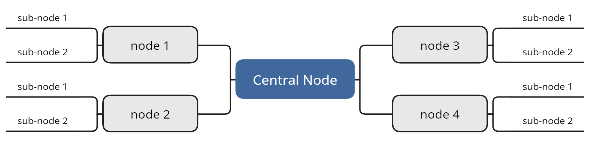

# Mind Maps

:::{dropdown} Learning Goals
By the end of this section you will:
- understand what a mind map is
- understand how to create a mind map
- understand with mind map terminology
:::

Mind maps will not be part of the submitted documentation. However, they are a valuable tool for understanding the scope of a project and planning your approach.

Use a mind map to categorise information from the assessment criteria sheet and the stimulus. Group related ideas together, then decompose each category into specific tasks that you will need to complete to meet the assessment requirements.

## To create a mind map
- Start with a **central idea** (the project or problem) in the middle.
- Draw **branches** for the main categories, such as user requirements, data, programming, and interface design.
- Add **sub-branches** for details or smaller tasks under each main category.
- Use **keywords** or short phrases on each branch to keep ideas clear and concise.
- Include **connections** between branches when ideas are related.

## Terminology
- **Node**: A point on the mind map representing a single idea.
- **Branch**: A line connecting ideas; shows relationships.
- **Central Node**: The main idea or topic in the centre.
- **Sub-node**: A more detailed idea branching off a parent node.
- **Hierarchy**: The structure showing main ideas and their breakdown into smaller parts.

