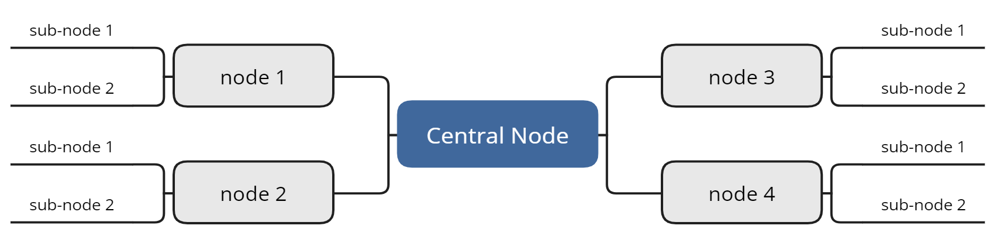

# Mind Maps

:::{dropdown} Learning Goals
By the end of this section you will:
- understand what a mind map is
- understand the role of mind maps in your assessments
- understand mind map terminology
- understand how to create an effective mind map
:::

The QCAA defines a mind map as a purposeful diagram used to visually organise information, allowing the abstract relationships between ideas to be explored and refined.

Mind maps are **assessable evidence** in both IA1 and IA2. They are assessed under the **Retrieving and comprehending** criterion as part of the symbolisation requirement. A well-constructed mind map that shows the relationships between the user, data, interface, and programmed components of your solution can demonstrate insightful analysis of the problem. A superficial mind map — one that simply lists topics without showing how they connect — will limit your marks.

Mind maps are not a list of things to do. They are a thinking tool. You use them to make sense of the stimulus and problem before you begin designing your solution.

## What to include in a Digital Solutions mind map

Start by reading the stimulus carefully. Your mind map should capture and connect the key elements of the problem domain, including:

- the **user and developer problem** — who needs this solution and why
- **user interface requirements** — useability principles, visual communication needs, and interface components
- **data requirements** — what data is needed, where it comes from, and how it is structured
- **programmed components** — the functions, algorithms, and logic the solution will need
- **constraints and limitations** — technical, environmental, or scope boundaries
- **potential impacts** — personal, social, and economic considerations

The goal is to show how these elements relate to each other, not just to list them. Connections between branches are just as important as the branches themselves.

## Terminology

- **Central node**: The main idea or topic at the centre — typically the name or description of the problem.
- **Branch**: A line connecting a related idea to the central node or another node; represents a relationship.
- **Node**: A point on the mind map representing a single idea or concept.
- **Sub-node**: A more specific idea branching off a parent node; shows decomposition of a concept.
- **Hierarchy**: The structure of the map showing how broad ideas break down into more specific ones.
- **Cross-link**: A connection between nodes on different branches, showing a relationship between otherwise separate ideas.

## How to create a mind map

- Place the **central node** (the project or problem) in the middle.
- Draw **main branches** for the key categories: user, interface, data, programmed components, constraints, impacts.
- Add **sub-nodes** to break each category into specific elements drawn from the stimulus.
- Use **keywords and short phrases** — not sentences — to keep the map readable.
- Draw **cross-links** where ideas on different branches are related; label the connection if the relationship is not obvious.
- Develop the map **iteratively** — return to it as your understanding of the problem grows.

## What makes a mind map insightful

QCAA subject reports distinguish between superficial and insightful mind maps. An insightful mind map:

- is grounded in the specific details of the stimulus, not generic categories
- shows relationships between ideas across different branches, not just within them
- demonstrates your understanding of the problem as a complex system
- is developed and refined throughout the project, not completed once and discarded

The quality of your mind map is judged on how well it represents information and relationships — not on its visual appearance. A simple hand-drawn map that shows genuine insight will outperform a polished digital one that only lists topics.

