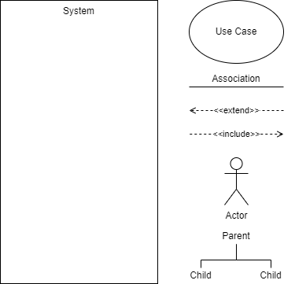

# Use Case Diagrams

:::{dropdown} Learning Goals
By the end of this section you will:
- understand how a use case diagram identifies how a digital solution meets users goals and needs
- understand how a use case diagram helps define the scope of a project
- know the different elements that make up a use case diagram
- understand the process of developing a use case diagram
:::

> In the **Unified Modelling Language** (UML), a use case diagram can summarize the details of your system's users (also known as actors) and their interactions with the system. To build one, you'll use a set of specialized symbols and connectors. `lucidchart_2019_uml`

## What are Use Case Diagrams?

**Use case diagrams** are a type of Unified Modelling Language (UML) diagram used to visually represent the interactions between users (called *actors*) and a system. Each *use case* is a specific **goal or task** that a user wants to achieve using the system, such as "Log In," "Place Order," or "View Results."

**How They Assist in the Design of a Digital Solution:**
- **Clarify System Requirements**: Use case diagrams help identify what functions the system must perform by showing the goals of each user type.
- **Identify Different User Roles**: By representing different actors, they make it easier to see who will interact with the system and how.
- **Improve Communication**: Use case diagrams provide a clear and simple way to discuss system functionality with stakeholders, including non-technical users.
- **Support Planning and Development**: Developers and designers can use the diagram to guide system architecture, UI design, and task prioritisation.
- **Detect Gaps Early**: They make it easier to spot missing features or unnecessary complexity before detailed development begins.

An effective use case diagram can help you represent:
- Scenarios in which your system or application interacts with people, organizations, or external systems
- Goals that your system or application helps those entities (known as actors) achieve
- The scope of your system

We will employ Use Case Diagrams to further develop our exploration of the problem.

<iframe width="560" height="315" src="https://www.youtube.com/embed/zid-MVo7M-E" title="YouTube video player" frameborder="0" allow="accelerometer; autoplay; clipboard-write; encrypted-media; gyroscope; picture-in-picture" allowfullscreen></iframe>

:::{tip} UML Use Case Diagram Tutorial Summary
:class: dropdown
This tutorial, led by Chloe, explains how to create UML Use Case diagrams. These diagrams are high-level visual tools that simply illustrate a system's function, who interacts with it, and what it does.

The tutorial breaks down Use Case diagrams into four key elements, using a **Banking App** as a running example:

1.  **System:** The application or process being developed (e.g., the Banking App). It is represented by a large rectangle that defines the scope of the system.
2.  **Actors:** External people, organizations, or other systems that interact with the system. They are shown as stick figures outside the system rectangle.
    - **Primary Actors:** Initiate actions (e.g., a `Customer`). Placed on the left.
    - **Secondary Actors:** React to the system or primary actor's actions (e.g., the `Bank`). Placed on the right.
3.  **Use Cases:** Specific actions or goals an actor can achieve within the system (e.g., `Log In`, `Check Balance`). They are represented by ovals inside the system rectangle and are typically named with verb-led phrases.
4.  **Relationships:** Lines that connect the elements and show interaction. There are four main types:
    - **Association:** A simple solid line showing an actor interacts with a use case.
    - **Include (`<<include>>`):** A mandatory relationship where a base use case *requires* another use case to function. This happens *every time*. The dashed arrow points to the required use case (e.g., `Log In` includes `Verify Password`).
    - **Extend (`<<extend>>`):** An optional relationship where one use case *may* be triggered under certain conditions. This happens *sometimes*. The dashed arrow points back to the base use case (e.g., a failed `Log In` extends to `Display Login Error`).
    - **Generalization:** A parent-child relationship where specialized "child" use cases (e.g., `Pay from Checking`) inherit the properties of a general "parent" use case (e.g., `Make Payment`). The arrow points from the child to the parent.
:::

## Steps to create a Use Case Diagram
1. What is the system being created?
2. Who are the actors using the system? (People, Organisations, Other systems, External devices)
3. Is each actor a primary actor or a secondary actor?
4. What actions will the primary actors want to do with the system?
5. How will each actor interact with the use cases?
6. Are the any new actions automatically connected to current use cases?
7. Are there any additional, optional actions connected to current use cases?
8. Do any use cases or actors have sub categories?

## Use Case Diagram Symbols

&nbsp;

### Extend and Include

These two are easy to confuse:
- **Extend** &rarr; adds more functionality to the system
  - is dependent on the extended (base) use case
  - usually optional and can be triggered conditionally
- **Include** &rarr; simplifies complex behaviours and can be used for common actions reused across multiple use cases.
  - base use case is incomplete without the included use case
  - included use case is mandatory and not optional

:::{seealso} Use Case Diagram Activities
:class: dropdown
**Activity 1: Student Portal Login System**

A school is designing a new online student portal. Students should be able to log in, check their timetable, submit assignments, and view results. Teachers can upload resources, mark assignments, and send messages to students.

Identify the system, actors (primary and secondary), and use cases. Develop a use case diagram showing the relationships and any potential `<<include>>` or `<<extend>>` connections.

---

**Activity 2: Online Food Delivery App**

A start-up is building an app where users can browse restaurants, place orders, and make payments. Delivery drivers can accept delivery jobs and update order status. Admins monitor transactions and manage delivery listings.

List the primary and secondary actors and their goals. Create a use case diagram representing their interactions with the app, including optional actions or repeated functions.

---

**Activity 3: Library Management System**

A local library is upgrading its software. Patrons should be able to search for books, borrow and return items, and reserve books. Staff need to manage inventory, track loans, and send reminders for overdue books.

Draw a use case diagram that shows actor interactions, system scope, and any use cases that are shared or conditionally triggered using `<<extend>>` and `<<include>>`.

---

**Activity 4: School Event Booking Platform**

A digital platform allows students and teachers to book school facilities (like halls and courts) for events. Students can request bookings, view schedules, and receive confirmations. Staff approve requests and manage the calendar.

Identify all actors and use cases. Create a use case diagram that includes mandatory and optional interactions, as well as generalised roles if applicable.
:::
