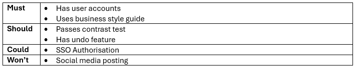

# Success Criteria

:::{dropdown} Learning Goals
By the end of this section you will:
- understand the importance of clearly establising your digital solution's success criteria.
- know how to use the MuSCoW method to prioritise the solution's requirements.
- know how to create criteria used to measure the whether a requirement has been met.
:::

## Introduction

Establishing success criteria is essential for your digital solutions project because it gives clear goals and measurable benchmarks for evaluating the effectiveness and quality of your solution. Success criteria are used to:

- Guide decision-making throughout the **problem-solving process**, especially you are evaluating components and the overall solution.
- Ensure solutions meet the **user needs** and **technical requirements** you identified during the exploration phase.
- Enable **ongoing testing and refinement** by helping you improve your work based on clear expectations.
- Provides a basis for **justified recommendations** and informed judgments about the solution's performance and impact.

Using success criteria means you can determine whether their digital solution is **functional**, **user-friendly**, and has a **positive personal, social, and economic impact**. This helps you stay focused, reflect critically, and communicate their results effectively.

## Requirements table

Solution requirements are the specific needs and constraints that must be addressed when creating a digital solution. 

These requirements typically include:

- **Functional requirements**: What the solution must do (e.g. store user input, display search results).
- **Non-functional requirements**: How the solution performs (e.g. speed, accessibility, appearance).
- **User experience requirements**: How the user interacts with the solution (e.g. ease of use, mobile compatibility).
- **Constraints**: Limitations such as time, tools, platforms, or available data.

From the project's stimulus, empathy maps, personas and use case diagram, you should be able to identify these requirements. Before we develop success criteria, we need to prioritise these requirements. For that we will use a **MuSCoW** table.

### MuSCoW table

A **MoSCoW table** is a way to prioritise solution requirements by grouping them into four categories:

- **Mu**st
- **S**hould
- **Co**uld
- **W**on’t.

It helps you to focus on what’s truly necessary; allows you to manage time and resources effectively and supports clear communication with stakeholders (ie. your teacher).

| Priority | Meaning | Source |
| --- | --- | --- |
| **Must** | Essential features that the client has requested | criteria sheet stimulus empathy maps  personas |
| **Should** | Important features you think should be included | existing solutions useability principles good coding practice data principles |
| **Could** | Good features that you don't have the time, skills or resources to implement. May be implmented in next version | existing solutions |
| **Won’t** | Feature that you will never implement | existing solutions |

**Layout**

Structure your MuSCoW table with each priority horizontal. Then list the the requirments in the appropriate priority category.

## Criteria Table

Criteria are the characteristics by which a project is evaluated or judged. They should be written in a way that states what actions will be taken to check that the requirement is met. For example, for a requirement of having accessible on-screen text, the criteria would be &mdash; passes AAA text contrast test. In Digital Solutions, there are two types of criteria, prescribed and self-determined.

### Prescribed Criteria

Prescribed criteria are those criteria that are provided or placed on a project by the client. In an educational context like Digital Solutions, these can also be provided by the teacher or detailed in an assignment.

In our workflow, we have already identified our prescribed requirements in the **Must** column of the Requirements table. Create a Prescribed-criteria table (see below) and transfer **all** the requirements from the Must column into the Requirements column.

### Self Determined Criteria

Self-determined criteria are any criteria that, rather than being prescribed, have been identified throughout the Explore phase.

In our workflow, we have also identified our self-determined requirements. They are in the **Should** column of the Requirements table. Create a Self-determined criteria table and transfer **all** the requirements from the Should column into the Requirements column.

note: change MuSCoW to vertical