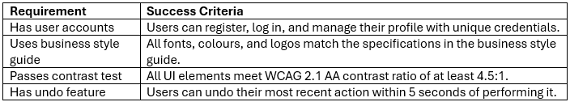

# Success Criteria

:::{dropdown} Learning Goals
By the end of this section you will:
- understand the importance of clearly establishing your digital solution's success criteria.
- know how to use the MuSCoW method to prioritise the solution's requirements.
- know how to create criteria used to measure the whether a requirement has been met.
:::

## Introduction

Establishing success criteria is essential for your digital solutions project because it gives clear goals and measurable benchmarks for evaluating the effectiveness and quality of your solution.  

Success criteria are used to:

- Guide decision-making throughout the **problem-solving process**, especially you are evaluating components and the overall solution.
- Ensure solutions meet the **user needs** and **technical requirements** you identified during the exploration phase.
- Enable **ongoing testing and refinement** by helping you improve your work based on clear expectations.
- Provides a basis for **justified recommendations** and informed judgments about the solution's performance and impact.

Using success criteria means you can determine whether their digital solution is **functional**, **user-friendly**, and has a **positive personal, social, and economic impact**. This helps you stay focused, reflect critically, and communicate their results effectively.

## Requirements table

Solution requirements are the specific needs and constraints that must be addressed when creating a digital solution.  

These requirements typically include:

- **Functional requirements**: What the solution must do (e.g. store user input, display search results).
- **Non-functional requirements**: How the solution performs (e.g. speed, accessibility, appearance).
- **User experience requirements**: How the user interacts with the solution (e.g. ease of use, mobile compatibility).
- **Constraints**: Limitations such as time, tools, platforms, or available data.

From the project's stimulus, empathy maps, personas and use case diagram, you should be able to identify these requirements. Before we develop success criteria, we need to prioritise these requirements. For that we will use a **MuSCoW** table.

&nbsp;

### MuSCoW table

A **MoSCoW table** is a way to prioritise solution requirements by grouping them into four categories:

- **Mu**st
- **S**hould
- **Co**uld
- **W**on’t.

It helps you to focus on what’s truly necessary; allows you to manage time and resources effectively and supports clear communication with stakeholders (ie. your teacher).

| Priority | Meaning | Source |
| --- | --- | --- |
| **Must** | Essential features that the client has requested | criteria sheet stimulus empathy maps  personas |
| **Should** | Important features you think should be included | existing solutions useability principles good coding practice data principles |
| **Could** | Good features that you don't have the time, skills or resources to implement. May be implemented in next version | existing solutions |
| **Won’t** | Feature that you will never implement | existing solutions |

:::{hint} The difference between Must and Should
:class: dropdown
The difference between **Must** and **Should** is that **Must** requirements are essential and non-negotiable, while **Should** requirements are important but not critical. In other words, if a **Must** requirement is not met, the solution will fail to meet its core objectives. If a **Should** requirement is not met, the solution may still function but may not provide the best user experience or meet all stakeholder expectations.
:::

**Layout**

Structure your MuSCoW table with each priority horizontal. Then list the the requirements in the appropriate priority category. See the example below.

&nbsp;

## Success Criteria

We now need to write out success criteria. Success criteria are important in digital solutions projects because they:

- **Define what success looks like** — they give a clear target for the project to aim for.
- **Guide development** — help developers make decisions that stay focused on user needs.
- **Support testing and evaluation** — provide measurable goals to check if the solution works.
- **Improve communication** — ensure everyone (students, teachers, stakeholders) understands what is expected.
- **Enable reflection and refinement** — make it easier to identify what’s working and what needs fixing.

You should write criteria for all the requirements with the **Must** and **Should** priorities.

### Writing Success Criteria

To write a **success criteria** for a requirement, describe how you will know the requirement has been met. It should be **specific, measurable, and testable**.

1. **Start with the requirement**

   - e.g. “The solution must allow users to upload images.”

2. **Decide how to measure success**

   - What evidence proves it works?
   - e.g. “User can upload an image file (JPG/PNG) and see a preview.”

3. **Write the success criteria clearly**

   - e.g. “Users can successfully upload a JPG or PNG image, which is displayed within 2 seconds.”

   Good success criteria are:

- **Clear**: Easy to understand
- **Testable**: You can check if it's met
- **Relevant**: Tied to the requirement

**Layout**

Structure your Criteria table with each requirement having it's own row. Then write the corresponding criteria in the right-hand column. See the example table below:

&nbsp;

:::{seealso} Requirements and Success Criteria Activities
:class: dropdown
**Activity 1: Identifying Requirements**

You are designing a mobile-friendly web app that helps students keep track of their homework tasks and deadlines. The app should allow students to:

- Add and delete tasks
- Set due dates and reminders
- Mark tasks as completed
- View a summary of tasks

Instructions:

1. Read the scenario above.
2. List the following:

   - 3 **functional requirements** (What the solution must do)
   - 3 **non-functional requirements** (How the solution should perform)
   - 2 **user experience requirements** (What the user needs or expects)
   - 2 **constraints** (Limitations like time, tools, or platforms)

   **Activity 2: Prioritising with a MuSCoW Table**

   You are developing a website for a local gym. The gym wants to attract new members, keep current members informed, and make communication easy. Below are 20 possible requirements. Sort them into the correct **MuSCoW** categories.

   Possible Requirements:

- Users can view class timetables
- Pages load in under 3 seconds
- Staff can log in and edit timetable information
- Users can sign up for a membership online
- Website matches gym’s official branding (colours, fonts)
- Website is mobile responsive
- Users can search for classes by day or trainer
- Include an animated logo on page load
- Provide a live chat feature for talking to staff
- Allow users to cancel or reschedule bookings
- Offer a blog with fitness tips
- Include video tours of the gym
- Include testimonials from current members
- Use strong colour contrast for accessibility
- Include a staff login portal
- Sell gym merchandise through an online shop
- Allow users to create workout plans
- Offer push notifications through the browser
- Include a downloadable PDF of the class schedule
- Translate the site into five languages

**Activity 3: Creating Criteria**

1. Transfer the requirements from the MuSCoW table in activity 2 into a Success Criteria Table.
2. Create a success criteria for each requirement.
   :::
