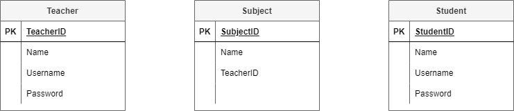
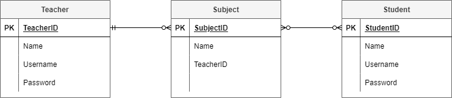
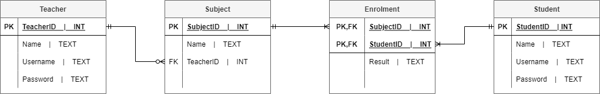
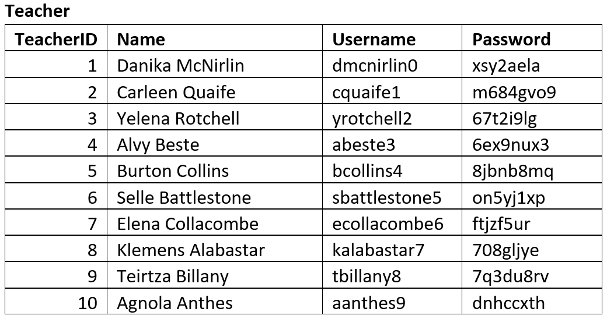

# ERD and RS

:::{dropdown} Learning Goals
By the end of this section you will:
- be able to develop Entity Relationship Diagrams by:
  - identifying the entities in a data scenario
  - categorizing attributes under the entities
  - establishing the relationships between the entities
  - resolving many-to-many relationships
  - identifying foreign keys
- be able to develop a Relational Schema from the Entity Relationship Diagram
- use sample table to check the Relational Schema
:::

The purpose of the ERD and Relational Schemas are to design and represent the database that forms your application's datastore (model).

The first step in designing a database is developing an understanding of the scenario. For learning about designing databases we will use the following scenario:

:::{seealso} Database Design Scenario
Student Subject Database

- Students can log into to access:
  - their current enrolment
  - subject grades when entered
- Teachers can log into to:
  - Enter student grades
- Each subject is only offered once, with one teacher
- Each student can enrol in each subject only once.
:::

## EDR &mdash; Entity Relationship Diagram

> An Entity Relationship Diagram (ERD) is a type of flowchart that illustrates how “entities” such as people, objects or concepts relate to each other within a system. `lucidchart_2017_er`

In following the process of creating a ERD, you will create a relational database that complies with [normalisation](../04_data.md/03_structuring_data.md) rules to the level of **3NF**.

Watch the videos below to understand designing an ERD.

<iframe width="560" height="315" src="https://www.youtube.com/embed/QpdhBUYk7Kk" title="YouTube video player" frameborder="0" allow="accelerometer; autoplay; clipboard-write; encrypted-media; gyroscope; picture-in-picture" allowfullscreen></iframe>

:::{tip} Entity Relationship Diagram (ERD) Tutorial - Part 1 Summary
:class: dropdown
**What is an ERD?**
- A **visual representation** of a database structure showing **entities**, their **attributes**, and **relationships**.
- Helps developers understand how data elements interact.

**Why Use ERDs?**
- To organise data clearly and logically.
- Useful for systems like Twitter usernames or Amazon’s inventory and order management.

**Core Components:**
- **Entities**: Objects being tracked (e.g., Customer, Order, Product).
- **Attributes**: Properties of entities (e.g., Customer ID, Name, Address).
- **Relationships**: Connections between entities (e.g., a Customer places an Order).
- **Cardinality**: Defines the numeric relationship (e.g., one-to-many, zero-to-many).

**Cardinality Examples:**
- A customer can have zero or many orders.
- An order must have one and only one customer.
- An order can include many products, but a product can belong to zero or many orders.

**Notation Used:**
- Crow’s foot notation for visualising cardinality.
:::

<iframe width="560" height="315" src="https://www.youtube.com/embed/-CuY5ADwn24" title="YouTube video player" frameborder="0" allow="accelerometer; autoplay; clipboard-write; encrypted-media; gyroscope; picture-in-picture" allowfullscreen></iframe>

:::{tip} Entity Relationship Diagram (ERD) Tutorial - Part 1 Summary
:class: dropdown
**Primary Keys (PK)**
- A **primary key** uniquely identifies each record in a table.
- Must be:
  - **Unique**
  - **Never-null**
  - **Never-changing**
- Example: `Customer ID` is a better PK than name or address because it's stable and unique.
- PKs prevent duplication and maintain data integrity.

**Foreign Keys (FK)**
- A **foreign key** is a reference to a primary key in another table.
- Used to define relationships between tables.
- Example: `Customer ID` in the **Order** table is a FK referring to the **Customer** table.
- FKs can be **repeated** (unlike PKs) and there can be **multiple FKs** in one table.

**Composite Primary Keys**
- A **composite key** uses two or more fields together to uniquely identify a record.
- Useful when no single field is unique (e.g. `Order Number` + `Product ID` for a **Shipment** table).
- Rules:
  - Use as few attributes as possible.
  - Avoid changle fields.

**Bridge Tables**
- Used to resolve **many-to-many** relationships.
- Stores interaction data between two entities.
- Example: An **Order** table can serve as a bridge between **Customers** and **Products**.
- Ensures more detail like time, quantity, and frequency of purchases.

**Data Types**
- You can add data types to attributes in your ERD for clarity and database design:
  - `INT` for IDs
  - `VARCHAR(n)` for text fields (e.g. names, phone numbers)
- Helps prepare ERDs for database implementation.
:::

We will use the following steps to create our Entity Relationship Diagrams, using the **Student Subject Database** as an example:

### Step 1: Identify the entities

Look at the scenario and the data needs and identify all the **entities** that the database needs to store. Entities can be people, places, things or processes.

In the **Student Subject Database** we have the following entities.

&nbsp;

### Step 2: Add attributes

Refer back to your data needs and requirements and add the relevant **attributes** to each entity.

The **Student Subject Database** ERD after stage 2:

&nbsp;

### Step 3: Establish relationships and cardinality

The next step is to create the **relationship** between the entities:
1. Connect the related entities using lines. 
2. Establish the **cardinality** by working out the range of connections each entity can have to the second entity.

Cardinality options

&nbsp;
 

For example in the **Student Subject Database**:

- **teacher&mdash;subject** relationship
  - each teacher can teach **zero to many** subjects (assuming you can have teachers who do not teach for this time period)
  - each subject has **one and only one teacher** who teaches it
- **student&mdash;subject** relationship
  - each student can study **zero to many subject** (assuming a student can be enrolled but not studying)
  - each subject can have **zero to many students** studying it (assuming a subject can exist without students studying it)

You will end up with the following ERD

&nbsp;

### Step 4: Resolve many-to-many relationships

In this course we will use bridging entities to deal with many-to-many relationships.

To do this:

1. find a **many-to-many** relationship
2. place a bridging entity between the two entities
  - the bridging entity will have a **composite key**, consisting of the primary keys of the two original entities.
3. reconnect the relationships
4. establish the new cardinality
  - the cardinality will be a **many** on the bridging entity's side, and a **one** on the original entities' sides
5. enter the **primary keys** from the original entities as the two parts of the composite key for the bridging entity
6. add any other relevant **attributes**

For our **Student Subject Database**:

- the **subject&mdash;student** relationship is a **many-to-many**
- add a **bridging entity** between the two, and named **'Enrolments'**
  - if you can't think of an appropriate name, just combine the name of the two original entities
- connect the relationships from the **Enrolments** entity to the **Subject** entity and the **Student** entity
- the new cardinalities will be **many** on the **Enrolments** entity end, and **one** on both the **Subject** entity and the **Student** entity
- **SubjectID** and **StudentID** are entered as the two parts of Enrolments' composite key
- the attribute of Results is added to Enrolments

At the end of step 4 our ERD looks like this:

&nbsp;

### Step 5: Identify the foreign keys

Identifying the **foreign keys** establishes how the different entities are connected together. If there is a relationship drawn between entities, then there must be a **primary key&mdash;foreign key** connection.

Steps to establish foreign keys

- select a relationship
- check the table on the **many** end
  - look for a **attribute** that logically connects it to the other entity
  - ensure that the name of the **foreign key** reflects the **primary key** of the connected entity
  - note: if you can't find one, you should add an **attribute** and name it after the primary key of the connected entity
- place a **FK** in front of the **foreign key attribute**
- move the relationship so that it connects the **foreign key** to the primary key in the connected entity

Our **Student Subject Database** example at the end of step 5:

&nbsp;

---

(rs)=
## Relational Schema

To convert your final ERD to a **Relational Schema (RS)** you will need to identify the datatype of each field.

We will be using SQLite which provides the following data type options:

- **INTEGER:** signed integers
- **REAL:** floating point values
- **TEXT:** text strings
- **BLOB:** a blob of data, stored exactly as it was input

Since Diagram.net does not provide a three column entity table, we will separate the attribute name and data type using the `|` symbol.

The RS for the **Student Subject Database** will look like:

&nbsp;

---

## Sample Tables

Sample tables are used to ensure that the database structure that the ERD produced can effectively store the required data adequately.

You should create tables that reflects the entities identified and attributes identified by the ERD. Then fill the table with sample data. This data may be given to you, or you may produce mock data that is representative of data that will be stored in the database. A good resource for creating mock data is <a href="https://www.mockaroo.com/" target="_blank">mockaroo</a>.

Below are the sample tables for the **Student Subject Database**.

&nbsp;

&nbsp;

&nbsp;

&nbsp;

:::{seealso} ERD & RS Activities
:class: dropdown
**Activity 1**

A manufacturing company produces products. The following product information is stored: product name, product ID and quantity on hand. These products are made up of many components. Each component can be supplied by one or more suppliers. The following component information is kept: component ID, name, description, suppliers who supply them, and products in which they are used. Represent this information in a relational schema.

**Acvitity 2**

Create a relational schema for a school library that allows students to borrow books throughout the term. Each book has a title, a genre, and the year it was published. Students can borrow multiple books, and each borrowing event includes a borrow date and a return date. The library also keeps track of who wrote each book, including the author’s name and nationality. Authors may have written multiple books.

**Activity 3**

An online store allows customers to place orders through a website. Each customer provides a name, email, and phone number when registering. Orders include the date placed and the total cost. Each order contains multiple products. Every product has a name, a price, and an amount in stock. For each product in an order, the system tracks the quantity purchased and the selling price at the time of order. Create a relational schema representing this data.

**Activity 4**

A company keeps its order records in a spreadsheet where each row lists the customer name, their address, the items purchased, the unit price of the items, and the order date (see table below). The company wants to convert this into a structured database. Create a Relational Schema for this database, then create sample tables using the data from the original table.

| Customer Name   | Address         | Item     |   Unit Price | Order Date   |
|:----------------|:----------------|:---------|-------------:|:-------------|
| Alice Johnson   | 123 Park Lane   | Keyboard |        49.99 | 2024-06-01   |
| Alice Johnson   | 123 Park Lane   | Mouse    |        19.99 | 2024-06-01   |
| Bob Smith       | 456 River Rd    | Monitor  |       149.99 | 2024-06-02   |
| Bob Smith       | 456 River Rd    | Keyboard |        49.99 | 2024-06-02   |
| Charlie Lee     | 789 Forest Ave  | Mouse    |        19.99 | 2024-06-03   |
| Charlie Lee     | 789 Forest Ave  | Webcam   |        89.99 | 2024-06-03   |
| Alice Johnson   | 123 Park Lane   | Webcam   |        89.99 | 2024-06-04   |
| Diana Prince    | 321 Ocean Dr    | Monitor  |       149.99 | 2024-06-04   |
| Diana Prince    | 321 Ocean Dr    | Mouse    |        19.99 | 2024-06-04   |
| Evan Thomas     | 654 Mountain Rd | Keyboard |        49.99 | 2024-06-05   |
| Evan Thomas     | 654 Mountain Rd | Webcam   |        89.99 | 2024-06-05   |
| Fiona Chen      | 987 Valley St   | Mouse    |        19.99 | 2024-06-06   |
| Fiona Chen      | 987 Valley St   | Keyboard |        49.99 | 2024-06-06   |
| George Hill     | 147 Sunset Blvd | Monitor  |       149.99 | 2024-06-07   |
| George Hill     | 147 Sunset Blvd | Mouse    |        19.99 | 2024-06-07   |
| Hannah Black    | 369 Seaside Ln  | Webcam   |        89.99 | 2024-06-08   |
| Hannah Black    | 369 Seaside Ln  | Keyboard |        49.99 | 2024-06-08   |
| Ian White       | 753 Skyline Ave | Monitor  |       149.99 | 2024-06-09   |
| Ian White       | 753 Skyline Ave | Webcam   |        89.99 | 2024-06-09   |
| Jessica Green   | 159 Pine Way    | Mouse    |        19.99 | 2024-06-10   |
:::