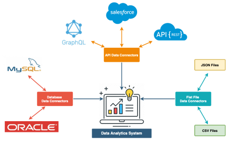
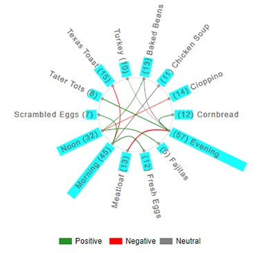
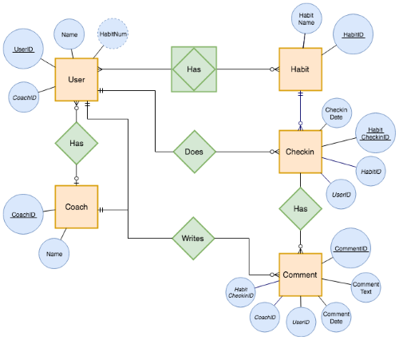

# Data Connection Diagrams

:::{dropdown} Learning Goals
By the end of this section you will:
- understand the different types of data connection diagrams and what they are used for
- understand how networks can be represented using different data connection diagrams
- know how to represent the data communicated between different nodes using a network diagram
:::

A **Data Connections Diagram** is a drawing that shows how different systems, databases, files, or tables are connected and how they share or move data between each other. It helps you understand where data comes from, where it goes, and how different parts of a system interact.

## How are they used?

Data Connection Diagrams are used to:

- **Show how things are linked**: They clearly display how different data sources (like tables or databases) are connected in a system.
- **Make data flow easier to understand**: You can follow the path data takes as it moves from one place to another, helping you understand the full picture.
- **Help with troubleshooting and upgrades**: When something goes wrong, the diagram can help you find where the problem is. It’s also useful when you want to make improvements.

---

## Key parts of the diagram

- **Nodes**: These are the things that hold or use data — like databases, spreadsheets, forms, or apps.
- **Edges (Connections)**: These are lines that show how the nodes are linked. They show the direction and type of data being shared.
- **Attributes (optional)**: Some diagrams include extra information on each connection &ndash; like how often the data updates or the amount of data being sent.

### Common diagram types

**Network Diagram**

A Network Diagram shows how **different parts of a system** (like websites, databases, or devices) are linked and how data moves between them. Each part is shown as a circle box or symbol, and lines or arrows connect them to show the direction of data flow. These diagrams are great for seeing how systems work together and are often used to spot problems, improve performance, or keep data secure.

&nbsp;

**Chord Diagram**

A **Chord Diagram** is a circle diagram used when **lots of systems are sharing data with each other**. Each item is placed around the edge of the circle, and curved lines inside the circle show how they are connected. It’s helpful for showing complex relationships—like how different school apps or departments share information—especially when everything is linked to everything else.

&nbsp;

**Relationship Diagram**

A **Relationship Diagram** is used to show how different things in a database are related. Each table (like “Students” or “Subjects”) is drawn as a box, and lines connect the boxes to show how they’re linked through shared fields (like student IDs). This diagram doesn’t show how data moves, just how the data is structured and connected. It’s mostly used when designing or understanding how a database works. Our Entity Relationship Diagrams are an example of a relationship diagram.

&nbsp;

We will be using Network Diagrams in Unit 4.

## Creating Data Exchange Diagrams

1. **Identify All Devices and Systems**

   - List all devices (e.g. computers, servers, routers, printers, phones, cloud services).
   - Include physical and virtual systems, like cloud apps, databases, and VPNs.

2. **Define How Devices Communicate**

   - Note the transmission methods (wired or wireless).
   - Include relevant **protocols** (TCP/IP, HTTP/HTTPS, FTP, VPN).
   - Identify which systems send and receive data, and whether it's **unicast**, **broadcast**, or **multicast**.

3. **Group Devices by Network Type**

   - Organize into **LANs** (Local Area Networks) or **WANs** (Wide Area Networks).
   - Show which parts are internal (e.g. school network) vs external (e.g. internet access).

4. **Add Transmission Details**

   - Include latency-sensitive connections (e.g. VoIP, streaming) and label them clearly.
   - Add any QoS (Quality of Service) requirements or performance concerns (e.g. timeliness, jitter).

5. **Represent Devices as Nodes**

   - Use circles, rectangles or symbols to represent each device or system.
   - Label them with names like “Web Server”, “Student Laptop”, “Database”, or “Router”.

6. **Draw Connections (Edges)**

   - Use arrows or lines to show how data flows between nodes.
   - Arrows show direction (e.g. from laptop to web server).
   - Include information such as:
     - Data type (e.g. JSON, XML, streaming video)
     - Transmission protocol (e.g. HTTPS, FTP)
     - Connection type (wired, wireless, VPN).

7. **Highlight Key Security Measures**

   - Show where firewalls, encryption, or VPNs are used.
   - Add any points of vulnerability (e.g. public Wi-Fi, cloud storage).

8. **Label External and Third-Party Services**

   - Clearly mark connections to services outside your network, such as:
     - Cloud platforms (Google Drive, AWS)
     - Email servers
     - Third-party APIs

9.  **Check for Privacy and Risk Areas**

   - Use your understanding of data flow to identify where personal data moves.
   - Flag areas that may require privacy protection or encryption.

10. **Review for Accuracy and Clarity**

:::{seealso} Data Connection Diagram Activities
:class: dropdown
**Activity 1**

A small business office has 5 staff who use laptops connected via Wi-Fi to a wireless router. The router provides access to the internet and a cloud-based storage service. There is also a shared network printer. Staff use an online CRM system and video conferencing apps.

Create a network diagram that shows:

- Each device (laptops, printer, router)
- The wireless connections
- External services (e.g. cloud storage, video calls)
- Security points like VPNs or firewalls
- The flow of data for file sharing,

---

**Activity 2**

You are designing a simple weather dashboard for your school website. The system includes:

- A web app that students access from their laptops
- The web app sends requests to an external weather API to get current conditions
- The app stores daily weather history in a local database hosted on a school server
- An admin panel allows staff to view and export reports

Create a network diagram that shows:
- Each device and service (student laptop, web app, API, database, admin panel)
- How they connect (wired/wireless/cloud)
- What direction the data flows (e.g. student → app → API)
- Which connections require HTTPS or API keys for security
- Where data is stored or retrieved
