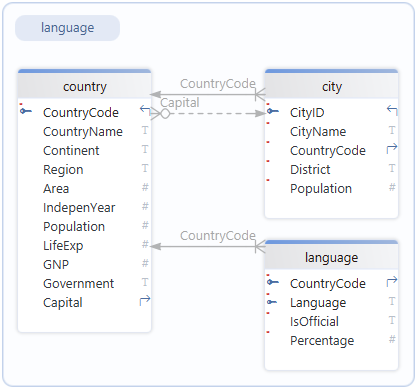
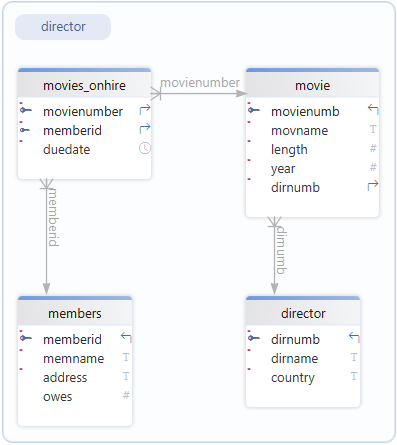
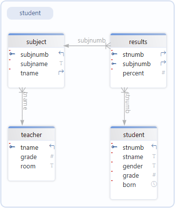
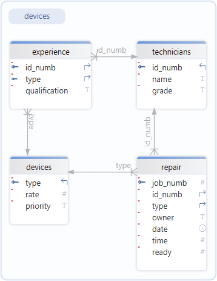
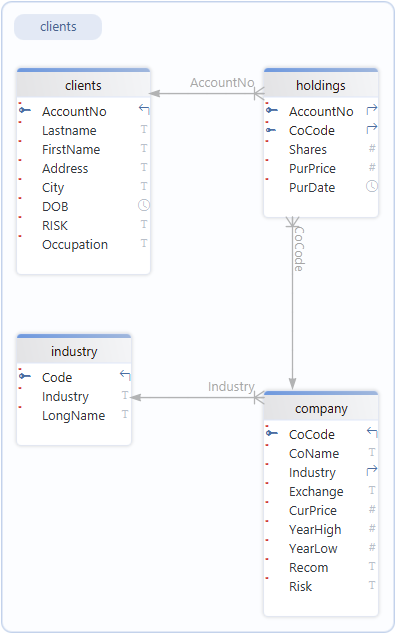
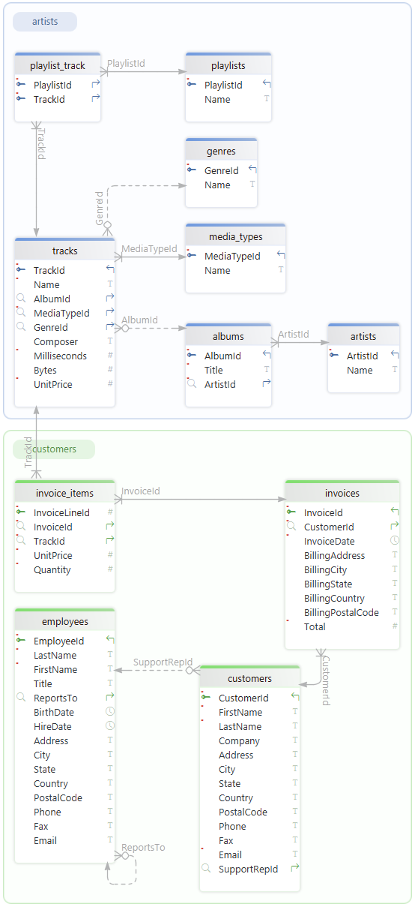

# SQLite3

:::{dropdown} Learning Goals
By the end of this section you will:
- understand Python's SQLite3 connection and cursor commands.
- know how to use SQLite3 to access an SQLite database.
:::

SQLite3 is a lightweight, easy-to-use database system that stores data in a single file on your computer. It's built into Python, which means you don’t need to install anything extra to start using it. SQLite3 lets you create tables to organise data, run SQL commands to add, search or delete data, and use that data in your apps. Because it’s fast and simple, it’s perfect for small projects and will be the tool we use to work with our databases.

## Databases

We will need databases in order to learn concepts and for our exercises. Below are complete databases that we also use to learn SQL.

:::{note} World Database
:class: dropdown
A geographic and demographic database containing data about countries, cities, populations, and related global statistics.

**Relational Schema**

<p>&nbsp;</p>

Download the [world database](../08_sql/assets/world.db)
:::

:::{note} Movies Database
:class: dropdown
 A movie database that contains information about movies on hire, such as titles, actors, directors hire and members.

**Relational Schema**

<p>&nbsp;</p>

Download the [movies database](../08_sql/assets/moives.db)
:::

:::{note} School Database
:class: dropdown
A database representing a school system, containing information on students, classes, teachers, and grades or enrolments.

**Relational Schema**

<p>&nbsp;</p>

Download the [school database](../08_sql/assets/school.db)
:::

:::{note} Repairs Database
:class: dropdown
A database designed to track repair jobs, including customers, devices, repairs performed, technicians, and costs.

**Relational Schema**

<p>&nbsp;</p>

Download the [repairs database](../08_sql/assets/repairs.db)
:::


:::{note} Shares Database
:class: dropdown
A database related to stock market or asset trading, storing data about companies, share transactions, and possibly investors or prices.

**Relational Schema**



Download the [shares database](../08_sql/assets/shares.db)
:::

:::{note} Chinook Database
:class: dropdown
A sample music store database that stores data about artists, albums, tracks, customers, invoices, and employee information.

**Relational Schema**



Download the [chinook database](../08_sql/assets/chinook.db)
:::

## Using MVC Architecture

When we discussed the [MVC Achitecture Pattern](../02_coding/04_paradigms.md#mvc-architecture-pattern) it was noted that the Model component will consist of two files. The `.bd` SQLite file and the `datastore.py` file. All of the SQLite3 code will go into the `datastore.py` file, so we need to create that before we continue.

## Datastore file

Create the datastore.py:

1. Open your repository for this unit.
2. Create a new folder in that repo called **data** (if it doesn't already exist)
3. Download all the databases above to the **data** folder
4. Create a new file called `datastore.py` in the repo root directory
5. Add the code below to `datastore.py` and save.

```{code}python
:linenos:
import sqlite3

class Datastore:

    def __init__(self):
        self.connection = sqlite3.connect("data/chinook.db")
        self.cursor = self.connection.cursor()

    def close(self):
        self.connection.close()
```

By now, much of this code and the stucture should be familiar, but there will be three things that might stand out:

- `sqlite3.connect`
- `self.connection.cursor()`
- `self.connection.close()`

The best way to think of these three is to draw an analogy with using Microsoft Word.

### Connect

When you want to write or edit a Word document, you first must open the document, this is the same as `self.connection = sqlite3.connect("data/chinook.db")`. You are telling sqlite3 which database file to open (for our learning purposes we will use `chinook.db`). The creates an object (`self.connection`) which represents the database file you have openned.

### Cursor

 Once your Word document is open, there is a little flashing line which indicates where you are access that document. If you type, words appear here. That little flashing line is called a **cursor**. This is the same as `self.cursor = self.connection.cursor()` which creates a cursor tool to access the database. 
 
 Notice that the cursor belongs to `self.connection`, that is it belongs to the opened database. This means that it can only access the `self.connection` database.

### Close

Finally, once you have finished with your Word document you will want to save and close it. That is exactly what `self.connection.close()` does. Because RAM is faster than driver, SQLite3 might cache information in RAM to prevent holding up the program. This information will get written to drive ASAP, but it is possible there is still some data in the cache when you end your program. `self.connection.close()` ensures that all cache data is written to the drive as part of Python's end of program proceedure.

## Test file

Now that we have a datastore, we need to create a `test.py` so we can check our code.

In the same directory, create a `test.py` file, and add the code below.

```{code}python
:linenos:
from datastore import Datastore

database = Datastore()

print(database.__sizeof__())
```

:::{important} Explanation of Code
:class: dropdown
This code creates an instance of our datastore, then prints the size of the instance, just to check that it has been created.
:::

:::{seealso} Activities
:class: dropdown
In your unit 2 repo, create datastores for each of the practice databases.
:::