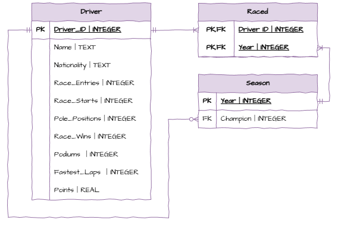
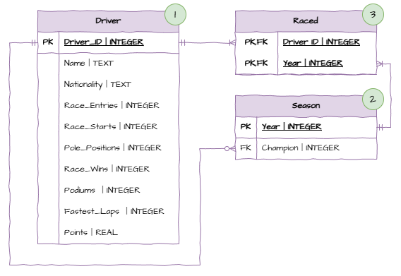

# SQLite3 - Creating, Updating, Deleting

:::{dropdown} Learning Goals
By the end of this section you will:
- 
:::

Our applications will be required to create a database programmatically using SQLite3, but we will be using several tools to assist us in this process.

Before we can start creating our database, we need to complete both:

- [ERD from Data Files](../06_documentation/11_erd_rs.md#erd-from-data-files)
- [DB Browser](../09_tools/02_db_browser.md)

## Creating a Database

First we need to look at our RS from [ERD from Data Files](../06_documentation/11_erd_rs.md#erd-from-data-files).

When creating a database, we need to be aware of foreign keys. Since foreign keys are places constraints on fields, we cannot create a table if it contains foreign keys which link to an non-existing table. Looking at the ERD above and we can observe our creation order should be:

1. **Driver table** - there are no foreign keys.
2. **Season table** - the only foreign key is Champion, which is linked to the created Driver_ID field.
3. **Raced table** - the two foreign keys link to fields that we have created.

The relational schema also provides us with the data types we need to use when creating our tables.

### Constraints

When creating our tables we should also consider what constraints we need to apply to our fields. This information should be available in our data dictionary.

