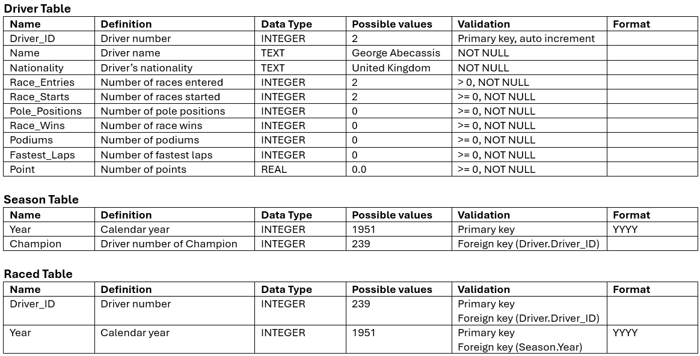

# SQLite3 - Creating, Updating, Deleting

:::{dropdown} Learning Goals
By the end of this section you will:
- 
:::

Our applications will be required to create a database programmatically using SQLite3, but we will be using several tools to assist us in this process.

Before we can start creating our database, we need to complete both:

- [ERD from Data Files](../06_documentation/11_erd_rs.md#erd-from-data-files)
- [DB Browser](../09_tools/02_db_browser.md)

## Creating a Database

First we need to look at our RS from [ERD from Data Files](../06_documentation/11_erd_rs.md#erd-from-data-files).


### Table Creation Order

When creating a database, we need to be aware of foreign keys. Since foreign keys are places constraints on fields, we cannot create a table if it contains foreign keys which link to an non-existing table. Looking at the ERD above and we can observe our creation order should be:

1. **Driver table** - there are no foreign keys.
2. **Season table** - the only foreign key is Champion, which is linked to the created Driver_ID field.
3. **Raced table** - the two foreign keys link to fields that we have created.


The relational schema also provides us with the data types we need to use when creating our tables.

### Constraints

When creating our tables we should also consider what constraints we need to apply to our fields. This information should be available in our data dictionary.

<p>&nbsp;</p>

### Create the tables

With this information, now open DB Browser and create the three tables in the correct order, applying the correct data types and constraints.

Once you have created the tables, you can access the SQL code used to create the tables by selecting the "Database Structure" tab, right-clicking on the table name and selecting "Copy CREATE statement to clipboard".

Here is the SQL we have created:

**Driver Table**

```{code}SQL
CREATE TABLE "Driver" (
	"driver_id"	INTEGER,
	"name"	TEXT NOT NULL,
	"nationality"	TEXT NOT NULL,
	"race_entries"	INTEGER NOT NULL CHECK(race_entries > 0),
	"race_starts"	INTEGER NOT NULL CHECK(race_starts >= 0),
	"pole_positions"	INTEGER NOT NULL CHECK(pole_positions >= 0),
	"race_wins"	INTEGER NOT NULL CHECK(race_wins >= 0),
	"podiums"	INTEGER NOT NULL CHECK(podiums >= 0),
	"fastest_laps"	INTEGER NOT NULL CHECK(fastest_laps >= 0),
	"points"	REAL NOT NULL CHECK(points >= 0),
	PRIMARY KEY("driver_id" AUTOINCREMENT)
);
```

**Raced Table**

```{code}SQL
CREATE TABLE "Raced" (
	"driver_id"	INTEGER,
	"year"	INTEGER,
	PRIMARY KEY("driver_id","year"),
	FOREIGN KEY("driver_id") REFERENCES "Driver"("driver_id"),
	FOREIGN KEY("year") REFERENCES "Seasons"("year")
);
```

**Seasons Table**

```{code}SQL
CREATE TABLE "Seasons" (
	"year"	INTEGER,
	"champion"	INTEGER NOT NULL,
	PRIMARY KEY("year"),
	FOREIGN KEY("champion") REFERENCES "Driver"("driver_id")
);
```

## Python Code

Now it is time to transfer this process to Python code. Inside your Unit 3 repo, create a file called `f1_datastore.py`. Then add the code below to create the database and tables.

```{code}python
:linenos:
import sqlite3

class Datastore:
    """
    Datastore for the f1 driver database
    """

    def __init__(self, data_file: str):
        """
        initialises the datastore
        """

        self.conn = sqlite3.connect("f1_driver.db")
        self.cursor = self.conn.cursor()

        self.bulid_database()
        self.conn.commit()

    def bulid_database(self):
        """
        builds the database
        """

        self.cursor.execute(
            """
            CREATE TABLE "Driver" (
                "driver_id"	INTEGER,
                "name"	TEXT NOT NULL,
                "nationality"	TEXT NOT NULL,
                "race_entries"	INTEGER NOT NULL CHECK(race_entries > 0),
                "race_starts"	INTEGER NOT NULL CHECK(race_starts >= 0),
                "pole_positions"	INTEGER NOT NULL CHECK(pole_positions >= 0),
                "race_wins"	INTEGER NOT NULL CHECK(race_wins >= 0),
                "podiums"	INTEGER NOT NULL CHECK(podiums >= 0),
                "fastest_laps"	INTEGER NOT NULL CHECK(fastest_laps >= 0),
                "points"	REAL NOT NULL CHECK(points >= 0),
                PRIMARY KEY("driver_id" AUTOINCREMENT)
            );
            """
        )

        self.cursor.execute(
            """
            CREATE TABLE "Seasons" (
                "year"	INTEGER,
                "champion"	INTEGER NOT NULL,
                PRIMARY KEY("year"),
                FOREIGN KEY("champion") REFERENCES "Driver"("driver_id")
            );
            """
        )

        self.cursor.execute(
            """
            CREATE TABLE "Raced" (
                "driver_id"	INTEGER,
                "year"	INTEGER,
                PRIMARY KEY("driver_id","year"),
                FOREIGN KEY("driver_id") REFERENCES "Driver"("driver_id"),
                FOREIGN KEY("year") REFERENCES "Seasons"("year")
            );
            """
        )
```