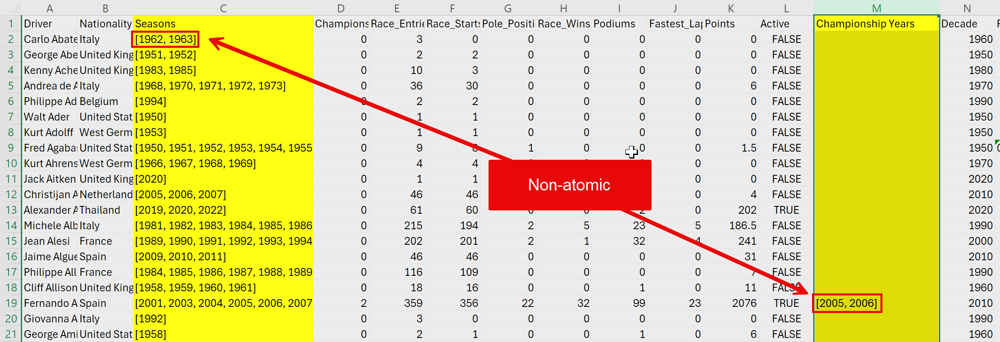
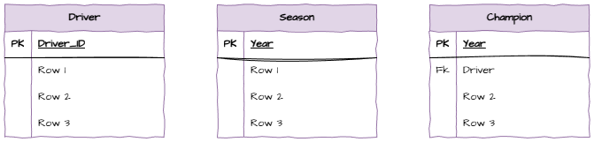
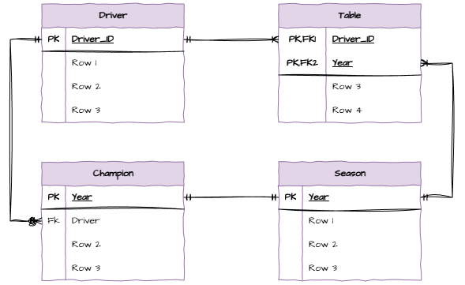
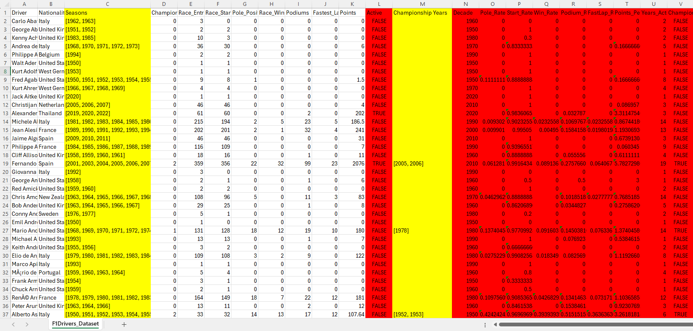

# SQLite3 - Creating, Updating, Deleting

:::{dropdown} Learning Goals
By the end of this section you will:
- Know how to create a relational schema from a csv atafile
:::

:::{note} You will need...
:class: dropdown
- [F1Drivers_Dataset.csv](./assets/07/F1Drivers_Dataset.csv)
- [netflix_titles.csv](./assets/07/netflix_titles.csv)
:::

Often the development of a relational schema starts with or includes a datafile. In this section we will look at how to analyse a data file and create a relational schema from it.

We will be using cvs files as our datafile. It is importnat to note that csv file can only represnet flat files, while we will be working with relational databases. Therefore, we will need to decompose the data in the csv file into multiple tables.

Before we do this it will be useful to remember the rules of [Normalization](../04_data/03_structuring_data.md).

A table is in 3NF if:
1. Each column contains atomic values
2. Each column contains the same type of data
3. Each column and row has a unique identifier
4. The order in which the data is saved does not matter
5. There are no partial dependencies
6. There are no transitive dependencies

## Analysing the datafile

While we can look at the raw csv file as a datafile, it is easier to analyse if we open it in Excel or similar software. 

### Setup

Navigate to the `data` folder in the unit repository and open the file `F1Driver_Dataset.csv` in Excel.

The first thing Excel will want to do is convert the data in the file. Do want to see the data as it is, so select **Don't Convert**, then get rid of the yellow banner warning of dataloss, by click on the x on the right.

Since the table is almost 900 records long, we want a way to easily look over all the data. Fortunately Excel has a feature called **Filters** that will help us with this.

To turn filters on:

1. Go to the **Data** tab in the ribbon
2. Click on **Filter**

You should now see little arrows next to each column header. Clicking on these will allow you to see all the unique values in that column, and filter the data based on these values.

### Non-atomic values

The first thing we will do is to check that each column only contains **atomic values**.

You will notice that both the **Seasons** and the **Champioship Years** columns contain multiple values in a single cell, therefore non-atomic values.

When you find non-atomic values in a column, this means that this column will need to be split into a separate table. Note, that once you have found one non-atomic value in a column, you don't need to check the rest of that column.

So we can see that we will need to create two  tables in addition to the main table, one for Seasons and one for Championship Years.

Open Draw.io and use the Entity Relation symbols to create these three tables.

&nbsp;

### Relationships and Cardinalities

Now add the relationships and cardinalities between the tables.

- One driver must have at least one season, but can have many seasons
- Each season must have at least one driver, but can have many drivers
- One driver can be zero or many champions
- Each champion has to be one and only one driver
- Each season has to have one and only one champion
- Each champion can be in one and only one year

Remove the many-to-many relationship by a bridging entity.

Notice the one-to-one relationship between Seasons and Champions. This means that we can merge these two tables into one. 

&nbsp;

### Partial Dependencies

Next we need to check for partial dependencies. Particial dependencies can only occur in tables with composite primary keys. We only have one table with a composite primary key, the Raced table. Since there are no columns in this table that are not part of the primary key, there are no partial dependencies.

### Transitive Dependencies

Finally we need to check for transitive dependencies. A transitive dependency occurs when a non-key attribute depends on another non-key attribute.

If we look back at our csv files we will see many columns that can be inferred from other columns. For example, the **Pole Rate** can be inferred from the Pole_Positions column and the Race_Entries column. This means that the Pole Rate column depends on the Pole_Positions and Race_Entries columns. Therefore it is transitive.

There are many other columns that are also transitive, so we will not include them in our schema.

&nbsp;

### Final Schema

We will now include the remaining columns in our schema and end up with the final schema below.

