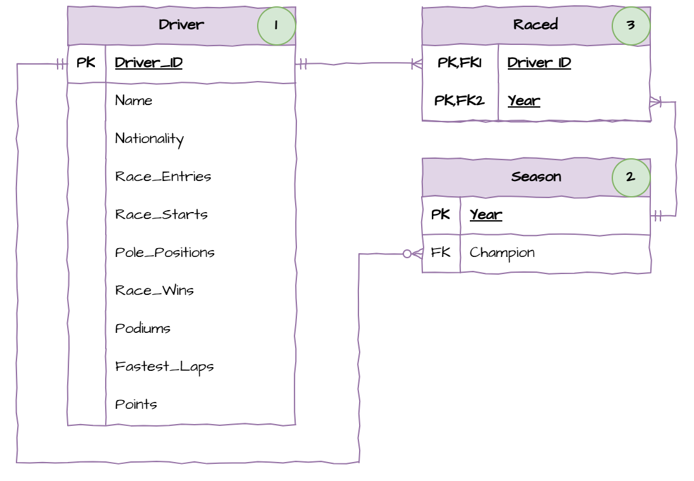
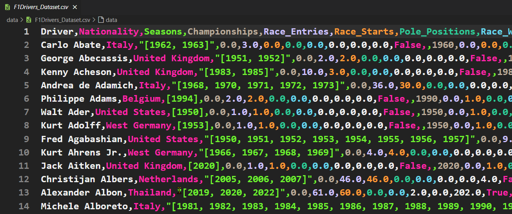
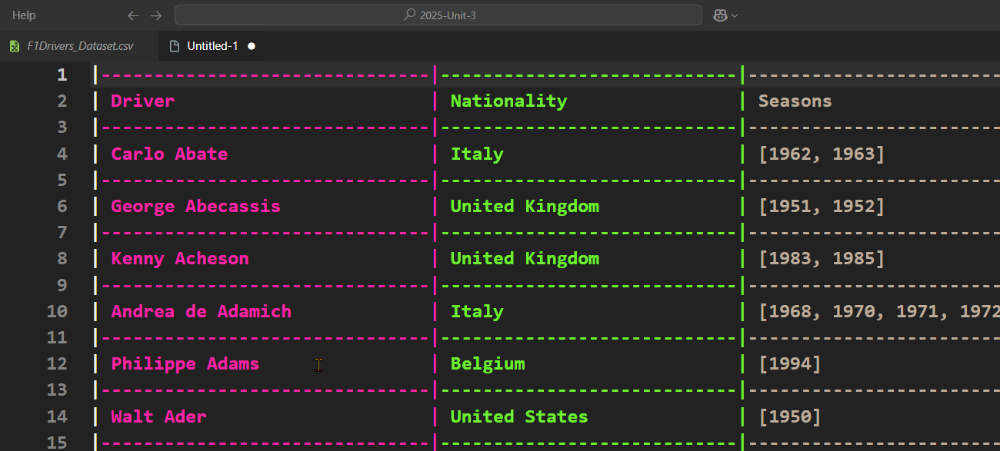

# Populating Databases

:::{dropdown} In this section you will...
- Learn to read data from a CSV file into a SQLite database
:::

:::{note} You will need...
:class: dropdown
- [Digital Solutions Unit 3 repository](https://github.com/DamoM73/DS-2025-Unit-3)
- [Rainbow CSV Visual Studio Code Extension](https://marketplace.visualstudio.com/items?itemName=mechatroner.rainbow-csv)
- [CSV to Table Visual Studio Code Extension](https://marketplace.visualstudio.com/items?itemName=phplasma.csv-to-table)
- [SQLite Visual Studio Code Extension](https://marketplace.visualstudio.com/items?itemName=alexcvzz.vscode-sqlite)
:::

In this section we will learn how to parse a CSV file into a SQLite database. We will populate the **f1_driver.db** with the data contained in the **F1Drivers_Dataset.csv** file. We will continue to use the MVC architecture, meaning this code will be placed in the **Datastore** class and be called from the **main.py** file.

## F1 Database Structure

Before we populate a database, we would have already designed the data structure and created the tables that form our database. The **f1_drive.db** contains our database which uses the structure below.



When populating a database, we need to be aware of foreign keys. We cannot write to a table if it contains foreign keys which link to an unpopulated table. Looking at the ERD above and we can observe the populate order should be:

1. **Driver table** - there are no foreign keys.
2. **Season table** - the only foreign key is Champion, which is linked to the populated Driver_ID field.
3. **Raced table** - the two foreign keys link to fields that we have populated.

## Explore the Dataset
Whenever you work with a dataset, it is important to explore it first. You need to understand it, in order to ensure the integrity of the data as you parse it into your database structure.

Click on the **F1Drivers_Dataset.csv** to view it's content. You will see the raw data below.



Although the colour helps, the columns are a bit hard to use, so press **Ctrl/Cmd** + **P** and then type **Convert to table from CSV**. This should present the data below.



Scrolling through the data we can make some observations about how we will need to process the data:

- CSV files are essentially text files. Programming languages use protocols to add functionality, but they are still text files. Therefore, everything read from the text file will be a string. This means that any data that is not a TEXT type, will need to be converted into the appropriate type for processing.
- **Seasons** and **Championship Years** fields contain lists. These two will be read as a string, and we will need to convert them into lists for processing.
- All the numbers that are written as floats (eg. **Championships**) do not have any decimal value, and are logically integers&mdash;you can't have 0.5 of a championship&mdash; so we will need to convert them into integers.

## Initial Processing

A common problem with processing data into databases is not knowing the data that is being parsed. To address this, throughout coding the populate solution we will first extract the data from the CSV and print it to terminal. This way we can see the *actual* data we will write to the database. Once we are confident that the data is correct, we can then send it to the database.

First we will do this for the entire CSV, so we can see what is returned when we read the CSV.

### Create datastore.py

In your Unit 3 repo, create a new file called **f1_datastore.py**, then add the following code:

```{code}python
:linenos:
import sqlite3


class Datastore:
    """
    Datastore for the f1 driver database
    """

    def __init__(self, database_file: str, data_file: str):
        """
        initialises the datastore
        """
        self.database_file = database_file
        self.data_file = data_file
        self.conn = sqlite3.connect("self.database_file")
        self.cursor = self.conn.cursor()
```

:::{important} Explanation of Code
:class: dropdown
- lines 3-8 &rarr; create a `Datastore` class which accepts a filenames for the database file and data file.
- line 12 &rarr; stores the database filename.
- line 13 &rarr; stores the data filename.
- line 14 &rarr; connects to the database.
- line 15 &rarr; creates a database cursor for manipulating data.
:::

Now that we have connected to the database, we need to start reading data from the CSV file. To do this we need to import the csv module.

```{code}python
:linenos:
:emphasize-lines:2
import sqlite3
import csv
```

We will also modularise all the population code into a separate method. This method needs to be called at the end of the **__init__()** method.

```{code}python
:linenos:
:lineno-start: 10
:emphasize-lines:19
    def __init__(self, database_file: str, data_file: str):
        """
        initialises the datastore
        """
        self.database_file = database_file
        self.data_file = data_file
        self.conn = sqlite3.connect("self.database_file")
        self.cursor = self.conn.cursor()

        self.populate_database()
```

Next we will open and read the CSV file, with each row being converted into a dictionary. This will produce an iterable object (something that can be processed using a `for` loop) of dictionaries. We'll then iterate over this object, printing out all the dictionaries.

```{code}python
:linenos:
:lineno-start: 21
    def populate_database(self):
        """
        populates the database with data from the csv file
        """
        with open(self.data_file, mode="r", encoding="utf-8") as csvfile:
            csv_reader = csv.DictReader(csvfile)

            # process the CSV data
            for record in csv_reader:
                print(record)
```

:::{important} Explanation of Code
:class: dropdown
- line 21 &rarr; creates the **populate_database** method
- line 25 &rarr; opens the CSV file
  - `mode = "r"` &rarr; opened in reading mode
  - `encoding="utf-8"` &rarr; allows the reading of non-English characters
  - `as csvfile` &rarr; stores the open file in the `csvfile` variable
- line 26 &rarr; creates a Dictreader object that reads each row of the CSV file as a dictionary, where the keys are the column headers from the first row of the file.
- line 29 &rarr; starts a loop that goes through each row in the CSV file, as provided by csv_reader, record is a dictionary representing one row from the CSV.
- line 30 &rarr; prints the current record dictionary
:::

### Create the main.py

In order to test our code, we now need to create a **main.py** file. In this file we need to create an instance of our Datastore object. We use the following code to do this.

```{code}python
:linenos:
from f1_datastore import Datastore

db = Datastore("f1_driver.db", "data/F1Drivers_Dataset.csv")
```

### Test Initial Processing

Now we can test the initial processing by running **main.py**

Your terminal should stream a list of dictionaries (868 of the to be exact). This is the data that is being read from the CSV file. Lets have a look at one of these dictionaries. I have formatted the last dictionary to make it easier to read.

```{code}python
{
    'Driver': 'Ricardo Zunino', 
    'Nationality': 'Argentina', 
    'Seasons': '[1979, 1980, 1981]', 
    'Championships': '0.0', 
    'Race_Entries': '11.0', 
    'Race_Starts': '10.0', 
    'Pole_Positions': '0.0', 
    'Race_Wins': '0.0', 
    'Podiums': '0.0', 
    'Fastest_Laps': '0.0', 
    'Points': '0.0', 
    'Active': 'False', 
    'Championship Years': '', 
    'Decade': '1980', 
    'Pole_Rate': '0.0', 
    'Start_Rate': '0.9090909090909091', 
    'Win_Rate': '0.0', 
    'Podium_Rate': '0.0', 
    'FastLap_Rate': '0.0', 
    'Points_Per_Entry': '0.0', 
    'Years_Active': '3', 
    'Champion': 'False'
}
```

The first thing we can notice is that there is more data in the dictionary, than can be stored in the database. That's because `Pole_Rate`, `Start_Rate`, `Win_Rate`, `Podium_Rate`, `FastLap_Rate`, `Points_Per_Entry`, `Years_Active`, and `Champion` can all be calculated from the other values. 

The next thing we can notice is that each value is a string, meaning that we need to covert it into the correct data type for the dictionary.

Finally the `Seasons` value is a string representing a list. This will need to be converted and then iterated over. For example, processing Ricardo's seasons will require three entries into the database (one for each year).

## Writing to Driver Table

Looking at the [Data Structure ERD](#f1-database-structure), or viewing the **f1_driver.db** file, we can see that the Driver table requires the following fields:
- driver_id
- name
- nationality
- race_entries
- race_starts
- pole_positions
- race_wins
- podiums
- fastest_laps
- points

Here is the pseudocode for the process we will follow:

```{code}pseudocode
FOR record IN csv_reader
    name = record[Driver]
    nationality = record[Nationality]
    race_entries = record[Race_Entries]
    race_starts = record[Race_Starts]
    pole_positions = record[Pole_Positions]
    race_wins = record[Race_Wins]
    podiums = record[Podiums]
    fastest_laps = record[Fastest_Laps]
    points = record[Points]
    
    INSERT driver data INTO driver table
NEXT record
ENDFOR
```

We will do this in two stages:
1. process the driver data and output them to terminal - this will allow us to check that the data is correct.
2. change the output to insert the values in the database.

### Process Driver Data

Return to our **f1_datastore.py** file and replace the `print` statement on **line 30** with the code below:

```{code}python
:linenos:
:lineno-start: 28
:emphasize-lines: 30, 31
            # process the CSV data
            for record in csv_reader:
                # process driver values
                name = record["Driver"]
                nationality = record["Nationality"]
                race_entries = int(float(record["Race_Entries"]))
                race_starts = int(float(record["Race_Starts"]))
                pole_positions = int(float(record["Pole_Positions"]))
                race_wins = int(float(record["Race_Wins"]))
                podiums = int(float(record["Podiums"]))
                fastest_laps = int(float(record["Fastest_Laps"]))
                points = float(record["Points"])

                # view the driver data
                print(
                    name,
                    nationality,
                    race_entries,
                    race_starts,
                    pole_positions,
                    race_wins,
                    podiums,
                    fastest_laps,
                    points,
                )
```

:::{important} Explanation of Code
:class: dropdown
- lines 31 & 32 &rarr; taking the string from the record dictionary and assigning it to the variable.
- lines 33 - 38 &rarr; taking the string from the record dictionary and converts it to a float then to an integer (this is needed as a strait conversion to integer will cause an error because of the decimal value).
- line 39 &rarr; taking the string from the record dictionary and converts it to a float. The points field actually contains information in the decimal value.
- lines 42 - 52 &rarr; displays the processed driver data to the terminal.
:::