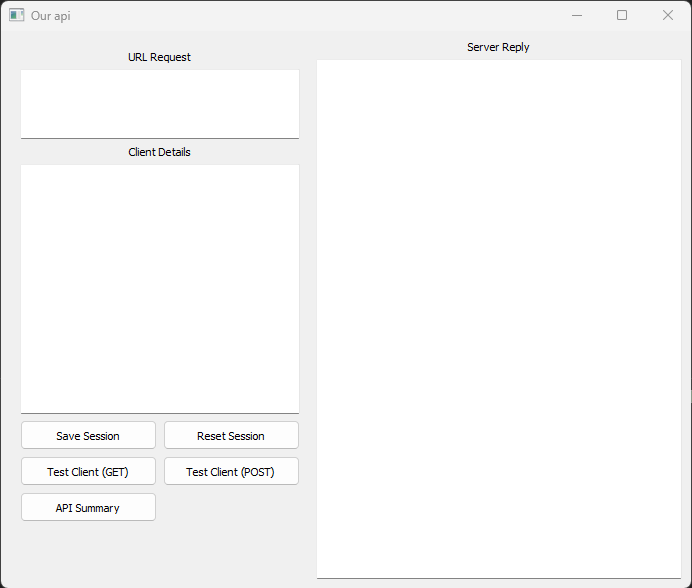
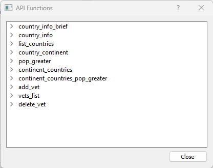
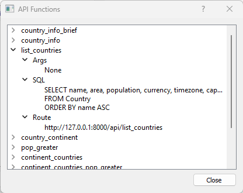
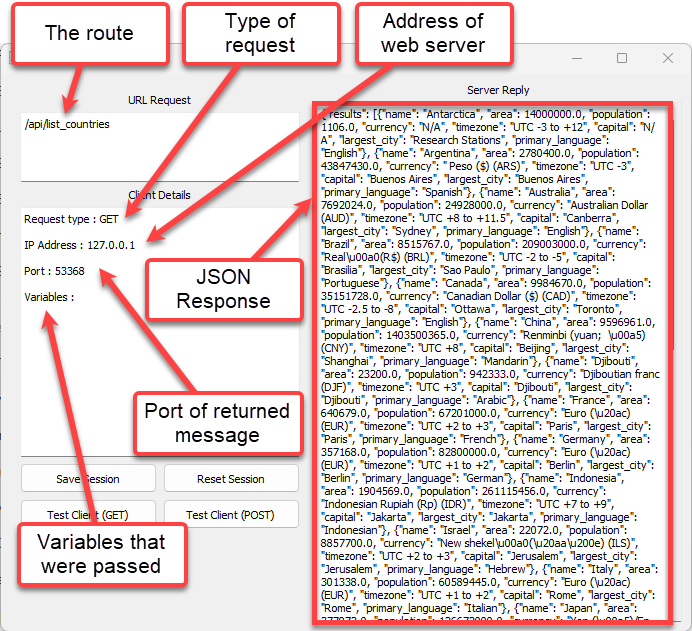
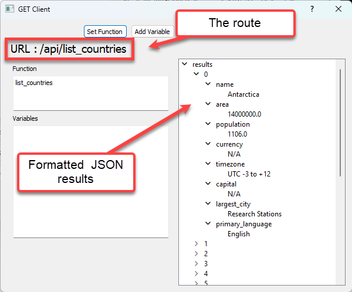
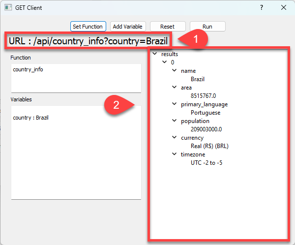
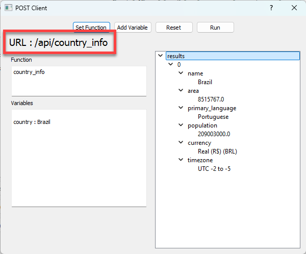

# OurAPI

:::{dropdown} Learning Goals
By the end of this section you will:
 - install OurAPI on your computer
:::

OurAPI was originally created as an educational tool. It enables quick and easy development of a RESTful JSON API, with real-time request feedback displayed through its graphical interface. Built-in GET and POST clients allow for interface testing, although any HTTP client—including a web browser—can interact with the API. It was developed by Steven Tucker and his original 

We will use OurAPI's built in database to practice using API GET and POST requests. We will then explore using our own databases and creating our own API functions.

## Getting Started

To get started you can download [OurAPI](https://sourceforge.net/projects/ourapi/) from SourceForge. OurAPI doesn't have an installer, rather extracting the zip file will provide access to the program, so make sure you remember it. Launch OurAPI by opening it's folder and starting the **main** file.

:::{error} OurAPI is not working
:class: dropdown
If OurAPI doesn't work on your computer, this sometimes happens with macOS, then you can clone my [fork of OurAPI](https://github.com/DamoM73/myourapi.git). Create a virtual environment, ensuring you tick the **requirement.txt** option, then run **main.py**.
:::

Now you should have the following window displayed on your screen.

<p>&nbsp;</p>

What you are seeing is the GUI of the application, in the background your computer is running a webserver. This webserver is hosting the API that we will be accessing. Let try it out with a simple GET request.

## Function Calls

### First call

The APi has a range of functions that provide access to the database. To see these functions click on the **API Summary** button. You should have the following dialogue pop up:

<p>&nbsp;</p>

You can see there are currently 10 functions the API offers. Click on the **>** beside **list_countries** and you will see three more options. Click on all the **>** so you can see all the details of **list_countries** function.

<p>&nbsp;</p>

Lets look at those details:
- Args &rarr; there is no need to pass arguments
- SQL &rarr; this is the SQL query that will be run on the database
- Route &rarr; this is the address that executes the query
  - `http://127.0.0.1:8000` &rarr; the address of the webserver on your computer
  - `/api/list_countries` the route to the API function of that web server.

Copy the route, paste it into address bar of a browser, then press return. Two things should have happened:

1. Your browser should display a block of text &ndash; this is actual the JSON response from the web server.
2. the OurAPI UI should now have a heap of new details.

<p>&nbsp;</p>

**Test Client**

Lets run that request a different way:

1. Click **Reset Session**
2. Click on **Test Client (GET)** then type **list_countries**
3. Click **Run**

The OurAPI GUI should display the same information as before, but lets look at the change in the **GET Client** dialogue.

<p>&nbsp;</p>

:::{seealso} List Countries Activity
:class: dropdown
1. Write a Python script that call the OurAPI list_counties function, processes and displays the returned JSON response.
:::

### Call with Argument

RESTful operations also allow for the API to be provided with arguments. Lets try one:

In the **GET Client**:

1. Click on **Set Function** &rarr; enter **country_info**
2. Click on **Add Variable**
   - Name &rarr; **country**
   - Value &rarr; **Brazil**
3. Click **Run**

<p>&nbsp;</p>

You will notice:

1. The argument name and the value are part of the URL
2. Only one result has been returned

Close the **GET Client** then open the **POST Client** and repeat the same process.

<p>&nbsp;</p>

Have a look at the POST URL. Notice that the argument name or value is not part of it? That's because the data is sent in the body of the request—not in the URL. This means users don’t see the data in the address bar, making it more private and allowing larger amounts of information to be sent, like form details, login credentials, or file uploads.

:::{hint} When do I use POST
:class: dropdown
It’s better to use **POST** rather than **GET** when you are **sending data to a server to create or update something**, like submitting a form or logging in. POST is more secure for sensitive data (like passwords), doesn’t show information in the URL, and can handle larger amounts of data than GET. Use POST when the action **changes data on the server** or when the information being sent should not be visible or stored in browser history.
:::

:::{seealso} Requests Activities
:class: dropdown
1. Perform both GET requests and POST requests for all of the function in the **API Functions** list (via the **API Summary** button).
2. Write Python scripts that also perform all the requests.
:::

## Customising OurAPI

You can customise OurAPI to use different databases and create your own functions. What's even better is that it is super easy to do this.

To udnerstand how to do this, we're going to look a bit closer at how OurAPI works.

### Exploring OurAPI

First, open the `api_db.sqlite` file using DB Browser. You will find that it just an ordinary SQLite database. You can see that there are many more tables in the database than we can access using the API functions. That is one of the security features of the REST framework. Users can only access the data you make available to them.

Next open the `definitions.ini` with a text editor, or in VS Code. You will find the following:

```{code}yaml
[country_info_brief]
args = country
sql = SELECT name,population
      FROM Country
      WHERE name = :country

[country_info]
args = country
sql = SELECT name, area, primary_language, population, currency, timezone
      FROM Country
      WHERE name = :country

[list_countries]
args = None
sql = SELECT name, area, population, currency, timezone, capital, largest_city, primary_language
      FROM Country
      ORDER BY name ASC

[country_continent]
args = country 
sql = SELECT c.name AS Country, ct.name AS Continent
      FROM Country AS c
      INNER JOIN Continent AS ct
      ON c.continent_id = ct.id
      WHERE c.name = :country

[pop_greater]
args = min_pop
sql = SELECT name, population 
      FROM Country 
      WHERE population > :min_pop
      ORDER BY population ASC

[continent_countries]
args = continent
sql = SELECT c.name AS Country
      FROM Country AS c
      INNER JOIN Continent AS ct
      ON c.continent_id = ct.id
      WHERE ct.name = :continent

[continent_countries_pop_greater]
args = continent,min_pop
sql = SELECT c.name, c.population
      FROM Country AS c
      INNER JOIN Continent AS ct
      ON c.continent_id = ct.id
      WHERE ct.name = :continent
      AND c.population > :min_pop
      ORDER BY c.population ASC

[add_vet]
args = first_name,last_name,phone,address,room,appointment_times,email
sql = INSERT INTO Vet
      (first_name, last_name, phone_no, address, room_no, appointment_times, email)
      VALUES(:first_name, :last_name, :phone, :address, :room, :appointment_times, :email)

[vets_list]
args = None
sql = SELECT first_name, last_name
      FROM Vet

[delete_vet]
args = first_name,last_name
sql = DELETE FROM Vet
      WHERE first_name = :first_name
      AND last_name = :last_name
```

Looking at this you should recognise three things:

1. the text in the square brackets are the names of the API functions
2. the **args** line lists the arguments that the function needs
3. the **sql** is a Python parameterised SQL statement.

With this information, you can start creating new API functions.

:::{seealso} New Function Activities
:class: dropdown
Create the following functions, then call them from the OurAPI UI. Use DB Browser to confirm your results.

1. Write a API function to return the names of all artists.
2. Write a API function to return all tracks that cost less than $1.
3. Write a API function to return all employees’ first and last names, ordered by last name.
4. Write a API function to return all customers who do not have a company listed.
5. Write a API function to return all customers with the last name provided.
6. Write a API function to return all track names that start with the provided word.
7. Write a API function to return the first and last names of customers who live in a provided city.
8. Write a API function to return all album titles along with the artist's name.
9. Write a API function to return the count of how many tracks exist in a provided genre.
10. Write a API function to return the average invoice total for invoices from the provided country.
:::

### Making OurAPI yours

We have now identified the two files that provide OurAPI with the relevant information:

- **definitions.ini** provides the structure for the API functions
- **api_db.sqlite** provides the data for the functions

So to customise OurAPI replace these two files with your custom file:

- your database needs to be called **api_db.sqlite**
- your file containing your function details needs to be called **definitions.ini**

:::{caution} Be Careful
Make sure that you don't loose the original **api_db.sqlite** and **definitions.ini**. Make a copy of them and call them something else.
:::

Remember the API function structure when making your own **definitions.ini**:

```{code}yaml
[<function_name>]
args = <argument names seperated by commas>
sql = <parameterised SQL statement>
```

:::{seealso} Custom OurAPI Activities
:class: dropdown
To complete the following activities We will use the Chinook Database from [exercise databases we used to learn SQL](../08_sql/01_intro.md#exercise-databases). You will need to save it to your OurAPI folder.

For each of the following activities, you will need to:

- create the API function in the **definitions.ini**
- write a Python script that calls the API function and displays the returned results

**Activities**

1. Write an API function that returns the count of how many tracks are stored in the database.
2. Write an API function that returns the names and unit prices of the 5 most expensive tracks.
3. Write an API function that returns each genre and the number of tracks in that genre, ordered from most to least.
4. Write an API function that returns first and last names of employees whose title is "Sales Support Agent".
5. Write an API function that returns the track which appears the most in invoice lines, showing its name and how many times it was sold.
6. Write an API function that returns the first name, last name, and city of all customers who live in the provided country.
7. Write an API function that returns the name and duration (in milliseconds) of tracks that are longer than the provided time (in seconds).
8. Write an API function that returns the titles of albums created by the provided artist.
9. Write an API function that returns invoice ID, customer name, and total for all customers located in the provided country.
10. Write an API function that returns full name and the total amount spent by the customer with the provided customer ID.
:::


