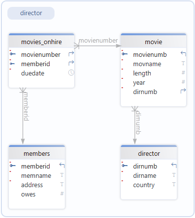

# SQL Introduction

## Exercise Databases

:::{note} World Database
:class: dropdown
A geographic and demographic database containing data about countries, cities, populations, and related global statistics.

**Relational Schema**

&nbsp;

Download the [world database](./assets/world.db)
:::

:::{note} Movies Database
:class: dropdown
 A movie database that contains information about movies on hire, such as titles, actors, directors hire and members.

**Relational Schema**

&nbsp;

Download the [movies database](./assets/moives.db)
:::

:::{note} School Database
:class: dropdown
A database representing a school system, containing information on students, classes, teachers, and grades or enrolments.

**Relational Schema**

&nbsp;

Download the [school database](./assets/school.db)
:::

:::{note} Repairs Database
:class: dropdown
A database designed to track repair jobs, including customers, devices, repairs performed, technicians, and costs.

**Relational Schema**

&nbsp;

Download the [repairs database](./assets/repairs.db)
:::

:::{note} Shares Database
:class: dropdown
A database related to stock market or asset trading, storing data about companies, share transactions, and possibly investors or prices.

**Relational Schema**

Download the [shares database](./assets/shares.db)
:::

:::{note} Chinook Database
:class: dropdown
A sample music store database that stores data about artists, albums, tracks, customers, invoices, and employee information.

**Relational Schema**

Download the [chinook database](./assets/chinook.db)
:::
