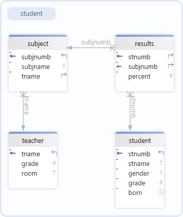

# SQL Introduction

:::{dropdown} Learning Goals
By the end of this section you will:
- the basics of what SQL is
- be ready to start your SQL learning
:::

<iframe width="560" height="315" src="https://www.youtube-nocookie.com/embed/zpnHsWOy0RY?si=gkyE6sd4acHOy65m" title="YouTube video player" frameborder="0" allow="accelerometer; autoplay; clipboard-write; encrypted-media; gyroscope; picture-in-picture; web-share" referrerpolicy="strict-origin-when-cross-origin" allowfullscreen></iframe>

:::{tip} Summary
:class: dropdown
This video provides a concise introduction to SQL (Structured Query Language), a standard language for interacting with databases. Here's a summary of the key points covered:

**What is SQL?**
SQL, often pronounced "sequel," stands for Structured Query Language. It is the standard language for accessing and manipulating databases. The video highlights that SQL became a standard of the American National Standards Institute (ANSI) in 1986 and the International Organization for Standardization (ISO) in 1987.

**What can SQL do?**
The video explains several key functions of SQL, including:
- Executing queries to retrieve data from a database.
- Inserting, updating, and deleting records within a database.
- Creating new databases, tables, and views.
- Setting permissions and more.

**Versions of SQL**
While SQL is a standardized language, different database systems may use their own versions or "dialects" of SQL. However, to comply with the ANSI standard, they all support major commands like SELECT, UPDATE, DELETE, INSERT, and WHERE.

**Building a Website with a Database**
To create a website that displays data from a database, you'll need:
- An RDBMS (Relational Database Management System) program like MS Access, SQL Server, or MySQL.
- A server-side scripting language such as PHP or ASP.
- Knowledge of SQL to retrieve the desired data.
- HTML and CSS to style the webpage.

**RDBMS: Relational Database Management System**
RDBMS is the foundation for SQL and modern database systems. Some of the most popular RDBMS examples include MS SQL Server, IBM DB2, Oracle, MySQL, and Microsoft Access.

**How Data is Stored in an RDBMS**
In an RDBMS, data is stored in tables, which are collections of related data entries consisting of columns and rows.
- **Tables**: The main objects in a database that store data.
- **Fields (Columns)**: These are the columns in a table, designed to maintain specific information about every record.
- **Records (Rows)**: Each individual entry that exists in a table.
- **Columns**: Vertical entities in a table containing all information associated with a specific field.

The video concludes with an example of a SELECT statement (SELECT * FROM Customers;) to retrieve all records from a "Customers" table.
:::

## Exercise Databases

We will be using the database below for our SQL activities. We will be using [DB Browser for SQLite](../01_introduction/02_technologies_used.md#database-management-system) to execute your SQL, so make sure you have it installed.

:::{note} World Database
:class: dropdown
A geographic and demographic database containing data about countries, cities, populations, and related global statistics.

**Relational Schema**

&nbsp;

Download the [world database](./assets/world.db)
:::

:::{note} Movies Database
:class: dropdown
 A movie database that contains information about movies on hire, such as titles, actors, directors hire and members.

**Relational Schema**

&nbsp;

Download the [movies database](./assets/moives.db)
:::

:::{note} School Database
:class: dropdown
A database representing a school system, containing information on students, classes, teachers, and grades or enrolments.

**Relational Schema**

&nbsp;

Download the [school database](./assets/school.db)
:::

:::{note} Repairs Database
:class: dropdown
A database designed to track repair jobs, including customers, devices, repairs performed, technicians, and costs.

**Relational Schema**

&nbsp;

Download the [repairs database](./assets/repairs.db)
:::

:::{note} Shares Database
:class: dropdown
A database related to stock market or asset trading, storing data about companies, share transactions, and possibly investors or prices.

**Relational Schema**

Download the [shares database](./assets/shares.db)
:::

:::{note} Chinook Database
:class: dropdown
A sample music store database that stores data about artists, albums, tracks, customers, invoices, and employee information.

**Relational Schema**

Download the [chinook database](./assets/chinook.db)
:::
