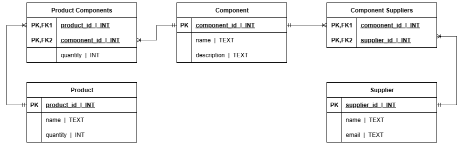
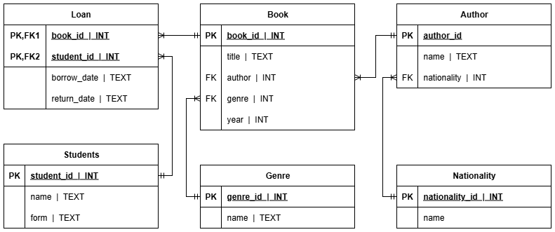
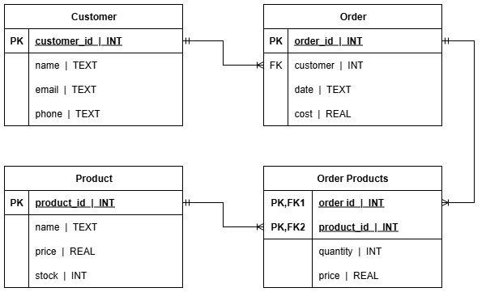
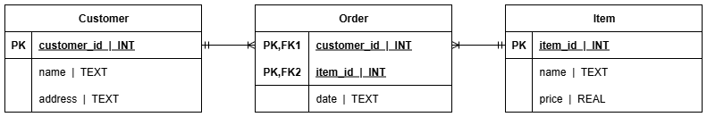

# CREATE TABLE

:::{dropdown} Learning Goals
By the end of this section you will:
:::

The `CREATE TABLE` statement is used to create a new table in a database.

Go to the [W3schools Tutorial](https://www.w3schools.com/sql/sql_create_table.asp) on the CREATE TABLE Statement and complete their exercises.

We will use **DB Broswer** to create our databases. Watch the videos below to see how.

<iframe width="560" height="315" src="https://www.youtube-nocookie.com/embed/videoseries?si=SJ5IvDs0oyw80qlb&amp;list=PLXCOpHy94WuakzGAJWupxrogCubmnBlyt" title="YouTube video player" frameborder="0" allow="accelerometer; autoplay; clipboard-write; encrypted-media; gyroscope; picture-in-picture; web-share" referrerpolicy="strict-origin-when-cross-origin" allowfullscreen></iframe>
&nbsp;

## CREATE TABLE order

When creating a relational database containing multiple tables, you need to be findful of order in which they're created. If a table contains a foreign key, this foreign key needs to be able point to the table of where it is the primary key, ie. the one side of the one-to-many relationship. So the table containing the primary key needs to be create first.

Let's look at the student subject database from the ERD / RS section:

We can observe:

- Both the **Teacher** and the **Student** tables have no foreign keys, so they can be created straight away.
- The **Subject** table cannot be created until the **Teacher** table is created
- The **Enrolment** table cannot be create until both the **Subject** table and the **Student** table is created.

:::{seealso} CREATE TABLE Activities
:class: dropdown
Create dartabases for the Relational schemas you created in the [ERD and RS section](../06_documentation/11_erd_rs.md)

**Activity 1**

---

**Activity 2**

---

**Activity 3**

---

**Activity 4**

:::
