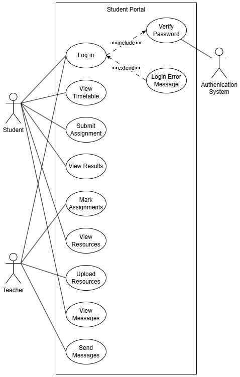
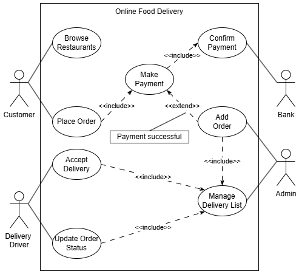
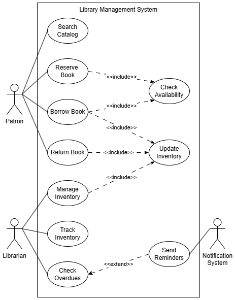
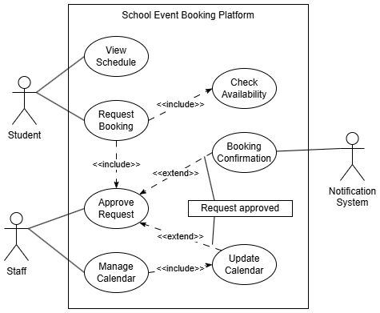

# Activity Solutions

:::{attention}Suggested solutions
Just like all things digital, there are many paths to a solution. The solutions provided below are **a** solution, but are **not the only** solution.

They are provided not so you can check you answers, but so you can check the thinking that lead to your answers.
:::

## Coding

### Coding Introduction

:::{seealso} IPO Solutions
:class: dropdown
**1. Budget Calculator**

| Input | Process | Output |
| --- | --- | --- |
| Total weekly income | Add up all expenses | Total expenses |
| List of expenses (e.g. food, transport, entertainment) | Subtract expenses from income | Remaining money |

---

**2. Step Counter App**

| Input | Process | Output |
| --- | --- | --- |
| Step data from motion sensor | Count total steps walked  Calculate distance and calories using step count and user data | Total steps  Distance walked and calories burned |

---

**3. Quiz App**

| Input | Process | Output |
| --- | --- | --- |
| User-selected answer | Compare answer to correct answer  Track score for each question | Show “Correct” or “Incorrect”  Final score after all questions |
:::

:::{seealso} Decomposition Solutions
:class: dropdown
**Activity 1**

- Ask the user to enter homework details (subject, task, due date)
- Store the homework tasks in a list or file
- Display the list of tasks to the user
- Allow the user to mark tasks as completed
- Sort or filter tasks by due date or subject

---

**Activity 2**

- Get team names and store them
- Set the starting score for each team to zero
- Create a way to add or subtract points during the game
- Display the current score on screen
- Show a final message with the winner when the game ends

---

**Activity 3**

- Load a set of questions and multiple-choice answers
- Display one question at a time to the user
- Record the user’s selected answer
- Check if the answer is correct and keep score
- Show the final score after all questions are answered
:::

:::{seealso} Pattern Recognition Solutions
:class: dropdown

**Activity 1**

Quiz Feedback Program:

- Each question has a structure: question text, multiple options, one correct answer
- The same process is repeated: show question → get answer → check answer → give feedback
- Feedback messages follow a pattern (e.g. "Correct!" or "Incorrect, the right answer is...")

---

**Activity 2**

Weather App:

- Each day’s forecast uses the same data format: day name, icon, temperature, description
- Icons represent weather types (e.g. sun, cloud, rain) and are reused across days
- Patterns in temperature changes (e.g. hot in afternoon, cool at night) can be recognised

---

**Activity 3**

Timetable Generator:

- Class times follow regular patterns (e.g. Period 1 starts at 9:00 every day)
- Subjects repeat on the same days each week
- Breaks and lunch are placed in the same time slots across all timetables
:::

:::{seealso} Abstraction Solutions
:class: dropdown
**Activity 1: Water Intake App**

- **Necessary information and features**: Date, amount of water consumed, daily goal, total intake so far, and a simple way to log each drink
- **Unnecessary details to leave out**: Brand of water, exact time of each sip, detailed drink history beyond a few days
- **Abstraction used**: Focus on tracking totals and goals; ignore details that don’t help the user meet their target

---

**Activity 2: Puzzle Game**

- **Parts that stay the same**: Player controls, puzzle-solving mechanics, scoring system, level completion logic
- **How to group/simplify**: Use a single function or module to handle shared game mechanics; only change artwork, sound, and puzzle layout per level
- **Abstraction used**: Group repeated behaviour into reusable procedures or objects (e.g. movePlayer(), checkPuzzleComplete())

---

**Activity 3: Staff Profiles Website**

- **Essential information**: Name, photo, job title, email address
- **How to keep it consistent**: Use one profile template or function that fills in staff data for each person
- **Abstraction used**: Create a reusable layout or function for all staff profiles instead of writing separate code for each one
:::

:::{seealso} System Thinking Solutions
:class: dropdown
**Activity 1: School Attendance App**

Parts of the system:

- Student data input (e.g. scanned ID or manual entry)
- Database storing attendance records
- Notification system for sending updates to teachers and parents
- Reporting interface for staff

Interactions:

- When a student is marked present or absent, the database updates
- The system sends notifications based on changes
- Reports are generated from stored attendance data
- If the input method fails, notifications and reports may be incorrect

---

**Activity 2: Online Food Delivery System**

Parts of the system:

- User app (for browsing and ordering)
- Restaurant system (receives and confirms orders)
- Payment gateway
- Delivery tracking system

Interactions:

- The user order triggers updates across the system
- Payment confirmation activates the restaurant system
- Restaurant status affects delivery time
- If one part fails (e.g. restaurant delay), it affects the whole order process

---

**Activity 3: Smart Home Lighting System**

Parts of the system:

- Light bulbs or smart switches
- Sensors (e.g. motion or daylight sensors)
- User interface (e.g. mobile app or voice assistant)
- Automation rules

Interactions:

- Sensor input affects lighting behaviour
- User settings control when and how lights change
- Automation rules link actions together (e.g. turn off lights when no motion)
- A change in settings or sensor failure can disrupt the whole system’s function
:::

### Basic Features

### Good Practice

:::{seealso} Good Programming Practice Solutions
:class: dropdown
Here are the answers to the scenario-based questions:

1. **Make your code easy for a teammate to understand**

   - Use meaningful variable and function names
   - Follow a consistent style guide like PEP 8
   - Write clear comments and docstrings
   - Keep functions short and focused

2. **Program crashes on unexpected input**

   - Add input validation to check for bad data
   - Use `try-except` blocks to handle errors gracefully
   - Test edge cases to make sure your code is dependable

3. **Long, hard-to-follow function**

   - Break it into smaller, single-purpose functions
   - Use descriptive names for each function
   - Add comments to explain complex sections

4. **Program is slow when processing many records**

   - Choose efficient algorithms and data structures
   - Avoid unnecessary loops or calculations
   - Use early exits in loops and optimise repeated actions

5. **Code breaks after a module update**

   - Your code is part of a **dependency chain**
   - You can manage this by:

     - Locking versions in a `requirements.txt` file
     - Testing after updates
     - Keeping modules loosely coupled

6. **Code gives wrong results in some cases**

   - Likely a **logic error**
   - Fix it by:

     - Reviewing your algorithm
     - Testing with different inputs, including edge cases
     - Using desk checks and walkthroughs

7. **Evaluating code effectiveness**

   - Compare outputs to the expected results
   - Use real and edge case data
   - Ask for user feedback
   - Use the success criteria you defined earlier

8. **`IndexError: list index out of range`**

   - This is a **runtime error**
   - Prevent it by checking list length before accessing elements
   - Add error handling to avoid crashes

9. **Making a function easier to understand later**

   - Add a **docstring** after the function definition
   - Include descriptions of parameters, the process, and return values
   - IDEs will use the docstring to show helpful hints

10. **Running Python on different devices**

   - This shows **code portability**
   - Python is portable because it runs on many platforms (Windows, macOS, Linux, iOS, Android, web) without changes to the code
:::

### Programming Paradigms

:::{seealso} Programming Paradigms Solutions
:class: dropdown
1. **Inheritance** – it lets `Car` reuse the code from `Vehicle`, reducing repetition and improving structure.
2. **MVC pattern** – separates data (Model) from display (View), making the app easier to manage and update.
3. **Event-driven programming** – event handlers respond to user actions like clicks or key presses.
4. One is working on the **View**, the other on the **Model** – MVC allows both to work independently without conflict.
5. **Event handler** – triggered by the event loop when the key press is detected.
6. **Object-Oriented Programming (OOP)** – allows the use of classes and objects to model shared and unique behaviours.
:::

## User Experience

### Useability

:::{seealso} Useability Solutions
:class: dropdown
**Activity 1**

| Issue # | Usability Principle | Suggested Improvement |
| :--- | :--- | :--- |
| 1 | Safety | Move the 'Delete' button away from 'Save' and add a confirmation dialog before deletion. |
| 2  | Accessibility | Use a high-contrast colour scheme (e.g. black text on white background) and test using the Colour Contrast Analyser. |
| 3 | Learnability | Add an onboarding tutorial, tooltips, or a help screen with brief explanations. |
| 4 | Efficiency / Utility | Add a dropdown list or autocomplete for common subjects to save time and reduce errors. |
| 5 | Effectiveness / Safety | Prevent crashes by making due date optional or showing a clear error message before saving. |
| 6 | Effectiveness / Reliability | Fix the reminder system to ensure it works consistently, even after the app is closed. |
| 7 | Learnability / Accessibility  | Add text labels or tooltips to icons and use familiar symbols (e.g. trash can for delete). |
| 8 | Safety | Include a confirmation step before deleting tasks to avoid accidental loss. |
| 9 | Accessibility / Effectiveness | Increase button size and spacing for easier touch use, especially on mobile. |
| 10 | Safety / Utility | Instead of deleting completed tasks, move them to a “Completed” tab with an option to restore. |
:::

### Visual Communication 

:::{seealso} Alignment Activity Solution
:class: dropdown
**Examples of Alignment on the LEGO Website:**

- **Top Navigation Bar**:
  Menu items like “Shop,” “Discover,” “Help,” and the search and cart icons are horizontally aligned, creating a clean and organized header.

- **Product Grid Layout**:
  On category pages, products are aligned vertically in columns and horizontally in rows, making it easy to scan and compare items.

- **Homepage Banners**:
  Promotional text and buttons are aligned with images or backgrounds. For example, text is often left-aligned or centred depending on the layout, maintaining visual consistency.

- **Footer Links**:
  Links in the footer are aligned into neat columns under headings like “About Us,” “Support,” and “Legal,” allowing for quick navigation and readability.

- **Text Blocks and Images**:
  On product pages, text descriptions, prices, and buttons are left-aligned with the product image, ensuring a coherent flow of information.
:::

:::{seealso} Balance Activity Solution
:class: dropdown
**Examples of Balance on the LEGO Website:**

- **Homepage Hero Sections**:
  Large feature images are visually balanced with text boxes or call-to-action buttons placed on the opposite side, achieving symmetrical or asymmetrical balance.

- **Product Pages**:
  Images on the left and product information (name, price, reviews, buttons) on the right create a balanced layout that guides the user’s attention naturally.

- **Category Pages**:
  Products are evenly spaced in a grid format, ensuring visual weight is distributed across the screen, maintaining consistent spacing and size.

- **Navigation and Icons**:
  The logo, navigation menu, and icons (search, cart, account) are placed to balance each other across the top bar, preventing the header from feeling lopsided.

- **Mobile View**:
  Sections are stacked with equal spacing and centred elements, preserving balance in a vertical layout suited for smaller screens.
:::

:::{seealso} Contrast Activity Solution
:class: dropdown
**Examples of Contrast on the LEGO Website:**

- **Text and Background**:
  White or yellow text is used on dark backgrounds (e.g. banner images), and black or dark text on light backgrounds, making content easy to read.

- **Call-to-Action Buttons**:
  Buttons like “Add to Bag” or “Shop Now” are in bright colours (e.g. blue, yellow, or red) that stand out against the surrounding content.

- **Product Thumbnails**:
  Bold colours of LEGO sets contrast strongly with neutral backgrounds, making the products pop and attract attention.

- **Sale and Promotion Labels**:
  Discounts or special offers use red or yellow tags that contrast with the usual site colours, drawing the user’s eye immediately.

- **Hover Effects**:
  Interactive elements such as buttons or product cards use contrast changes (e.g. background darkens or border appears) to show they are clickable.
:::

:::{seealso} Harmony Activity Solution
:class: dropdown
**Examples of Harmony on the LEGO Website:**

- **Consistent Colour Palette**:
  The site uses LEGO’s signature colours (red, yellow, blue, black, white) throughout, creating a unified and familiar brand experience.

- **Typography**:
  Fonts are used consistently across headings, body text, and buttons, which helps maintain a harmonious and professional appearance.

- **Icon and Button Styles**:
  Icons (e.g. cart, user profile, search) and buttons share consistent shapes, outlines, and animations, contributing to a cohesive interface.

- **Spacing and Layout**:
  Margins, padding, and alignment are consistent across all pages, making each section feel like part of a unified design.

- **Product Presentation**:
  Product images follow the same framing, lighting, and background style, creating visual harmony across listings and pages.
:::

:::{seealso} Repetition Activity Solution
:class: dropdown
**Examples of Repetition on the LEGO Website:**

- **Navigation Structure**:
  The top menu bar with categories like “Shop,” “Discover,” and “Help” is repeated on every page, helping users know where to find information.

- **Product Cards**:
  Each product uses a repeated format: image, name, price, and “Add to Bag” button. This consistent structure makes browsing easier.

- **Icons and Buttons**:
  Icons (cart, user, search) and buttons use repeated shapes, sizes, and colours throughout the site for visual consistency.

- **Section Layouts**:
  Sections such as "Recommended for You," "Popular Sets," and "New Releases" follow a repeated horizontal scrolling format.

- **Colour and Branding**:
  LEGO’s red and yellow brand colours are repeated throughout the site in banners, buttons, and labels, reinforcing brand identity.
:::

:::{seealso} Hierarchy Activity Solution
:class: dropdown
**Examples of Hierarchy on the LEGO Website:**

- **Homepage Banners**:
  Large images with bold headlines and smaller subtext create a clear visual order, drawing attention to key promotions first.

- **Product Pages**:
  Product names appear in large, bold text, followed by price, reviews, and then detailed descriptions, guiding the user from most important to least.

- **Call-to-Action Buttons**:
  Buttons like “Add to Bag” or “Shop Now” are larger, brightly coloured, and centrally placed, making them stand out as the next step.

- Navigation Menu:
  Primary categories (e.g. “Shop,” “Discover”) are placed at the top, while subcategories appear only after interaction, showing importance levels.

- **Text Styling**:
  Fonts vary in size and weight — headings are bold and larger, while supporting details are smaller — helping users quickly scan for key info.
:::

:::{seealso} Proximity Activity Solution
:class: dropdown
**Examples of Proximity on the LEGO Website:**

- **Product Listings**:
  Product image, name, price, and “Add to Bag” button are grouped closely together, showing they belong to the same item.

- **Navigation Menu**:
  Related links such as “Shop by Age,” “Shop by Theme,” and “Offers” are grouped in dropdown menus, helping users find related content easily.

- **Checkout Section**:
  Shipping details, payment options, and order summary are placed near each other, showing they are part of the same process.

- **Homepage Sections**:
  Headings are positioned close to their related images and descriptions, clearly linking the content together.

- **Footer Links**:
  Information like “Customer Service,” “About Us,” and “Legal” are grouped under clear headings, showing their related purpose.
:::

:::{seealso} Colour Activity Solution
:class: dropdown
**Examples of Colour Use on the LEGO Website:**

- **Brand Identity**:
  LEGO’s primary colours (red, yellow, blue) are used consistently across the site to reinforce brand recognition and create harmony.

- **Contrast**:
  Bright colours (e.g. yellow buttons on dark backgrounds) are used to create contrast, making important elements like calls-to-action stand out.

- **Hierarchy**:
  Colour intensity and brightness are used to highlight what’s most important. For example, “Add to Bag” buttons are brighter than surrounding text, drawing attention first.

- **Repetition**:
  Consistent use of colour for buttons, icons, and headings helps users quickly recognise similar functions or sections across the site.

- **Grouping (Proximity and Colour)**:
  Background shades (e.g. white, grey, or coloured panels) are used to visually separate sections, aiding in grouping related content.
:::

:::{seealso} Form Activity Solution
:class: dropdown
**Examples of Form Use on the LEGO Website:**

- **Product Thumbnails**:
  LEGO sets are shown in 3D-rendered images or angled photos that emphasise their physical form, helping users visualise the product.

- **Buttons and Icons**:
  Rounded rectangles and consistent button shapes provide a familiar and clickable form, supporting usability and harmony.

- **Homepage Visuals**:
  Large banners feature LEGO models with clear form and structure, using shadows and depth to create visual interest and contrast.

- **Category Icons**:
  Icons representing age ranges, themes, or collections use simplified forms that are easy to recognise and differentiate.

- **Interactive Elements**:
  Hover effects on buttons and cards create a sense of movement and depth, reinforcing form through visual feedback.
:::

:::{seealso} Line Activity Solution
:class: dropdown
**Examples of Line Use on the LEGO Website:**

- **Dividers Between Sections**:
  Thin horizontal lines are used to separate content areas, helping to create clear structure and visual hierarchy.

- **Navigation Menus**:
  Lines and borders are used to group dropdown items, improving proximity and making relationships between links clearer.

- **Product Cards**:
  Subtle lines around product tiles or within cards separate image, title, price, and button, guiding the eye through the layout.

- **Grid Layouts**:
  Invisible or faint lines structure the grid of products, creating alignment and balance across the page.

- **Hover Effects and Underlines**:
  Interactive text links often use underlines or bottom borders on hover, using line to signal interactivity.
:::

:::{seealso} Proportion Activity Solution
:class: dropdown
**Examples of Proportion Use on the LEGO Website:**

- **Product Cards**:
  Images are larger than text and buttons, reflecting their importance and drawing users’ attention first.

- **Headings vs Body Text**:
  Headings are significantly larger than supporting text, establishing hierarchy and helping users scan pages easily.

- **Call-to-Action Buttons**:
  Buttons like “Add to Bag” or “Shop Now” are proportionally larger than nearby text to make them visually dominant and easily clickable.

- **Hero Banners**:
  Featured sections on the homepage use oversized images and bold text to emphasise new or promoted products.

- **Icons and UI Elements**:
  Icons are proportionally balanced with the text and buttons they relate to, maintaining visual harmony and clarity.
:::

:::{seealso} Scale Activity Solution
:class: dropdown
**Examples of Scale Use on the LEGO Website**

- **Hero Banners**:
  Large-scale images and headlines at the top of the homepage draw immediate attention to featured products or promotions.

- **Product Images**:
  Product images are scaled larger than text or price to highlight the product and help users view details clearly.

- **Call-to-Action Buttons**:
  Buttons like “Add to Bag” are scaled up compared to surrounding text, making them easy to notice and interact with.

- **Heading Sizes**:
  Main headings are larger than subheadings and body text, creating a clear hierarchy and improving readability.

- **Mobile Responsiveness**:
  On smaller screens, elements are rescaled to maintain usability and visual balance while keeping the most important items easy to tap.
:::

:::{seealso} Shape Activity Solution
:class: dropdown
**Examples of Shape Use on the LEGO Website:**

- **Buttons and Input Fields**:
  Rectangular buttons with slightly rounded corners are used consistently, creating a clear and approachable interface.

- **Icons**:
  Simple geometric shapes (circles, squares, and rectangles) are used for icons like search, cart, and profile, supporting clarity and consistency.

- **Product Images**:
  LEGO sets are often photographed in ways that highlight their blocky, angular shapes, reinforcing the brand’s visual identity and creating harmony.

- **Content Blocks**:
  Sections of content are arranged in rectangular containers, helping users recognise grouped information and maintaining alignment.

- **Promotional Badges**:
  Shapes like stars or rounded tags are used to highlight promotions or featured products, creating visual contrast and drawing attention.
:::

:::{seealso} Space Activity Solution
:class: dropdown
**Examples of Space Use on the LEGO Website:**

- **Whitespace Around Elements**:
  Generous spacing between images, text, and buttons helps reduce clutter, making the content easier to read and improving overall clarity.

- **Product Grids**:
  Consistent spacing between product cards ensures balance and alignment, making it easy to scan and compare items.

- **Section Separation**:
  Clear space between homepage sections (e.g. banners, featured sets, and categories) defines each area and guides the user’s flow down the page.

- **Navigation and Dropdowns**:
  Menu items are spaced out to prevent accidental clicks and improve accessibility, especially on mobile devices.

- **Text Blocks**:
  Paragraphs and headings are spaced with clear margins and line spacing, enhancing readability and visual hierarchy.
:::

:::{seealso} Tone Activity Solution
:class: dropdown
**Examples of Tone Use on the LEGO Website:**

- **Backgrounds and Overlays**:
  Soft greys and muted tones are used behind text and product sections to maintain contrast while ensuring readability and a clean, modern look.

- **Product Photography**:
  Lighting and colour tone in product images are consistent, using bright and vibrant tones that reflect LEGO’s playful and energetic brand.

- **Typography Tone**:
  Bold, cheerful colours like red, yellow, and white are used in headlines and calls to action, reinforcing a friendly and enthusiastic tone.

- **Hover Effects**:
  Subtle tonal shifts when hovering over buttons or links signal interactivity while maintaining a consistent visual style.

- **Seasonal and Promotional Themes**:
  Darker or lighter tones may be used in themed promotions (e.g. Halloween, Christmas) to reflect mood while staying within the LEGO aesthetic.
:::

:::{seealso} Texture Activity Solution
:class: dropdown
**Examples of Texture Use on the LEGO Website:**

- **Product Images**:
  High-resolution photos show the surface detail of LEGO bricks — their gloss, studs, and seams — giving a sense of physical texture and realism.

- **Background Graphics**:
  Some banners and themed sections use illustrated or photographic textures (e.g. bricks, walls, packaging) to add depth and visual interest.

- **Hover Effects**:
  Subtle shadowing or lighting changes on hover create the illusion of tactile response, enhancing interactivity through implied texture.

- **Thematic Pages**:
  Pages for specific sets or franchises (e.g. Star Wars, Technic) may include gritty, smooth, or metallic textures in the background to match the theme’s tone.

- **Contrast and Depth**:
  Textured visuals are used sparingly to contrast with flat design elements, helping key content stand out without overwhelming the user.
:::

---

### Impacts

:::{seealso} Personal Impacts Solution
:class: dropdown
**Activity 1: Fitness Tracker**

Positive Impacts:

- Improved awareness of health metrics (steps, heart rate, sleep)
- Motivation to achieve daily activity goals

Negative Impacts:

- Increased stress and anxiety from unmet goals
- Obsessive behaviour affecting mental health
- Disrupted work-life balance due to constant checking

Refinements:

- Introduce “rest days” or flexible goals
- Provide positive feedback without pressure
- Add mental health check-ins or screen-time warnings

---

**Activity 2: Study App**

Positive Impacts:

- Helps Jamie stay organised with study tasks
- Improves digital literacy through regular use

Negative Impacts:

- Privacy risk from data collection
- Financial pressure to upgrade to premium
- Distracting ads reduce usability

Refinements:

- Limit ad tracking and data collection
- Offer ad-free version for education users
- Improve transparency in privacy policy

---

**Activity 3: VR Social Platform**

Positive Impacts:

- Enhances social interaction in a safe space
- May reduce social anxiety for some users

Negative Impacts:

- Avoidance of real-life interactions
- Excessive screen time leading to fatigue
- Risk of emotional over-reliance on digital spaces

Refinements:

- Add usage time limits or reminders to log off
- Encourage real-life meetups or offline goals
- Include features to track emotional well-being
:::

:::{seealso} Social Impacts Solutions
:class: dropdown
**Activity 1: Facial Recognition in Public Spaces**

Equity & Inclusion:

- Studies show facial recognition is significantly less accurate for people with darker skin tones, women, and young people. This can lead to disproportionate targeting, mistaken identity, and harassment, particularly affecting minority and vulnerable groups.
- People from culturally and linguistically diverse (CALD) backgrounds may be overrepresented in databases used for surveillance, reinforcing systemic bias.

Well-being & Safety:

- Although promoted as a safety tool, the system may create anxiety and discomfort. Citizens may feel they are constantly monitored, even when not doing anything wrong.
- It can erode public trust in government institutions and law enforcement, especially among communities with a history of being unfairly policed.

Unintended Societal Effects:

- Normalisation of surveillance may discourage protest and free expression.
- Increased social division as people perceive they are being unfairly watched, especially if surveillance is heavier in lower-income or high-diversity areas.
- Sets a precedent for expanding surveillance technologies without strong public oversight.

Recommendations:

- Implement strict policies defining when and where facial recognition can be used.
- Require transparency about how data is stored, who has access, and for how long.
- Mandate third-party bias audits and ban use in schools or areas not proven to benefit from it.
- Provide clear opt-out mechanisms or alternatives for those who do not consent to be scanned.

---

**Activity 2: AI Hiring Tool**

Economic Participation:

- Automating hiring processes can save time and reduce some biases, but often also reduces job opportunities for people with non-traditional experience or resumes (e.g. career changers, refugees, older adults).
- If the AI prefers characteristics based on previous successful hires (e.g. attending elite schools), it reinforces existing barriers to economic mobility.

Equity & Inclusion:

- Marginalised groups (e.g. women, First Nations people, people with disabilities) may be excluded due to algorithmic bias in resume screening.
- AI trained on biased historical hiring data may unintentionally penalise applicants based on name, gender, or cultural background.
- Neurodivergent applicants or those with non-linear career paths may be filtered out unfairly.

Social Justice:

- AI hiring lacks transparency; candidates don’t know how decisions are made, and there may be no way to appeal or request human review.
- Raises legal and ethical concerns under anti-discrimination laws, especially if fairness was not considered in the AI's design.

Recommendations:

- Require human review at critical stages to catch unfair rejections.
- Use diverse training data and conduct regular audits to identify discriminatory outcomes.
- Clearly inform applicants how AI is used and provide meaningful opt-out or appeal options.
- Engage legal and ethical experts when designing or purchasing AI systems.

---

**Activity 3: School Communication App**

Community & Culture:

- The app strengthens parent–teacher communication for tech-savvy families, increasing engagement and transparency.
- However, it weakens relationships with families who lack devices, don’t speak English well, or feel intimidated by digital tools. These families may feel excluded from the school community.

Equity & Inclusion:

- Digital divide is a major issue: low-income households may not have smartphones or internet. Remote or Indigenous communities may have limited connectivity.
- Migrant parents or carers with low literacy may struggle with apps in English.
- Children in these homes miss updates, permission notes, and homework alerts, increasing inequality.

Education Access and Fairness:

- Homework reminders, timetable updates, or absence notifications may never reach some families, leading to lower attendance, missed assignments, and disengagement.
- Some students may be embarrassed that their families don’t use the app, affecting confidence and sense of belonging.

Recommendations:

- Provide printed newsletters and SMS updates for families without app access.
- Translate communications into relevant community languages.
- Survey families to identify barriers to access and target support.
- Offer school workshops on digital literacy for parents.
- Design the app to function on low-bandwidth connections and older devices.
:::

:::{seealso} Economic Impacts Solutions
:class: dropdown
**Activity 1: Digital Tax Filing System**

Economic Productivity:

- Businesses save time on paperwork and manual calculations, reducing admin overhead.
- The Australian Taxation Office also reduces manual processing, increasing speed and accuracy of returns.
- Integration with accounting software means less duplication and fewer errors across the system.

Public Revenue & Policy:

- Improved compliance through automated prompts and reduced opportunities for errors or fraud.
- Broader tax base coverage due to ease of use for freelancers and small businesses.
- Potential need to update tax regulations to align with digital record-keeping and enforcement.

Cost-Benefit & ROI:

- Initial development costs may be high, but savings in processing and increased revenue offset these over time.
- Reduced costs for physical infrastructure (e.g. fewer tax offices and mailing systems).
- High return on investment if adoption is widespread.

Employment & Workforce:

- Less need for front-counter staff and manual data entry roles.
- New roles created in software development, cybersecurity, and digital customer support.
- Upskilling programs required for current tax office staff.

---

**Activity 2: E-Commerce Platform for Rural SMEs**

Market Growth & Trade:

- Enables rural producers to reach urban and international customers directly, bypassing middlemen.
- Increases potential for exports of artisan goods, local produce, and niche products.
- Stimulates competition and innovation among regional businesses.

Inclusion & Access:

- Reduces geographic disadvantage by levelling the playing field for remote communities.
- Supports Indigenous-owned or women-led rural enterprises to access new markets.
- Requires support for internet access and digital literacy to be truly inclusive.

Employment & Workforce:

- New jobs in order fulfilment, digital marketing, product design, and customer service.
- Rural youth may see more reason to remain in their communities with online income opportunities.
- Requires training programs to build e-commerce and logistics skills.

Resilience & Innovation:

- Builds economic resilience by diversifying rural income sources.
- Encourages innovation through digital entrepreneurship.
- Helps communities adapt to agricultural downturns or climate-related challenges by tapping into non-farming revenue.

---

**Activity 3: AI Automation in Manufacturing**

Economic Productivity:

- AI systems increase output speed and reduce waste through precise quality control.
- Operational costs decrease due to fewer errors and downtime.
- Global competitiveness improves, attracting foreign investment and increasing exports.

Employment & Workforce:

- Low-skilled jobs (e.g. manual inspection, warehouse roles) are displaced.
- High demand for data analysts, AI engineers, and robotics technicians.
- Requires strong national focus on reskilling and vocational education reform to prevent unemployment.

Resilience & Innovation:

- Automated systems adapt quickly to changes in demand or disruptions in supply chains.
- AI encourages innovation in product design and customisation.
- Stronger ability to compete with advanced economies in the global tech-driven market.

Public Revenue & Policy:

- Decline in payroll tax from lost jobs may impact revenue.
- Potential for new tax policies targeting automation or AI-driven productivity.
- Public investment needed in training subsidies, social safety nets, and digital infrastructure.
:::

:::{seealso} Algorithm Solutions
:class: dropdown
**Activity 1: Sorting Student Names**

1. Take a list of all student names
2. Compare the first two names
3. If they are out of order, swap them
4. Repeat the comparison for the next pair
5. Continue until the entire list is sorted
6. Repeat the process if needed until no more swaps are made

---

**Activity 2: Vending Machine Simulation**

1. Display available items and their prices
2. Wait for the user to select an item
3. Ask the user to insert money
4. Check if the inserted amount is equal to or greater than the item price
5. If not enough, ask for more money
6. If enough, dispense the item
7. Give change if needed

---

**Activity 3: Password Strength Checker**

1. Get the password input from the user
2. Check if the password is at least a minimum number of characters (e.g. 8)
3. Check if it contains at least one uppercase letter
4. Check if it contains at least one number
5. Check if it contains at least one special character (e.g. !, @, #)
6. If all rules are met, mark as "Strong"; otherwise, mark as "Weak"
:::

## Data

### Data Principles

### Structing Data

### Managing and Manipulating Data

## Data Transmission

### Data Privacy

### Networks

### Data Security Management

### Data Security - Threats

## Documentation

### Mind Maps

### User Insights

:::{seealso} Empathy Map Solutions
:class: dropdown
**Empathy Map Activity 1: Liam – School Study Planner App**

| Quadrant | Notes |
| --- | --- |
| **Says** | “I always feel behind.” “I’d like reminders but don’t want notifications every five minutes.” |
| **Thinks** | “I don’t want to miss deadlines again.” “This shouldn’t be complicated.” |
| **Does** | Writes homework in a notebook and loses it. Studies late at night. Uses phone often. |
| **Feels** | Stressed, overwhelmed, forgetful, anxious about due dates. |

Identified Needs (verbs):

- Organise tasks
- Receive reminders at useful times
- View progress clearly

Design Challenge: How might we help Liam stay organised and reminded without overwhelming him?

---

**Empathy Map Activity 2: Janet – Fitness Tracker for Older Adults**

| Quadrant | Notes |
| --- | --- |
| **Says** | “I don’t like lots of buttons or confusing screens.” “It makes me feel proud.” |
| **Thinks** | “I might press the wrong thing.” “I want to keep active safely.” |
| **Does** | Walks daily. Doesn’t use her smartwatch. Tries to stay healthy. |
| **Feels** | Proud, frustrated, intimidated by tech, concerned about making mistakes. |

Identified Needs (verbs):

- Track activity
- Understand performance
*-Use technology easily

Core Insight: Janet needs a way to track her walks simply and clearly because complex interfaces make her feel overwhelmed and unsure.
:::

:::{seealso} Persona Solutions
:class: dropdown
**Persona Activity 1: Tyler – School Canteen Ordering App**

| Category | Details |
| --- | --- |
| Image |  |
| Name | Tyler Nguyen |
| Age | 15 |
| Gender | Male |
| Location | Brisbane, QLD |
| Education | Year 10 |
| Occupation | Student |
| Income | $120 per week |
| Hobbies | Soccer, gaming, music |
| Goals | Buy lunch quickly without waiting; know what’s available before arriving |
| Technology Proficiency | High – uses phone daily, plays games, uses apps easily |
| Devices | Android phone, Windows laptop (school) |
| Operating System | Android |
| Tasks with Solution | View daily menu, pre-order food, get alerts for limited items |
| Challenges | Forgets to order early; gets frustrated when items are sold out |
| Pain Points | Long queues, slow app loading, unclear menus |
| Accessibility Needs | None |
| Quote | “I just want to grab my food and go – not waste lunch lining up.” |

---

**Persona Activity 2: Amina – Library Booking Kiosk**

| Category | Details |
| --- | --- |
| Image |  |
| Name | Amina Rahman |
| Age | 71 |
| Gender | Female |
| Location | Logan, QLD |
| Education | Former primary school teacher |
| Occupation | Retired |
| Income | Pension |
| Hobbies | Reading, gardening, local history research |
| Goals | Book study rooms, borrow eBooks, print documents independently |
| Technology Proficiency | Low – uses desktop with help from library staff |
| Devices | Android phone (son's old one), occasional use of library computer |
| Operating System | Andoird, Windows (library desktop) |
| Tasks with Solution | Book space, reserve books, print forms |
| Challenges | Avoids digital forms, forgets instructions |
| Pain Points | Touchscreen too sensitive, hard-to-read text, confusing menus |
| Accessibility Needs | Large text, low dexterity (arthritis), avoids scrolling |
| Quote | “If it’s simple and clear, I’ll give it a try. I just don’t want to feel lost.” |
:::

### Use Case Diagrams

:::{seealso} Use Case Diagram Soulitions
:class: dropdown
**Activity 1: Student Portal Login System**

&nbsp;

---

**Activity 2: Online Food Delivery App**

&nbsp;

---

**Activity 3: Library Management System**

&nbsp;

---

**Activity 4: School Event Booking Platform**

&nbsp;

:::

### Existing Solutions

### Success Criteria

### Mock-ups

### Pseudocode

### Desk Checking

### Data Flow Diagrams

### Testing

### User Feedback

### Evaluation Table

### Impacts Table

## Python Skills

### PyQt

### Working with CSV

### Type Hints

### Querying Databases

### Creating Databases

### Populating Databases

### Working with JSON and XML

### Requests

### OurAPI

### Ciphers

### Hashing

### Checksums

## SQL Skills

### SELECT Statement

### WHERE Clause

### Filters and Aggregators

### ORDER BY Clause

### GROUP BY and HAVING Clauses

### Subqueries

### JOIN Clauses

### CREATE TABLE Statement

### INSERT Statement

### UPDATE Statement

### DELETE Statement

## Utilities

